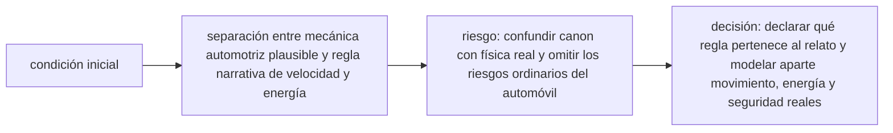

<!-- clase-meta
tipo_documento: clase
clase: 6
codigo: DELOREAN-06
curso: delorean
titulo: "Principios y operación de la DeLorean temporal"
modalidad: "resolución de problemas"
duracion_minutos: 90
nivel: introductorio
prerrequisito: DELOREAN-05
competencia: "razonamiento_operacional"
resultados_aprendizaje:
  - "Explicar principios físicos, fases de operación, decisiones y errores frecuentes con vocabulario propio de DeLorean temporal."
  - "Aplicar esos conceptos a una decisión segura o a un escenario de simulación de DeLorean temporal."
evidencia: "Resolución argumentada de un escenario operacional."
criterio_aprobacion: "Aplica los principios correctos, anticipa consecuencias y respeta los límites del curso."
fuentes: manuales/fuentes.md
ultima_revision: 2026-09-10
-->

# 🧪 Principios y operación de la DeLorean temporal

[🏠 Inicio](../../../README.md) · [🕰️ Curso: DeLorean temporal](../README.md) · 🧪 Principios

> ⚖️ Material educativo original; los derechos de las obras pertenecen a sus titulares.

Documento general y educativo. Aquí decidimos, concepto por concepto, que sería
posible según la física que hoy conocemos, que no lo sería y por qué. El objetivo
no es negar la diversión de la ficción, sino entender donde termina la ciencia y
empieza el guion.

---

## 🔬 Principios en juego

- **Energía cinética**: moverse implica energía, y esa energía crece con el
  cuadrado de la velocidad. Ir muy rápido es cada vez más costoso.
- **Potencia frente a energía**: entregar mucha energía en poco tiempo exige una
  potencia enorme; son magnitudes distintas.
- **Dilatación temporal**: a gran velocidad o cerca de gran masa, los relojes
  marchan más lento vistos por otros. Es real, pero apunta al futuro relativo.
- **Curvas temporales cerradas**: una idea teórica exótica que, en el papel,
  permitiría trayectorias que regresan a su propio pasado, sin receta práctica.
- **Causalidad**: la noción de que las causas preceden a sus efectos, base de las
  paradojas del viaje al pasado.

---

## ✅ Que sería posible y que no

| Concepto | Posible hoy | Por qué |
| --- | --- | --- |
| Acelerar un vehículo | Si | Es física de movimiento ordinaria. |
| Dilatación temporal medible | Si | Comprobada con relojes de precisión y partículas. |
| Envejecer un poco menos yendo muy rápido | Si, en teoría | Es el "viaje al futuro" relativista, mínimo a velocidades cotidianas. |
| Elegir una fecha del pasado y visitarla | No | No hay mecanismo físico conocido para retroceder. |
| Cambiar un evento ya ocurrido | No | Rompe la causalidad tal como la entendemos. |
| Saltar de época al pasar una velocidad | No | La velocidad no es un interruptor temporal. |

---

## 🎭 Ficción frente a realidad

| Idea de la ficción | Realidad según la física actual |
| --- | --- |
| Una velocidad exacta activa el viaje temporal | La velocidad solo cambia energía y dilatación, no la dirección del tiempo. |
| Con energía suficiente, el pasado es accesible | La energía no compra un billete al pasado; falta el mecanismo. |
| El tiempo se puede recorrer como una carretera | El tiempo tiene una dirección marcada por la causalidad. |
| Un salto limpio, sin consecuencias físicas | Cualquier propuesta teórica trae paradojas serias. |

---

## ⚙️ Fases de operación en simulación

| Fase | Que ocurre | Punto educativo |
| --- | --- | --- |
| Preparación | Elegir modo ciencia o ficción | Definir que reglas aplican. |
| Conducción | Acelerar hacia la velocidad umbral | Observar como sube la energía cinética. |
| Umbral | Alcanzar la velocidad del salto | En modo ciencia, no pasa nada temporal. |
| Salto | Ejecutar el salto ficticio | Solo disponible en modo ficción. |
| Análisis | Revisar el destino | Discutir causalidad y posibles paradojas. |

---

## 🎚️ Relación con los niveles de realismo

- **Nivel 1 (educativo)**: distinguir modo ciencia de modo ficción y observar
  energía y velocidad.
- **Nivel 2 (simplificado)**: agregar dilatación temporal como efecto real y
  mostrar el futuro relativo.
- **Nivel 3 (técnico)**: modelar potencia frente a energía y comentar las curvas
  temporales cerradas como idea teórica.

Ver el detalle de cada nivel en
[📏 docs/03-niveles-de-realismo.md](../../../docs/03-niveles-de-realismo.md).

## 🧭 Guía de estudio aplicada

### Pregunta guía

¿Cómo ayuda **Principios en juego, Que sería posible y que no, Ficción frente a realidad y Fases de operación en simulación** a **resolver intento de alcanzar la condición temporal en una vía con espacio limitado sin agotar el margen operacional**?

### Explicación razonada

El principio rector puede resumirse así: separación entre mecánica automotriz plausible y regla narrativa de velocidad y energía. Esto explica por qué una misma orden produce resultados distintos cuando cambian velocidad, carga, configuración o entorno. Operar bien consiste en leer la tendencia antes de agotar el margen y tomar esta decisión: declarar qué regla pertenece al relato y modelar aparte movimiento, energía y seguridad reales.

Esta clase se conecta con el resto del curso mediante **separación entre mecánica automotriz plausible y regla narrativa de velocidad y energía**. El hilo de
seguridad consiste en reconocer a tiempo **confundir canon con física real y omitir los riesgos ordinarios del automóvil** y poder justificar la decisión
**declarar qué regla pertenece al relato y modelar aparte movimiento, energía y seguridad reales**; en clases posteriores cambiará el ángulo de análisis, no esa relación causal.
La lectura funcional común sigue **motor y alimentación ficticia → transmisión → ruedas → sistema temporal**, de modo que cada concepto pueda
ubicarse dentro del funcionamiento completo y no quede como un dato aislado.

**Apoyo documental:** [Back to the Future](https://www.universalpicturesathome.com/movies/back-to-the-future) aporta obra audiovisual primaria;
[Vehicle Safety](https://www.nhtsa.gov/vehicle-safety) se usa para seguridad de vehículos terrestres. Estas fuentes
se contrastan con el alcance de la clase y no sustituyen un manual de equipo concreto.

### Caso resuelto: de la observación a la decisión

1. **Datos:** reconoce condiciones, configuración y margen disponibles en **intento de alcanzar la condición temporal en una vía con espacio limitado**.
2. **Modelo:** aplica **separación entre mecánica automotriz plausible y regla narrativa de velocidad y energía** para predecir una tendencia antes de actuar.
3. **Riesgo:** explica mediante qué cadena de causas podría ocurrir **confundir canon con física real y omitir los riesgos ordinarios del automóvil**.
4. **Decisión:** ejecuta mentalmente **declarar qué regla pertenece al relato y modelar aparte movimiento, energía y seguridad reales** y define qué observación confirmaría que funcionó.

### Comprueba tu comprensión

1. ¿Qué variable del principio «separación entre mecánica automotriz plausible y regla narrativa de velocidad y energía» cambia primero en el caso?
2. ¿Cómo se propaga ese cambio hasta **sistema temporal**?
3. ¿Qué evidencia confirmaría que **declarar qué regla pertenece al relato y modelar aparte movimiento, energía y seguridad reales** conservó margen operacional?

Orientación para revisar tus respuestas

- La primera respuesta debe relacionar el eslabón elegido con un efecto posterior, no solo nombrarlo.
- La segunda debe proponer una señal medible u observable y explicar qué tendencia sería preocupante.
- La tercera debe cambiar al menos una variable de capacidad, mando, entorno o margen de seguridad.

## 🎓 Cierre de clase

- **Actividad:** Resuelve un escenario de DeLorean temporal explicando, paso a paso, cómo intervienen principios físicos, fases de operación, decisiones y errores frecuentes.
- **Evidencia:** Resolución argumentada de un escenario operacional.
- **Criterio de aprobación:** Aplica los principios correctos, anticipa consecuencias y respeta los límites del curso.
- **Transferencia:** explica qué cambiaría al pasar a otra variante de esta máquina.

### Fuentes de esta clase

- [UNIVERSAL-BTTF](https://www.universalpicturesathome.com/movies/back-to-the-future): Back to the Future, Universal Pictures At Home. Uso: obra audiovisual primaria.
- [US-NHTSA](https://www.nhtsa.gov/vehicle-safety): Vehicle Safety, NHTSA. Uso: seguridad de vehículos terrestres.
- [NASA-FLIGHT](https://www1.grc.nasa.gov/beginners-guide-to-aeronautics/): Beginner's Guide to Aeronautics, NASA. Uso: contraste con física y vuelo reales.

> Las fuentes sostienen el marco conceptual y normativo; esta clase no reemplaza el manual
> del fabricante, la formación certificada ni la habilitación exigida para operar equipos reales.

---

[⬅️ Anterior: Mandos](../mandos/manual-mandos-delorean.md) · [➡️ Siguiente: Entornos](entornos-delorean.md)
