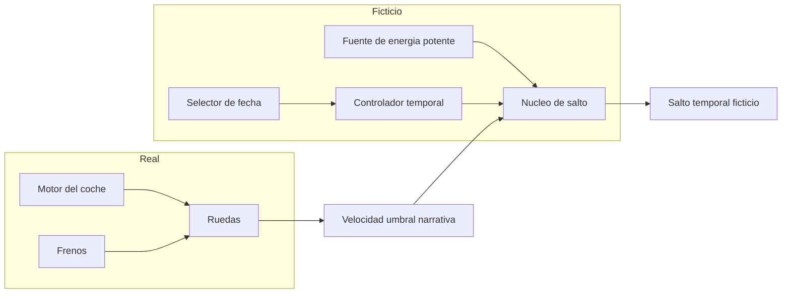
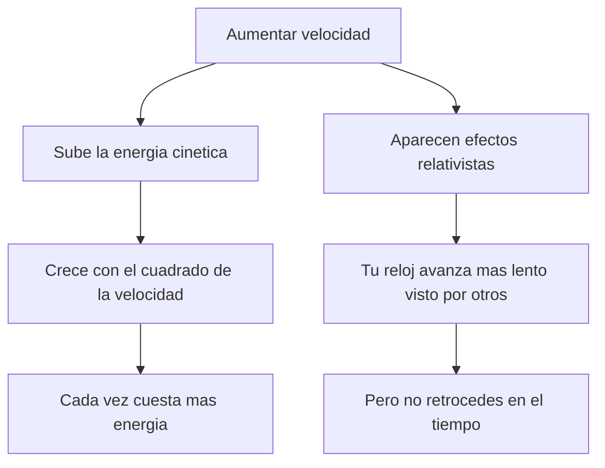

# 🔧 Sistemas mecanicos de la DeLorean temporal

[🏠 Inicio](../../../README.md) · [🕰️ Curso: DeLorean temporal](../README.md) · 🔧 Sistemas mecanicos

> ⚖️ Material educativo original; los derechos de las obras pertenecen a sus titulares.

Este modulo abre la nave por dentro, pero con una advertencia: la mayoria de sus
sistemas de salto temporal son imaginarios. Lo interesante es usar cada pieza
ficticia como puerta de entrada a la fisica real que evoca o que rompe. Todo el
contenido es original y con fines educativos.

---

## 🗺️ Vista general de subsistemas

En el modo carretera, solo actua la parte real. En el modo salto se activa la
parte ficticia, que no corresponde a ninguna tecnologia conocida.

---

## 1. ⚡ Energia y potencia

La historia asocia el salto a una fuente muy potente. Aqui conviene separar dos
ideas que se confunden a menudo.

- **Energia**: la cantidad total de "capacidad de hacer algo" almacenada o
  entregada. Se puede medir en joules.
- **Potencia**: la rapidez con la que se entrega esa energia. Se mide en watts,
  es decir joules por segundo.

Un pulso muy potente durante un instante puede entregar poca energia total; y una
fuente modesta durante mucho tiempo puede entregar mucha energia. La ficcion
suele pedir ambas cosas a la vez: muchisima energia entregada en un instante.

### Energia cinetica y velocidad umbral

La energia cinetica de un cuerpo crece con el cuadrado de su velocidad: si
duplicas la velocidad, la energia de movimiento se multiplica por cuatro. Esto
explica por que ir mas rapido cuesta cada vez mas energia.

El punto clave educativo es este: en la fisica real, alcanzar cierta velocidad
umbral solo te da mas energia de movimiento y efectos relativistas, pero **no**
abre ninguna puerta al pasado. La "velocidad magica" es un recurso de guion, no
un mecanismo fisico.

---

## 2. 🕳️ El nucleo de salto imaginario

En la ficcion, el nucleo toma la energia y "dobla" el tiempo. No existe una
tecnologia real equivalente. Para estudiarlo lo comparamos con ideas teoricas
exoticas de la fisica, dejando claro que son especulativas.

| Pieza ficticia | Idea real que evoca | Estado en la fisica actual |
| --- | --- | --- |
| Nucleo de salto | Curvas temporales cerradas | Solucion teorica exotica, sin evidencia ni receta practica. |
| Fuente potente | Densidades de energia enormes | Muy por encima de lo que sabemos manejar. |
| Selector de fecha | Control preciso del tiempo | No existe mecanismo conocido para elegir una fecha. |
| Umbral de velocidad | Regimenes relativistas | Reales, pero no producen viaje al pasado. |

---

## 3. 🧪 Ficcion frente a realidad

Esta tabla resume el corazon del modulo: que muestra la nave y que dice la
fisica que hoy conocemos.

| Afirmacion de la ficcion | Que dice la fisica real |
| --- | --- |
| Al pasar la velocidad umbral, se viaja en el tiempo | La velocidad no abre viajes al pasado; solo cambia energia y ritmo del reloj. |
| Basta energia suficiente para saltar de fecha | No hay mecanismo conocido que convierta energia en un salto al pasado. |
| El pasado se puede visitar y modificar | La fisica actual no permite retroceder ni reescribir eventos ya ocurridos. |
| Moverse rapido te lleva a otra epoca | Moverse rapido produce dilatacion temporal, que solo desfasa relojes hacia el futuro relativo. |

---

## 4. ⏱️ Dilatacion temporal real

La relatividad describe un efecto genuino: cuando algo se mueve muy rapido
respecto a ti, su reloj avanza mas lento comparado con el tuyo. Tambien ocurre
algo similar cerca de una gran masa. Esto esta comprobado con relojes muy
precisos y con particulas que "viven" mas tiempo cuando van muy rapido.

Pero cuidado con la interpretacion: la dilatacion temporal es siempre un
desfase hacia el futuro relativo. Nunca hace que un reloj marche hacia atras.
Puedes envejecer un poco menos que quien se queda quieto, lo que se parece a un
viaje al futuro, pero jamas al pasado.

---

## 5. 🧩 Como se conecta todo

1. En **modo carretera**, la nave es un coche normal y solo importa la fisica
   real de motor, frenos y ruedas.
2. En **modo salto**, la ficcion pide una **velocidad umbral** y una **fuente de
   energia** enorme.
3. Ese umbral, en la realidad, solo produce mas **energia cinetica** y efectos
   relativistas, no un salto al pasado.
4. El **nucleo** imaginario se inspira lejanamente en ideas teoricas exoticas
   como las curvas temporales cerradas, que no tienen receta practica.
5. La **dilatacion temporal** real existe, pero apunta al futuro relativo, no al
   pasado.

Con esto claro, el [Modulo 4: Mandos](../mandos/manual-mandos-delorean.md) muestra
como el usuario operaria estos sistemas en un tablero conceptual.

---

[⬅️ Anterior: Caracteristicas](caracteristicas-delorean.md) · [➡️ Siguiente: Mandos e instrumentos](../mandos/manual-mandos-delorean.md)
