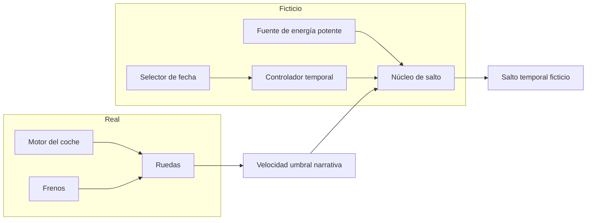
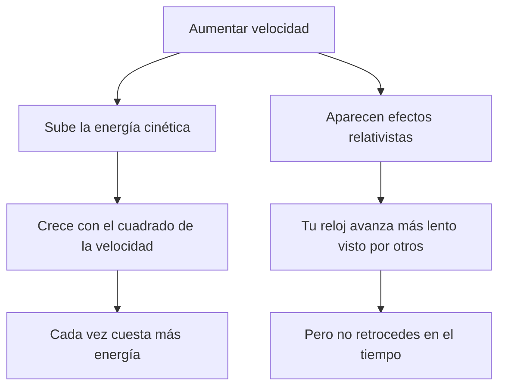
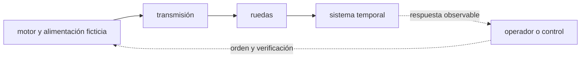

<!-- clase-meta
tipo_documento: clase
clase: 4
codigo: DELOREAN-04
curso: delorean
titulo: "Sistemas mecánicos de la DeLorean temporal"
modalidad: "teórica aplicada"
duracion_minutos: 90
nivel: introductorio
prerrequisito: DELOREAN-03
competencia: "comprension_de_sistemas"
resultados_aprendizaje:
  - "Explicar Vista general de subsistemas, Energía y potencia, El núcleo de salto imaginario y Ficción frente a realidad con vocabulario propio de DeLorean temporal."
  - "Aplicar esos conceptos a una decisión segura o a un escenario de simulación de DeLorean temporal."
evidencia: "Esquema con flujos de energía, materia o información anotados."
criterio_aprobacion: "Las conexiones esenciales son correctas y la consecuencia de la falla se propaga de manera coherente."
fuentes: manuales/fuentes.md
ultima_revision: 2026-09-10
-->

# 🔧 Sistemas mecánicos de la DeLorean temporal

[🏠 Inicio](../../../README.md) · [🕰️ Curso: DeLorean temporal](../README.md) · 🔧 Sistemas mecánicos

> ⚖️ Material educativo original; los derechos de las obras pertenecen a sus titulares.

Esta clase abre la nave por dentro, pero con una advertencia: la mayoría de sus
sistemas de salto temporal son imaginarios. Lo interesante es usar cada pieza
ficticia como puerta de entrada a la física real que evoca o que rompe. Todo el
contenido es original y con fines educativos.

---

## 🗺️ Vista general de subsistemas

```mermaid
flowchart LR
    subgraph Real
        Motor[Motor del coche] --> Ruedas[Ruedas]
        Frenos[Frenos] --> Ruedas
    end
    subgraph Ficticio
        Fuente[Fuente de energía potente] --> Nucleo[Núcleo de salto]
        Control[Controlador temporal] --> Nucleo
        Destino[Selector de fecha] --> Control
    end
    Ruedas --> Umbral[Velocidad umbral narrativa]
    Umbral --> Nucleo
    Nucleo --> Salto[Salto temporal ficticio]
```

En el modo carretera, solo actua la parte real. En el modo salto se activa la
parte ficticia, que no corresponde a ninguna tecnología conocida.

---

## 1. ⚡ Energía y potencia

La historia asocia el salto a una fuente muy potente. Aquí conviene separar dos
ideas que se confunden a menudo.

- **Energía**: la cantidad total de "capacidad de hacer algo" almacenada o
  entregada. Se puede medir en joules.
- **Potencia**: la rapidez con la que se entrega esa energía. Se mide en watts,
  es decir joules por segundo.

Un pulso muy potente durante un instante puede entregar poca energía total; y una
fuente modesta durante mucho tiempo puede entregar mucha energía. La ficción
suele pedir ambas cosas a la vez: muchísima energía entregada en un instante.

### Energía cinética y velocidad umbral

La energía cinética de un cuerpo crece con el cuadrado de su velocidad: si
duplicas la velocidad, la energía de movimiento se multiplica por cuatro. Esto
explica por qué ir más rápido cuesta cada vez más energía.

El punto clave educativo es este: en la física real, alcanzar cierta velocidad
umbral solo te da más energía de movimiento y efectos relativistas, pero **no**
abre ninguna puerta al pasado. La "velocidad mágica" es un recurso de guion, no
un mecanismo físico.

```mermaid
flowchart TD
    Vel[Aumentar velocidad] --> Cin[Sube la energía cinética]
    Cin --> Cuadrado[Crece con el cuadrado de la velocidad]
    Cuadrado --> Costo[Cada vez cuesta más energía]
    Vel --> Rel[Aparecen efectos relativistas]
    Rel --> Reloj[Tu reloj avanza más lento visto por otros]
    Reloj --> NoPasado[Pero no retrocedes en el tiempo]
```

---

## 2. 🕳️ El núcleo de salto imaginario

En la ficción, el núcleo toma la energía y "dobla" el tiempo. No existe una
tecnología real equivalente. Para estudiarlo lo comparamos con ideas teóricas
exóticas de la física, dejando claro que son especulativas.

| Pieza ficticia | Idea real que evoca | Estado en la física actual |
| --- | --- | --- |
| Núcleo de salto | Curvas temporales cerradas | Solución teórica exótica, sin evidencia ni receta práctica. |
| Fuente potente | Densidades de energía enormes | Muy por encima de lo que sabemos manejar. |
| Selector de fecha | Control preciso del tiempo | No existe mecanismo conocido para elegir una fecha. |
| Umbral de velocidad | Regímenes relativistas | Reales, pero no producen viaje al pasado. |

---

## 3. 🧪 Ficción frente a realidad

Esta tabla resume el corazón del módulo: que muestra la nave y que dice la
física que hoy conocemos.

| Afirmación de la ficción | Que dice la física real |
| --- | --- |
| Al pasar la velocidad umbral, se viaja en el tiempo | La velocidad no abre viajes al pasado; solo cambia energía y ritmo del reloj. |
| Basta energía suficiente para saltar de fecha | No hay mecanismo conocido que convierta energía en un salto al pasado. |
| El pasado se puede visitar y modificar | La física actual no permite retroceder ni reescribir eventos ya ocurridos. |
| Moverse rápido te lleva a otra época | Moverse rápido produce dilatación temporal, que solo desfasa relojes hacia el futuro relativo. |

---

## 4. ⏱️ Dilatación temporal real

La relatividad describe un efecto genuino: cuando algo se mueve muy rápido
respecto a ti, su reloj avanza más lento comparado con el tuyo. También ocurre
algo similar cerca de una gran masa. Esto está comprobado con relojes muy
precisos y con partículas que "viven" más tiempo cuando van muy rápido.

Pero cuidado con la interpretación: la dilatación temporal es siempre un
desfase hacia el futuro relativo. Nunca hace que un reloj marche hacia atrás.
Puedes envejecer un poco menos que quien se queda quieto, lo que se parece a un
viaje al futuro, pero jamás al pasado.

```mermaid
flowchart LR
    Rapido[Moverse muy rápido] --> Lento[Tu reloj avanza más lento para otros]
    Gravedad[Estar cerca de gran masa] --> Lento
    Lento --> Futuro[Efecto de viaje al futuro relativo]
    Futuro --> Barrera[Ninguna vía conocida al pasado]
```

---

## 5. 🧩 Cómo se conecta todo

1. En **modo carretera**, la nave es un coche normal y solo importa la física
   real de motor, frenos y ruedas.
2. En **modo salto**, la ficción pide una **velocidad umbral** y una **fuente de
   energía** enorme.
3. Ese umbral, en la realidad, solo produce más **energía cinética** y efectos
   relativistas, no un salto al pasado.
4. El **núcleo** imaginario se inspira lejanamente en ideas teóricas exóticas
   como las curvas temporales cerradas, que no tienen receta práctica.
5. La **dilatación temporal** real existe, pero apunta al futuro relativo, no al
   pasado.

Con esto claro, el [Clase 5: Mandos](../mandos/manual-mandos-delorean.md) muestra
como el usuario operaría estos sistemas en un tablero conceptual.

## 🧭 Guía de estudio aplicada

### Pregunta guía

¿Cómo ayuda **Vista general de subsistemas, Energía y potencia, El núcleo de salto imaginario y Ficción frente a realidad** a **seguir una alteración desde motor y alimentación ficticia hasta sistema temporal durante intento de alcanzar la condición temporal en una vía con espacio limitado**?

### Explicación razonada

El funcionamiento puede leerse como una cadena causal: motor y alimentación ficticia entrega o transforma energía; transmisión la adapta; ruedas la transmite o gobierna; y sistema temporal produce el efecto observable. La cadena no es lineal en sentido estricto: sensores, estructura y operador cierran el lazo. Si un eslabón se degrada, la señal importante es cómo cambia el estado de sistema temporal y qué margen queda.

```mermaid
flowchart LR
    A["motor y alimentación ficticia"] --> B["transmisión"] --> C["ruedas"] --> D["sistema temporal"]
    D -. respuesta observable .-> O["operador o control"]
    O -. orden y verificación .-> A
```

Esta clase se conecta con el resto del curso mediante **separación entre mecánica automotriz plausible y regla narrativa de velocidad y energía**. El hilo de
seguridad consiste en reconocer a tiempo **confundir canon con física real y omitir los riesgos ordinarios del automóvil** y poder justificar la decisión
**declarar qué regla pertenece al relato y modelar aparte movimiento, energía y seguridad reales**; en clases posteriores cambiará el ángulo de análisis, no esa relación causal.
La lectura funcional común sigue **motor y alimentación ficticia → transmisión → ruedas → sistema temporal**, de modo que cada concepto pueda
ubicarse dentro del funcionamiento completo y no quede como un dato aislado.

**Apoyo documental:** [Back to the Future](https://www.universalpicturesathome.com/movies/back-to-the-future) aporta obra audiovisual primaria;
[Vehicle Safety](https://www.nhtsa.gov/vehicle-safety) se usa para seguridad de vehículos terrestres. Estas fuentes
se contrastan con el alcance de la clase y no sustituyen un manual de equipo concreto.

### Caso resuelto: de la observación a la decisión

1. **Entrada:** identifica el estado inicial de **motor y alimentación ficticia** durante **intento de alcanzar la condición temporal en una vía con espacio limitado**.
2. **Transformación:** explica qué hacen **transmisión** y **ruedas**, y qué magnitud cambia en cada paso.
3. **Salida:** comprueba el efecto esperado en **sistema temporal** y busca una desviación temprana.
4. **Falla razonada:** si aparece **confundir canon con física real y omitir los riesgos ordinarios del automóvil**, retrocede por la cadena antes de ordenar otra acción.

### Comprueba tu comprensión

1. Si se degrada **transmisión**, ¿qué efecto esperarías primero en **ruedas** y después en **sistema temporal**?
2. ¿Qué observación ayudaría a diferenciar una falla de **motor y alimentación ficticia** de una falla de **ruedas**?
3. ¿Por qué una segunda orden podría agravar **confundir canon con física real y omitir los riesgos ordinarios del automóvil**?

Orientación para revisar tus respuestas

- La primera respuesta debe relacionar el eslabón elegido con un efecto posterior, no solo nombrarlo.
- La segunda debe proponer una señal medible u observable y explicar qué tendencia sería preocupante.
- La tercera debe cambiar al menos una variable de capacidad, mando, entorno o margen de seguridad.

## 🎓 Cierre de clase

- **Actividad:** Dibuja un esquema funcional de DeLorean temporal que conecte Vista general de subsistemas, Energía y potencia, El núcleo de salto imaginario y Ficción frente a realidad; después predice el efecto de una falla simulada.
- **Evidencia:** Esquema con flujos de energía, materia o información anotados.
- **Criterio de aprobación:** Las conexiones esenciales son correctas y la consecuencia de la falla se propaga de manera coherente.
- **Transferencia:** explica qué cambiaría al pasar a otra variante de esta máquina.

### Fuentes de esta clase

- [UNIVERSAL-BTTF](https://www.universalpicturesathome.com/movies/back-to-the-future): Back to the Future, Universal Pictures At Home. Uso: obra audiovisual primaria.
- [US-NHTSA](https://www.nhtsa.gov/vehicle-safety): Vehicle Safety, NHTSA. Uso: seguridad de vehículos terrestres.
- [NASA-FLIGHT](https://www1.grc.nasa.gov/beginners-guide-to-aeronautics/): Beginner's Guide to Aeronautics, NASA. Uso: contraste con física y vuelo reales.

> Las fuentes sostienen el marco conceptual y normativo; esta clase no reemplaza el manual
> del fabricante, la formación certificada ni la habilitación exigida para operar equipos reales.

---

[⬅️ Anterior: Modelos y variantes](../modelos/modelos-delorean.md) · [➡️ Siguiente: Mandos e instrumentos](../mandos/manual-mandos-delorean.md)
