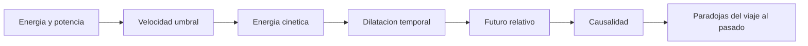

# 🧰 Recursos de la DeLorean temporal

[🏠 Inicio](../../../README.md) · [🕰️ Curso: DeLorean temporal](../README.md) · 🧰 Recursos

> ⚖️ Material educativo original; los derechos de las obras pertenecen a sus titulares.

Glosario especifico, diagrama de apoyo y enlaces internos del curso. Amplia el
[glosario general](../../../docs/05-glosario-general.md) con los terminos de
fisica que aparecen en esta nave.

---

## 📖 Glosario especifico

| Termino | Definicion |
| --- | --- |
| Energia cinetica | Energia asociada al movimiento; crece con el cuadrado de la velocidad. |
| Potencia | Rapidez con la que se entrega energia; energia por unidad de tiempo. |
| Velocidad umbral | Velocidad que la ficcion fija como disparador del salto; no tiene rol asi en la fisica real. |
| Dilatacion temporal | Efecto real por el que un reloj en movimiento o cerca de gran masa avanza mas lento visto por otros. |
| Futuro relativo | Consecuencia de la dilatacion: envejecer menos que quien queda en reposo. |
| Curva temporal cerrada | Idea teorica exotica de una trayectoria que regresaria a su propio pasado. |
| Causalidad | Principio de que las causas preceden a sus efectos. |
| Paradoja del abuelo | Contradiccion clasica de impedir el propio origen al viajar al pasado. |
| Autoconsistencia | Enfoque en el que ninguna accion del viajero puede contradecir la historia ya ocurrida. |

---

## 🗺️ Diagrama de conceptos del curso

---

## 🔗 Enlaces internos

- Portada del curso: [🕰️ Curso: DeLorean temporal](../README.md)
- Catalogo de naves de ficcion: [🌌 Naves de ficcion](../../README.md)
- Glosario general del proyecto: [📖 docs/05-glosario-general.md](../../../docs/05-glosario-general.md)
- Niveles de realismo: [📏 docs/03-niveles-de-realismo.md](../../../docs/03-niveles-de-realismo.md)

---

## 📚 Fuentes de divulgacion

- Registrar aqui obras de divulgacion sobre relatividad y viaje en el tiempo.
- Preferir material con licencia clara y de acceso publico.
- Mantener siempre la separacion entre fisica real y ficcion.

---

[🎓 Portada del curso](../README.md) · [⬅️ Anterior: Diseno de simulacion](../simulacion/diseno-simulador-delorean.md)
