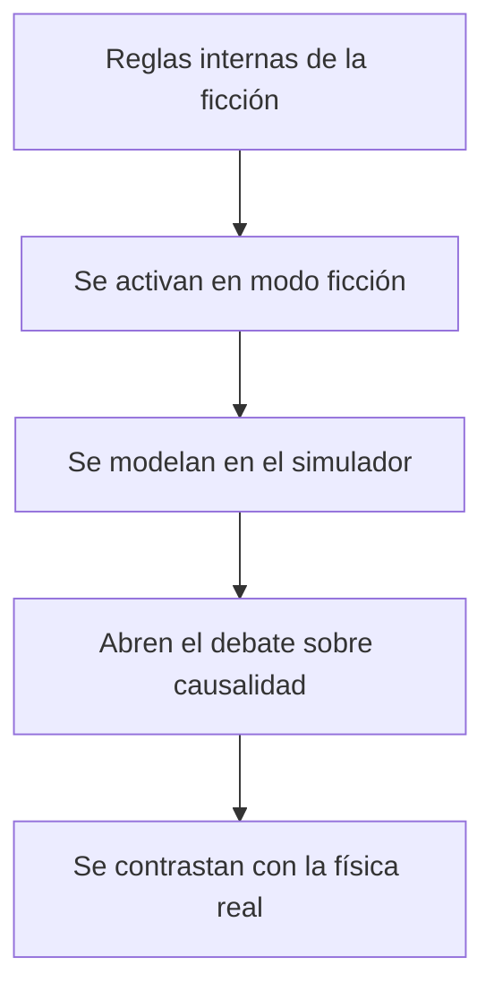

<!-- clase-meta
tipo_documento: clase
clase: 8
codigo: DELOREAN-08
curso: delorean
titulo: "Reglas del universo de la DeLorean temporal"
modalidad: "estudio de casos"
duracion_minutos: 60
nivel: introductorio
prerrequisito: DELOREAN-07
competencia: "cumplimiento_y_seguridad"
resultados_aprendizaje:
  - "Explicar ámbito, requisitos, seguridad, restricciones y aplicación en simulación con vocabulario propio de DeLorean temporal."
  - "Aplicar esos conceptos a una decisión segura o a un escenario de simulación de DeLorean temporal."
evidencia: "Ficha normativa con decisión y fuente trazable."
criterio_aprobacion: "Las decisiones citan la autoridad adecuada y no presentan el curso como habilitación profesional."
fuentes: manuales/fuentes.md
ultima_revision: 2026-09-10
-->

# ⚖️ Reglas del universo de la DeLorean temporal

[🏠 Inicio](../../../README.md) · [🕰️ Curso: DeLorean temporal](../README.md) · ⚖️ Reglas del universo

> ⚖️ Material educativo original; los derechos de las obras pertenecen a sus titulares.

En vez de un reglamento legal, este módulo describe con nuestras palabras las
"reglas internas" que una historia de viaje en el tiempo suele adoptar para ser
coherente. No citamos ni reproducimos la obra: resumimos convenciones generales
del género. Al final aclaramos que nada de esto es ley real y que la física dice
otra cosa.

---

## 📜 Reglas internas típicas del género

- **Regla del disparador**: el salto ocurre solo si se cumple una condición
  precisa, como alcanzar una velocidad umbral con energía suficiente.
- **Regla del destino elegido**: el viajero fija una fecha objetivo antes de
  saltar.
- **Regla de la consecuencia**: cambiar algo en el pasado altera el presente o
  el futuro del relato.
- **Regla de la fragilidad personal**: el viajero puede poner en riesgo su
  propia existencia si interfiere con eventos que lo hicieron posible.
- **Regla de la coherencia**: la historia intenta que los sucesos encajen sin
  contradicciones imposibles.

---

## 🔀 Dos formas de resolver las paradojas en la ficción

| Enfoque narrativo | Idea central | Ejemplo de conflicto |
| --- | --- | --- |
| Línea que se puede cambiar | El pasado se altera y el futuro se reescribe | La paradoja del abuelo amenaza al viajero. |
| Línea autoconsistente | Todo lo que pasa ya era parte de la historia | El viajero no puede cambiar lo que ya ocurrio. |

La **paradoja del abuelo** es el clásico dilema: si alguien impidiera su propio
origen, tampoco existiría para impedirlo, lo que genera una contradicción. El
enfoque **autoconsistente** la evita afirmando que ninguna acción del viajero
puede contradecir la historia que ya sucedio.

---

## 🧭 Cómo usamos estas reglas en el curso

---

## ⚠️ Aclaración importante: esto no es ley real

Las reglas anteriores son convenciones de historias, no leyes de la naturaleza.
La física que hoy conocemos indica algo muy distinto:

| Regla del universo de ficción | Que dice la física real |
| --- | --- |
| Una velocidad umbral dispara el viaje temporal | La velocidad no permite viajar al pasado. |
| El pasado se puede visitar y cambiar | No hay mecanismo conocido para retroceder en el tiempo. |
| Las paradojas se resuelven con una regla narrativa | Las paradojas indican por qué el viaje al pasado es problemático. |
| La energía suficiente basta para saltar de fecha | La energía no ofrece un camino conocido al pasado. |

Estas convenciones son útiles para contar historias y para pensar, no para
describir el mundo. Para el contexto de derechos y uso educativo de esta
sección, consulta el
[aviso de derechos del catálogo](../../README.md).

## 🧭 Guía de estudio aplicada

### Pregunta guía

¿Cómo ayuda **Reglas internas típicas del género, Dos formas de resolver las paradojas en la ficción, Cómo usamos estas reglas en el curso y Aclaración importante: esto no es ley real** a **interrumpir la cadena que podría producir confundir canon con física real y omitir los riesgos ordinarios del automóvil**?

### Explicación razonada

La regla de seguridad debe conectarse con un mecanismo de daño. El riesgo «confundir canon con física real y omitir los riesgos ordinarios del automóvil» se controla mediante límites, inspección, competencia y coordinación; cada medida corta una parte de la cadena causal. En una situación real prevalecen la autoridad aplicable y el manual vigente de DeLorean temporal.

Esta clase se conecta con el resto del curso mediante **separación entre mecánica automotriz plausible y regla narrativa de velocidad y energía**. El hilo de
seguridad consiste en reconocer a tiempo **confundir canon con física real y omitir los riesgos ordinarios del automóvil** y poder justificar la decisión
**declarar qué regla pertenece al relato y modelar aparte movimiento, energía y seguridad reales**; en clases posteriores cambiará el ángulo de análisis, no esa relación causal.
La lectura funcional común sigue **motor y alimentación ficticia → transmisión → ruedas → sistema temporal**, de modo que cada concepto pueda
ubicarse dentro del funcionamiento completo y no quede como un dato aislado.

**Apoyo documental:** [Back to the Future](https://www.universalpicturesathome.com/movies/back-to-the-future) aporta obra audiovisual primaria;
[Vehicle Safety](https://www.nhtsa.gov/vehicle-safety) se usa para seguridad de vehículos terrestres. Estas fuentes
se contrastan con el alcance de la clase y no sustituyen un manual de equipo concreto.

### Caso resuelto: de la observación a la decisión

1. **Describir el daño:** explica cómo se llegaría a **confundir canon con física real y omitir los riesgos ordinarios del automóvil** sin usar solo la palabra “peligro”.
2. **Localizar controles:** asocia inspección, límite, competencia o coordinación con un punto de la cadena causal.
3. **Consultar:** distingue qué afirma la fuente pública y qué debe verificarse en normativa y manual vigentes.
4. **Resolver:** documenta por qué **declarar qué regla pertenece al relato y modelar aparte movimiento, energía y seguridad reales** es una decisión preventiva y verificable.

### Comprueba tu comprensión

1. ¿Qué mecanismo concreto conduce a **confundir canon con física real y omitir los riesgos ordinarios del automóvil**?
2. ¿Qué barrera preventiva actúa antes del movimiento y cuál durante la operación?
3. ¿Qué parte de la respuesta requiere consultar normativa o manual vigente?

Orientación para revisar tus respuestas

- La primera respuesta debe relacionar el eslabón elegido con un efecto posterior, no solo nombrarlo.
- La segunda debe proponer una señal medible u observable y explicar qué tendencia sería preocupante.
- La tercera debe cambiar al menos una variable de capacidad, mando, entorno o margen de seguridad.

## 🎓 Cierre de clase

- **Actividad:** Analiza dos casos de DeLorean temporal; localiza la fuente aplicable y separa obligación real, buena práctica y regla de simulación.
- **Evidencia:** Ficha normativa con decisión y fuente trazable.
- **Criterio de aprobación:** Las decisiones citan la autoridad adecuada y no presentan el curso como habilitación profesional.
- **Transferencia:** explica qué cambiaría al pasar a otra variante de esta máquina.

### Fuentes de esta clase

- [UNIVERSAL-BTTF](https://www.universalpicturesathome.com/movies/back-to-the-future): Back to the Future, Universal Pictures At Home. Uso: obra audiovisual primaria.
- [US-NHTSA](https://www.nhtsa.gov/vehicle-safety): Vehicle Safety, NHTSA. Uso: seguridad de vehículos terrestres.
- [NASA-FLIGHT](https://www1.grc.nasa.gov/beginners-guide-to-aeronautics/): Beginner's Guide to Aeronautics, NASA. Uso: contraste con física y vuelo reales.

> Las fuentes sostienen el marco conceptual y normativo; esta clase no reemplaza el manual
> del fabricante, la formación certificada ni la habilitación exigida para operar equipos reales.

---

[⬅️ Anterior: Entornos](../operacion/entornos-delorean.md) · [➡️ Siguiente: Diseño de simulación](../simulacion/diseno-simulador-delorean.md)
