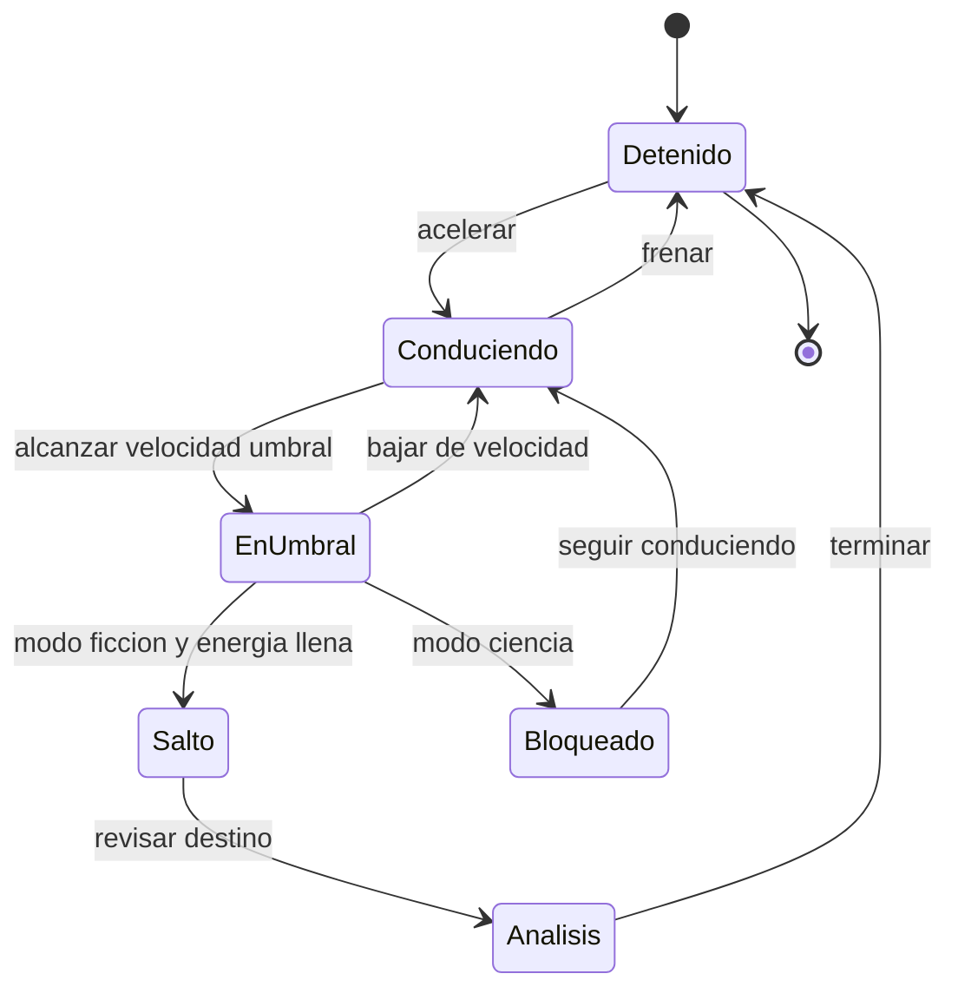

# 🎮 Diseño de simulación de la DeLorean temporal

[🏠 Inicio](../../../README.md) · [🕰️ Curso: DeLorean temporal](../README.md) · 🎮 Simulación

> ⚖️ Material educativo original; los derechos de las obras pertenecen a sus titulares.

Como modelar la nave de forma educativa y entretenida. La pieza central es un
**modo ciencia/ficción** que alterna entre la física realista y las reglas de la
película, para que el usuario compare ambas visiones sobre el mismo vehículo.

---

## 🔁 Ciclo de estados

---

## 🎯 Objetivo de la simulación

Que el usuario entienda, jugando, la diferencia entre lo que la física permite y
lo que solo ocurre en la ficción. En modo ciencia comprueba que la velocidad no
abre el tiempo; en modo ficción explora las reglas del relato y sus paradojas.

---

## 🔬 Modo ciencia frente a modo ficción

| Aspecto | Modo ciencia | Modo ficción |
| --- | --- | --- |
| Reglas | Física real | Reglas de la película |
| Al llegar al umbral | No pasa nada temporal | Se habilita el salto |
| Dilatación temporal | Se muestra como efecto real | Se ignora o simplifica |
| Viaje al pasado | Deshabilitado | Permitido y analizado |
| Objetivo | Entender la física | Explorar la narrativa |

---

## 🎛️ Variables principales

| Variable | Tipo | Rango | Afecta a | Comentarios |
| --- | --- | --- | --- | --- |
| Velocidad | numérica | 0-200 km/h | Umbral y energía cinética | Central en ambos modos. |
| Energía acumulada | numérica | 0-100% | Disponibilidad del salto | Solo relevante en ficción. |
| Umbral alcanzado | lógica | falso/verdadero | Transición a EnUmbral | Marca la condición del salto. |
| Modo ciencia/ficción | discreta | ciencia, ficción | Todas las reglas | Interruptor educativo clave. |
| Fecha objetivo | fecha | ajustable | Destino del salto | Solo activa en ficción. |
| Riesgo de paradoja | numérica | 0-1 | Aviso de causalidad | Abre el debate del Módulo 7. |
| Factor de dilatación | numérica | cerca de 1 | Reloj relativo | Se resalta en modo ciencia. |

---

## 🧮 Ciclo básico

1. Leer entrada del usuario y el modo activo.
2. Actualizar velocidad y energía cinética.
3. Comprobar si se alcanza la velocidad umbral.
4. En modo ciencia, mostrar dilatación temporal y bloquear el salto.
5. En modo ficción, permitir el salto si la energía está llena.
6. Actualizar instrumentos, avisos de causalidad y mensajes educativos.

---

## 🧩 Modos de juego futuros

- Tutorial que explica energía y velocidad umbral.
- Comparador lado a lado de modo ciencia y modo ficción.
- Reto de dilatación temporal con relojes que se desfasan.
- Escenario de paradojas para discutir causalidad sin castigos.

---

## 🚫 Elementos fuera de alcance

- Presentar el viaje al pasado real como algo confirmado por la ciencia.
- Instrucciones para construir dispositivos peligrosos.
- Afirmar datos técnicos oficiales de la obra que no existen.

---

## 📌 Pendientes

- [ ] Definir valores por defecto de cada variable.
- [ ] Prototipar el interruptor ciencia/ficción.
- [ ] Ajustar el modelo educativo de dilatación temporal.
- [ ] Registrar fuentes de divulgación en los recursos del curso.

---

[⬅️ Anterior: Reglas del universo](../reglamentos/reglas-universo-delorean.md) · [➡️ Siguiente: Recursos](../recursos/recursos-delorean.md)
