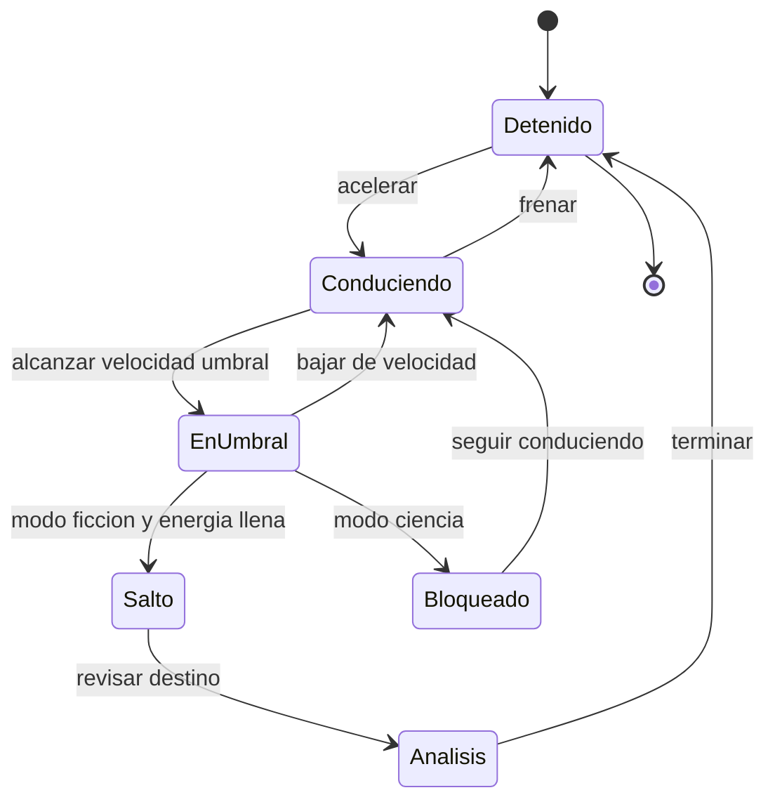

# 🎮 Diseno de simulacion de la DeLorean temporal

[🏠 Inicio](../../../README.md) · [🕰️ Curso: DeLorean temporal](../README.md) · 🎮 Simulacion

> ⚖️ Material educativo original; los derechos de las obras pertenecen a sus titulares.

Como modelar la nave de forma educativa y entretenida. La pieza central es un
**modo ciencia/ficcion** que alterna entre la fisica realista y las reglas de la
pelicula, para que el usuario compare ambas visiones sobre el mismo vehiculo.

---

## 🔁 Ciclo de estados

---

## 🎯 Objetivo de la simulacion

Que el usuario entienda, jugando, la diferencia entre lo que la fisica permite y
lo que solo ocurre en la ficcion. En modo ciencia comprueba que la velocidad no
abre el tiempo; en modo ficcion explora las reglas del relato y sus paradojas.

---

## 🔬 Modo ciencia frente a modo ficcion

| Aspecto | Modo ciencia | Modo ficcion |
| --- | --- | --- |
| Reglas | Fisica real | Reglas de la pelicula |
| Al llegar al umbral | No pasa nada temporal | Se habilita el salto |
| Dilatacion temporal | Se muestra como efecto real | Se ignora o simplifica |
| Viaje al pasado | Deshabilitado | Permitido y analizado |
| Objetivo | Entender la fisica | Explorar la narrativa |

---

## 🎛️ Variables principales

| Variable | Tipo | Rango | Afecta a | Comentarios |
| --- | --- | --- | --- | --- |
| Velocidad | numerica | 0-200 km/h | Umbral y energia cinetica | Central en ambos modos. |
| Energia acumulada | numerica | 0-100% | Disponibilidad del salto | Solo relevante en ficcion. |
| Umbral alcanzado | logica | falso/verdadero | Transicion a EnUmbral | Marca la condicion del salto. |
| Modo ciencia/ficcion | discreta | ciencia, ficcion | Todas las reglas | Interruptor educativo clave. |
| Fecha objetivo | fecha | ajustable | Destino del salto | Solo activa en ficcion. |
| Riesgo de paradoja | numerica | 0-1 | Aviso de causalidad | Abre el debate del Modulo 7. |
| Factor de dilatacion | numerica | cerca de 1 | Reloj relativo | Se resalta en modo ciencia. |

---

## 🧮 Ciclo basico

1. Leer entrada del usuario y el modo activo.
2. Actualizar velocidad y energia cinetica.
3. Comprobar si se alcanza la velocidad umbral.
4. En modo ciencia, mostrar dilatacion temporal y bloquear el salto.
5. En modo ficcion, permitir el salto si la energia esta llena.
6. Actualizar instrumentos, avisos de causalidad y mensajes educativos.

---

## 🧩 Modos de juego futuros

- Tutorial que explica energia y velocidad umbral.
- Comparador lado a lado de modo ciencia y modo ficcion.
- Reto de dilatacion temporal con relojes que se desfasan.
- Escenario de paradojas para discutir causalidad sin castigos.

---

## 🚫 Elementos fuera de alcance

- Presentar el viaje al pasado real como algo confirmado por la ciencia.
- Instrucciones para construir dispositivos peligrosos.
- Afirmar datos tecnicos oficiales de la obra que no existen.

---

## 📌 Pendientes

- [ ] Definir valores por defecto de cada variable.
- [ ] Prototipar el interruptor ciencia/ficcion.
- [ ] Ajustar el modelo educativo de dilatacion temporal.
- [ ] Registrar fuentes de divulgacion en los recursos del curso.

---

[⬅️ Anterior: Reglas del universo](../reglamentos/reglas-universo-delorean.md) · [➡️ Siguiente: Recursos](../recursos/recursos-delorean.md)
