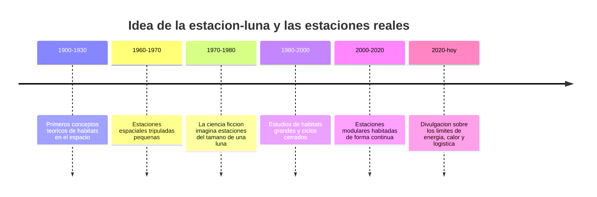

<!-- clase-meta
tipo_documento: clase
clase: 1
codigo: ESTRELLADELA-01
curso: estrella-de-la-muerte
titulo: "Historia de la Estrella de la Muerte"
modalidad: "teórica dialogada"
duracion_minutos: 45
nivel: introductorio
prerrequisito: ninguno
competencia: "contexto_historico"
resultados_aprendizaje:
  - "Explicar origen, evolución tecnológica, variantes representativas e impacto con vocabulario propio de Estrella de la Muerte."
  - "Aplicar esos conceptos a una decisión segura o a un escenario de simulación de Estrella de la Muerte."
evidencia: "Línea de tiempo comentada con cuatro hitos o más."
criterio_aprobacion: "Los hitos están ordenados, son pertinentes y dos relaciones de causa y efecto quedan justificadas."
fuentes: manuales/fuentes.md
ultima_revision: 2026-09-10
-->

# 📜 Historia de la Estrella de la Muerte

[🏠 Inicio](../../../README.md) · [🌑 Curso: Estrella de la Muerte](../README.md) · 📜 Historia

> ⚖️ Material educativo original; los derechos de las obras pertenecen a sus titulares.

Esta clase situa la idea de la estación del tamaño de una luna dentro de la
ciencia ficción y la compara con la historia real de las estaciones espaciales.
No describe una nave oficial: analiza el concepto genérico de "estación-mundo"
que popularizo el estilo "Star Wars" y lo contrasta con lo que la ingeniería sabe
hacer de verdad.

## De donde viene la idea

La estación-luna de la ficción nace del deseo de imaginar una construcción tan
grande que se confunda con un cuerpo celeste: una base del tamaño de una luna,
capaz de albergar a millones de personas y de concentrar un poder inmenso. Es una
imagen sobrecogedora. El problema es que, a ese tamaño, la estructura deja de
comportarse como una nave y empieza a comportarse como un mundo, con sus propias
reglas físicas, y ahí empieza lo interesante de este curso.

## Lo real frente a lo imaginado

La historia real de las estaciones espaciales siguió otro camino. Las estaciones
que se han habitado son pequeñas comparadas con una luna y dependen por completo
de suministros y de una gestión muy cuidadosa de energía, aire y calor. No existe
la estación-mundo gratis: alcanzar el tamaño de una luna trae consigo gravedad
propia, un apetito de energía colosal y un problema serio para deshacerse del
calor.

| Periodo | Hito de referencia | Importancia para el curso |
| --- | --- | --- |
| 1900-1930 | Conceptos teóricos de habitats espaciales | Primeras ideas de vivir en el espacio. |
| 1960-1970 | Estaciones tripuladas pequeñas | Muestra la dependencia de suministros. |
| 1970-1980 | Auge de la estación-mundo en la ficción | Fija la imagen popular de la base gigante. |
| 1980-2000 | Estudios de ciclos cerrados | Explica el reto de la autonomía. |
| 2000-2020 | Habitación continua en el espacio | Confirma la exigencia de energía y calor. |
| 2020-hoy | Divulgación de límites físicos | Separa el espectáculo de la realidad. |

## Por qué la ficción eligió la estación gigante

Una estación del tamaño de una luna es un símbolo perfecto: transmite un poder
que parece imposible de resistir y sirve de escenario colosal. La ficción
prioriza ese impacto sobre la viabilidad técnica, y eso es una decisión artística
legítima que este curso respeta y analiza.

## Que aprenderemos de todo esto

- Que conceptos de física real evoca la estación aunque los exagere.
- Por qué a esa escala aparecen gravedad propia, apetito de energía y calor.
- Cómo sería una estación-mundo si tuviera que respetar la física real.

## Fuentes

- Registrar aquí las fuentes públicas de divulgación consultadas.
- Enlazar cada fuente también en [`manuales/fuentes.md`](../../../manuales/fuentes.md).

## 🧭 Guía de estudio aplicada

### Pregunta guía

¿Cómo ayuda **De donde viene la idea, Lo real frente a lo imaginado, Por qué la ficción eligió la estación gigante y Que aprenderemos de todo esto** a **explicar cómo la evolución hizo posibles alternativas como estación móvil ficticia frente a estación orbital real**?

### Explicación razonada

La evolución de Estrella de la Muerte se comprende mejor como una sucesión de respuestas a problemas, no como una lista de fechas. Los cambios en reactor ficticio, distribución, propulsión y control y estación alteraron qué podía hacer la máquina, quién podía usarla y qué riesgos debían controlarse. El contraste «estación móvil ficticia frente a estación orbital real» permite observar qué decisiones de diseño permanecieron y cuáles cambiaron con la tecnología y el propósito.

Esta clase se conecta con el resto del curso mediante **una megaestructura debe modelarse como red de subsistemas y dependencias, no como un solo vehículo**. El hilo de
seguridad consiste en reconocer a tiempo **crear un sistema invulnerable o sin propagación comprensible de fallas** y poder justificar la decisión
**mapear dependencias, redundancias y estados degradados antes de decidir**; en clases posteriores cambiará el ángulo de análisis, no esa relación causal.
La lectura funcional común sigue **reactor ficticio → distribución → propulsión y control → estación**, de modo que cada concepto pueda
ubicarse dentro del funcionamiento completo y no quede como un dato aislado.

**Apoyo documental:** [Death Star](https://www.starwars.com/databank/death-star) aporta canon narrativo de la estación;
[Spaceships and Rockets](https://www.nasa.gov/humans-in-space/spaceships-and-rockets/) se usa para naves, sistemas y misiones. Estas fuentes
se contrastan con el alcance de la clase y no sustituyen un manual de equipo concreto.

### Caso resuelto: de la observación a la decisión

1. **Situar:** ordena los hitos que explican cómo se llegó a **estación móvil ficticia frente a estación orbital real** y describe la necesidad que impulsó cada cambio.
2. **Relacionar:** explica qué se modificó en **reactor ficticio**, **distribución**, **propulsión y control** o **estación**; una fecha sin mecanismo no basta.
3. **Interpretar:** vincula el cambio con una capacidad nueva y también con el riesgo **crear un sistema invulnerable o sin propagación comprensible de fallas**.
4. **Transferir:** usa la evolución para justificar por qué hoy conviene **mapear dependencias, redundancias y estados degradados antes de decidir**.

### Comprueba tu comprensión

1. ¿Qué necesidad histórica impulsó un cambio en **reactor ficticio** o **distribución**?
2. ¿Qué hito modificó la relación entre capacidad y **crear un sistema invulnerable o sin propagación comprensible de fallas**?
3. ¿Por qué **estación móvil ficticia frente a estación orbital real** no puede explicarse como una simple diferencia estética?

Orientación para revisar tus respuestas

- La primera respuesta debe relacionar el eslabón elegido con un efecto posterior, no solo nombrarlo.
- La segunda debe proponer una señal medible u observable y explicar qué tendencia sería preocupante.
- La tercera debe cambiar al menos una variable de capacidad, mando, entorno o margen de seguridad.

## 🎓 Cierre de clase

- **Actividad:** Construye una línea de tiempo de Estrella de la Muerte y explica cómo dos cambios históricos transformaron su función o su puesto de mando.
- **Evidencia:** Línea de tiempo comentada con cuatro hitos o más.
- **Criterio de aprobación:** Los hitos están ordenados, son pertinentes y dos relaciones de causa y efecto quedan justificadas.
- **Transferencia:** explica qué cambiaría al pasar a otra variante de esta máquina.

### Fuentes de esta clase

- [STARWARS-DEATHSTAR](https://www.starwars.com/databank/death-star): Death Star, Lucasfilm. Uso: canon narrativo de la estación.
- [NASA-SPACECRAFT](https://www.nasa.gov/humans-in-space/spaceships-and-rockets/): Spaceships and Rockets, NASA. Uso: naves, sistemas y misiones.
- [NASA-FLIGHT](https://www1.grc.nasa.gov/beginners-guide-to-aeronautics/): Beginner's Guide to Aeronautics, NASA. Uso: contraste con física y vuelo reales.

> Las fuentes sostienen el marco conceptual y normativo; esta clase no reemplaza el manual
> del fabricante, la formación certificada ni la habilitación exigida para operar equipos reales.

---

[🎓 Portada del curso](../README.md) · [➡️ Siguiente: Características](../operacion/caracteristicas-estrella-de-la-muerte.md)
