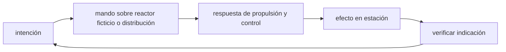

<!-- clase-meta
tipo_documento: clase
clase: 5
codigo: ESTRELLADELA-05
curso: estrella-de-la-muerte
titulo: "Mandos e instrumentos de la Estrella de la Muerte"
modalidad: "taller de simulación"
duracion_minutos: 60
nivel: introductorio
prerrequisito: ESTRELLADELA-04
competencia: "lectura_y_mando"
resultados_aprendizaje:
  - "Explicar controles, instrumentos, entradas y estados del sistema con vocabulario propio de Estrella de la Muerte."
  - "Aplicar esos conceptos a una decisión segura o a un escenario de simulación de Estrella de la Muerte."
evidencia: "Mapa de mandos y resolución de dos estados del tablero."
criterio_aprobacion: "Reconoce los controles críticos y responde a los estados sin introducir acciones inseguras."
fuentes: manuales/fuentes.md
ultima_revision: 2026-09-10
-->

# 🎛️ Mandos e instrumentos de la Estrella de la Muerte

[🏠 Inicio](../../../README.md) · [🌑 Curso: Estrella de la Muerte](../README.md) · 🎛️ Mandos

> ⚖️ Material educativo original; los derechos de las obras pertenecen a sus titulares.

## Vista general

El centro de control de una estación-mundo realista no es una cabina, sino la
sala de mando de una instalación del tamaño de una ciudad. Nadie "pilota" una
masa de dimensiones lunares con reflejos: se coordinan equipos que vigilan
energía, calor, gravedad estructural, soporte vital y logística. La clave es el
reparto de energía, porque todos los sistemas compiten por el mismo presupuesto.

## Mapa de controles

| Zona | Control | Tipo | Función | Prioridad | Comentarios |
| --- | --- | --- | --- | --- | --- |
| Estación de energía | Reparto de potencia | Consola | Distribuir el presupuesto de energía | Alta | Todos los sistemas compiten por el. |
| Estación térmica | Control de calor | Panel | Vigilar y radiar el calor generado | Alta | Limita cuanta energía se puede usar. |
| Estación de propulsión | Ordenes de maniobra | Consola | Pedir cambios de rumbo o velocidad | Media | La respuesta es lentísima por la masa. |
| Estación de soporte vital | Habitabilidad | Panel | Aire, agua y temperatura interior | Alta | Mantiene con vida a la población. |
| Estación de logística | Suministros internos | Consola | Coordinar comida, agua y transporte | Alta | Sostiene a millones de personas. |
| Estación de sensores | Vigilancia del entorno | Pantallas | Detectar objetos y trayectorias | Media | El entorno se explora a gran distancia. |
| Puesto de coordinación | Comunicación interna | Consola | Enlazar todas las estaciones | Media | Una ciudad-mundo exige coordinación. |

## Instrumentos principales

| Instrumento | Muestra | Unidad | Importancia | Notas |
| --- | --- | --- | --- | --- |
| Presupuesto de energía | Energía disponible y repartida | porcentaje | Alta | Todos los sistemas compiten por el. |
| Calor acumulado | Calor pendiente de radiar | porcentaje | Alta | La superficie limita su evacuación. |
| Estado de soporte vital | Aire, agua y temperatura | varios | Alta | Vital para la población. |
| Estado logístico | Suministros y transporte interno | varios | Alta | Sostiene la vida diaria. |
| Vector de velocidad | Movimiento de la estación | m/s | Media | Cambia muy despacio por la masa. |
| Gravedad interior | Nivel de gravedad propia | relativa | Media | Define el arriba y el abajo internos. |

## Entradas de simulación

| Acción | Teclado | Controlador | Comentarios |
| --- | --- | --- | --- |
| Repartir energía | 1 a 5 | Cruceta | Prioriza soporte vital, calor o propulsión. |
| Aumentar radiación de calor | R | Gatillo derecho | Expulsa más calor por la superficie. |
| Ordenar maniobra | Flechas | Stick izquierdo | La estación tarda muchísimo en responder. |
| Control de soporte vital | V | Botón de menu | Ajusta aire, agua y temperatura. |
| Gestión logística | L | Botón lateral | Coordina suministros y transporte. |
| Alerta térmica | Barra espaciadora | Botón central | Reduce consumos si el calor sube demasiado. |

## Estados del sistema

| Estado | Descripción | Indicadores | Acciones disponibles |
| --- | --- | --- | --- |
| Estable | Sistemas equilibrados | Energía y calor bajo control | Vigilar y planificar. |
| Alto consumo | Un sistema exige mucha energía | Presupuesto muy ajustado | Recortar en otros sistemas. |
| Sobrecalentando | Más calor del que se radia | Calor acumulado alto | Bajar consumos, radiar más. |
| Emergencia | Falla de energía o soporte vital | Alertas múltiples | Priorizar la vida de la población. |

## Observaciones ergonomicas

- El presupuesto de energía debe estar siempre visible: es la decisión central
  de toda la operación.
- El calor acumulado es tan crítico como la energía: si sube demasiado, hay que
  recortar consumos aunque duela.
- La maniobra debe planificarse con mucha antelación; la masa hace que la
  respuesta llegue tardísimo.
- Conviene un modo asistido que reparta energía de forma segura y avise antes de
  que el calor alcance niveles peligrosos.

## 🧭 Guía de estudio aplicada

### Pregunta guía

¿Cómo ayuda **Vista general, Mapa de controles, Instrumentos principales y Entradas de simulación** a **interpretar mandos e indicaciones durante falla simulada de distribución que afecta sectores distintos**?

### Explicación razonada

Un mando no se aprende memorizando su nombre, sino recorriendo el ciclo intención → acción → indicación → verificación. En Estrella de la Muerte, el operador actúa sobre reactor ficticio o distribución, observa la respuesta en propulsión y control y confirma el efecto en estación. Una indicación inesperada exige detener la secuencia mental, identificar el modo activo y evitar una segunda orden que agrave el estado.

Esta clase se conecta con el resto del curso mediante **una megaestructura debe modelarse como red de subsistemas y dependencias, no como un solo vehículo**. El hilo de
seguridad consiste en reconocer a tiempo **crear un sistema invulnerable o sin propagación comprensible de fallas** y poder justificar la decisión
**mapear dependencias, redundancias y estados degradados antes de decidir**; en clases posteriores cambiará el ángulo de análisis, no esa relación causal.
La lectura funcional común sigue **reactor ficticio → distribución → propulsión y control → estación**, de modo que cada concepto pueda
ubicarse dentro del funcionamiento completo y no quede como un dato aislado.

**Apoyo documental:** [Death Star](https://www.starwars.com/databank/death-star) aporta canon narrativo de la estación;
[Spaceships and Rockets](https://www.nasa.gov/humans-in-space/spaceships-and-rockets/) se usa para naves, sistemas y misiones. Estas fuentes
se contrastan con el alcance de la clase y no sustituyen un manual de equipo concreto.

### Caso resuelto: de la observación a la decisión

1. **Intención:** formula qué cambio se necesita durante **falla simulada de distribución que afecta sectores distintos**.
2. **Mando:** identifica el control que actúa sobre **reactor ficticio** o **distribución** y el modo que debe estar activo.
3. **Lectura:** localiza la indicación que confirma la respuesta de **propulsión y control** y el efecto en **estación**.
4. **Verificación:** si la lectura no coincide, no acumules órdenes; estabiliza e investiga el estado.

### Comprueba tu comprensión

1. ¿Qué mando inicia la respuesta y qué instrumento confirma que el modo correcto está activo?
2. ¿Qué indicación temprana advertiría **crear un sistema invulnerable o sin propagación comprensible de fallas**?
3. ¿Qué secuencia usarías si la respuesta de **estación** no coincide con la orden?

Orientación para revisar tus respuestas

- La primera respuesta debe relacionar el eslabón elegido con un efecto posterior, no solo nombrarlo.
- La segunda debe proponer una señal medible u observable y explicar qué tendencia sería preocupante.
- La tercera debe cambiar al menos una variable de capacidad, mando, entorno o margen de seguridad.

## 🎓 Cierre de clase

- **Actividad:** Recorre el puesto de mando simulado de Estrella de la Muerte: localiza los controles de controles, instrumentos, entradas y estados del sistema y asocia cada indicación con una decisión.
- **Evidencia:** Mapa de mandos y resolución de dos estados del tablero.
- **Criterio de aprobación:** Reconoce los controles críticos y responde a los estados sin introducir acciones inseguras.
- **Transferencia:** explica qué cambiaría al pasar a otra variante de esta máquina.

### Fuentes de esta clase

- [STARWARS-DEATHSTAR](https://www.starwars.com/databank/death-star): Death Star, Lucasfilm. Uso: canon narrativo de la estación.
- [NASA-SPACECRAFT](https://www.nasa.gov/humans-in-space/spaceships-and-rockets/): Spaceships and Rockets, NASA. Uso: naves, sistemas y misiones.
- [NASA-FLIGHT](https://www1.grc.nasa.gov/beginners-guide-to-aeronautics/): Beginner's Guide to Aeronautics, NASA. Uso: contraste con física y vuelo reales.

> Las fuentes sostienen el marco conceptual y normativo; esta clase no reemplaza el manual
> del fabricante, la formación certificada ni la habilitación exigida para operar equipos reales.

---

[⬅️ Anterior: Sistemas mecánicos](../operacion/sistemas-mecanicos-estrella-de-la-muerte.md) · [➡️ Siguiente: Principios y operación](../operacion/principios-estrella-de-la-muerte.md)
