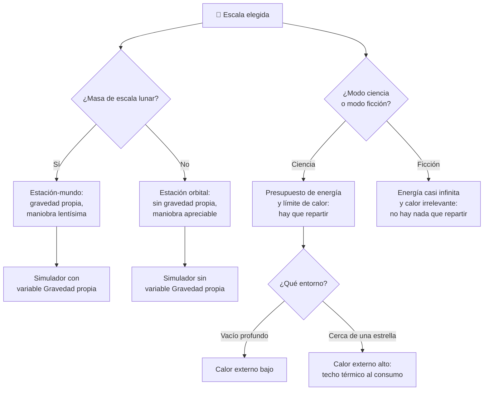

# 🧩 Modelos y variantes de la Estrella de la Muerte

[🏠 Inicio](../../../README.md) · [🌑 Curso: Estrella de la Muerte](../README.md) · 🧩 Modelos

> ⚖️ Material educativo original; los derechos de las obras pertenecen a sus titulares.

El [Módulo 2](../operacion/caracteristicas-estrella-de-la-muerte.md) ya dijo qué
es una estación del tamaño de una luna y qué rasgos la definen. Este módulo
empieza reconociendo un problema honesto: **aquí no hay una familia de modelos**.
No existen la "versión turismo" y la "versión deportiva" de una estación-mundo.
Hay una sola estación. Lo que sí cambia —y cambia el mando entero— es la
**escala** a la que se la mira y el **modo** con el que se la simula.

> 🎯 **La idea que sostiene el módulo.** El eje real de este curso no es el
> modelo: es la escala. Una estación orbital y una estación-mundo no son la misma
> máquina en dos tamaños. Al llegar al tamaño de una luna aparecen gravedad
> propia, un presupuesto de energía que no alcanza y un calor que solo puede
> salir por la superficie. Esos no son ajustes de dificultad: son mandos que
> aparecen y desaparecen del puesto de control.

---

## 🧭 Por qué el modelo decide el simulador

El [Módulo 5](../mandos/manual-mandos-estrella-de-la-muerte.md) describe un
puesto de mando con una estación de energía que reparte el presupuesto, una
estación térmica que vigila el calor acumulado y un instrumento de gravedad
interior. El [Módulo 9](../simulacion/diseno-simulador-estrella-de-la-muerte.md)
expone variables como `Presupuesto de energía`, `Calor acumulado`, `Gravedad
propia` y `Masa total`. Todas describen una estación **de escala lunar operada en
modo ciencia**.

Cambia la escala y esas variables se quedan sin contenido. En una estación
orbital de escala real no hay `Gravedad propia` que leer: no hay masa suficiente
para generarla, y el instrumento de gravedad interior del Módulo 5 no mide nada.
Cambia el modo y ocurre algo aún más fuerte: el propio Módulo 9 define el **modo
ficción** como aquel en el que la energía es casi infinita y el calor no molesta.
En ese modo, el reparto de potencia —la decisión central de toda la operación
según el Módulo 5— deja de decidir nada. El mando sigue en la consola, pero ya no
manda.

Si el simulador se construye sobre un solo esquema, está representando una
escala concreta y un modo concreto aunque diga representarlos todos.

---

## 🗂️ Qué cambia en el manejo

| Modelo o escala | Qué cambia en su operación |
| --- | --- |
| Estación-mundo en modo ciencia | La referencia del curso: gravedad propia, presupuesto de energía que hay que repartir, calor que solo se radia por la superficie y una masa que hace lentísima cualquier maniobra. |
| Estación-mundo en modo ficción | La energía deja de escasear y el calor deja de acumularse. La operación se vuelve espectacular y deja de ser un problema de reparto: ya no hay nada que recortar. |
| Estación orbital de escala real | Sin masa de escala lunar no hay gravedad propia: desaparece el "abajo" hacia el centro. La maniobra deja de ser lentísima y la estructura ya no tiene que soportar su propio peso planetario. |
| Escenario en órbita de un planeta | A la gravedad propia se le suma la externa, y aparecen esfuerzos de marea y trayectorias curvas. La estructura pasa a ser una preocupación permanente. |
| Escenario cerca de una estrella | El calor externo elevado dificulta expulsar el calor generado dentro. Más energía va a protección térmica y disipación, así que queda menos para todo lo demás. |
| Escenario en sistema estelar | La autonomía deja de ser propia: la estación depende del tráfico de naves para abastecerse, y la logística pasa al primer plano. |

---

## 🎛️ Qué cambia en el mando

| Modelo o escala | Qué mando aparece o desaparece | Consecuencia |
| --- | --- | --- |
| Estación-mundo en modo ciencia | Ninguno: el mapa de controles del Módulo 5 aplica tal cual. | Es el caso base del curso. |
| Estación-mundo en modo ficción | **Se vacían** el reparto de potencia y la alerta térmica: siguen presentes, pero con energía casi infinita y calor irrelevante no queda nada que repartir ni que recortar. | El operador deja de decidir. La estación se pilota; no se administra. |
| Estación orbital de escala real | **Desaparece** el instrumento de gravedad interior: sin masa lunar no hay gravedad propia que leer. Las órdenes de maniobra **dejan de ser** una planificación a muy largo plazo. | Se pierde el "arriba y abajo" internos y la maniobra vuelve a ser una respuesta, no una espera. |
| Escenario en órbita de un planeta | **Aparece** la vigilancia de esfuerzos estructurales por la gravedad externa y las mareas. | La mecánica orbital condiciona todas las demás órdenes. |
| Escenario cerca de una estrella | El control de calor **pasa de vigilar a limitar**: el calor externo fija cuánta energía se puede gastar. | La estación térmica manda sobre la de energía, y no al revés. |
| Escenario en sistema estelar | **Gana peso** la consola de logística: los suministros dejan de ser internos. | No es un mando nuevo, pero cambia la prioridad de todos los demás. |

---

## 🎮 Qué cambia en el simulador

Contrastado con las variables del
[Módulo 9](../simulacion/diseno-simulador-estrella-de-la-muerte.md):

| Modelo o escala | Variables que cambian | Esquema de control |
| --- | --- | --- |
| Estación-mundo en modo ciencia | Ninguna: es el caso base. `Modo` fijado en ciencia. | El del Módulo 5. |
| Estación-mundo en modo ficción | `Modo` **conmuta** a ficción. `Presupuesto de energía` deja de limitar y `Calor acumulado` deja de subir con el consumo. `Masa total` deja de frenar la maniobra. | El mismo puesto, pero sin decisión de reparto ni de recorte térmico. |
| Estación orbital de escala real | `Gravedad propia` **se elimina**: sin masa lunar no tiene valor que tomar. `Masa total` sale de la escala del curso y deja de dominar la aceleración. | Sin lectura de gravedad interior; maniobra con respuesta apreciable. |
| Escenario en órbita de un planeta | `Gravedad propia` deja de ser el único término: se le suma la gravedad externa del planeta. | El mismo, con la estructura como límite añadido. |
| Escenario cerca de una estrella | `Calor externo` sube de `0` a `alto` y estrangula la radiación por superficie; `Calor acumulado` se vuelve la variable crítica. | El mismo, con el techo térmico decidiendo el reparto. |
| Escenario en sistema estelar | `Estado logístico` deja de depender solo de los ciclos internos y pasa a depender del abastecimiento externo. | El mismo, con la logística como prioridad. |

---

## 🗺️ Del modelo al esquema de control

---

## ⚠️ Qué modelos no comparten simulador

Dos casos no se resuelven ajustando parámetros, porque su esquema de control es
otro:

- **La estación orbital de escala real** frente a la estación-mundo: no es una
  estación-mundo pequeña. Le falta una variable entera (`Gravedad propia`) y la
  masa deja de gobernar la maniobra. Es otra máquina, no otro tamaño. Esta es
  justamente la frontera que el curso quiere hacer sentir: al alcanzar el tamaño
  de una luna, la nave deja de comportarse como nave y empieza a comportarse
  como mundo.
- **El modo ficción** frente al modo ciencia: no es un nivel fácil. Con energía
  casi infinita y calor irrelevante, el reparto de potencia deja de ser una
  decisión, y el puesto de mando del Módulo 5 se queda sin su función central.
  Por eso las [reglas del universo](../reglamentos/reglas-universo-estrella-de-la-muerte.md)
  piden avisar en pantalla qué regla se activa o se desactiva al conmutar: no es
  un ajuste, es otro contrato con el jugador.

Los escenarios de entorno del [Módulo 7](../operacion/entornos-estrella-de-la-muerte.md)
sí caben en un mismo simulador ajustando rangos, tal como plantean los
[niveles de realismo](../../../docs/03-niveles-de-realismo.md): en el nivel 1
basta con notar que existen gravedad propia y un límite de energía, y las
diferencias emergen a medida que el nivel sube.

---

[⬅️ Anterior: Características](../operacion/caracteristicas-estrella-de-la-muerte.md) · [➡️ Siguiente: Sistemas mecánicos](../operacion/sistemas-mecanicos-estrella-de-la-muerte.md)
