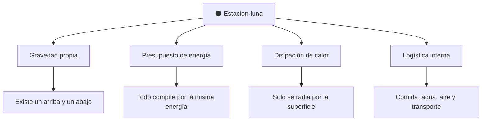

# 📋 Características de la Estrella de la Muerte

[🏠 Inicio](../../../README.md) · [🌑 Curso: Estrella de la Muerte](../README.md) · 📋 Características

> ⚖️ Material educativo original; los derechos de las obras pertenecen a sus titulares.

Que es una estación del tamaño de una luna genérica, que rasgos la definen en la
ficción y cuales tendrían sentido físico real. Este módulo da el contexto antes
de abrir la tecnología por dentro en el Módulo 3.

---

## 🧭 Definición

Una estación-mundo, en la ficción estilo "Star Wars", es una construcción
esférica del tamaño de una luna pequeña, con millones de habitantes, hangares,
ciudades interiores y una enorme concentración de energía. La imaginamos como una
base capaz de moverse por el espacio. En este curso la usamos como excusa para
estudiar que le pasa a la física cuando algo alcanza el tamaño de un cuerpo
celeste.

---

## 🧬 Características clave

| Característica | Como la muestra la ficción | Lectura física real |
| --- | --- | --- |
| Tamaño de luna | Esfera de decenas de kilómetros | A esa masa aparece gravedad propia. |
| Forma esférica | Superficie enorme y regular | Coherente: una masa grande tiende a la esfera. |
| Población inmensa | Millones de tripulantes | Exige soporte vital y logística colosales. |
| Energía concentrada | Potencia casi ilimitada | Habría un presupuesto de energía con límites. |
| Movilidad | Se desplaza por el espacio | Mover esa masa exige un empuje descomunal. |
| Autonomía | Se abastece a si misma | Muy exigente; depende de ciclos y suministros. |

---

## 🗂️ Aspectos conceptuales de la estación

| Aspecto | Idea en la ficción | Compromiso físico |
| --- | --- | --- |
| Gravedad propia | Se camina como en un planeta | A esa masa la gravedad sería real y notable. |
| Energía | Fuente casi infinita | En la realidad habría un presupuesto limitado. |
| Calor | No se menciona | Disiparlo sería un reto enorme por la escala. |
| Logística | Todo funciona sin más | Sostener millones de personas es colosal. |

---

## 🎯 Para qué sirve en el relato

- Representar una amenaza abrumadora y un símbolo de poder.
- Ofrecer un escenario colosal para las escenas de la historia.
- Concentrar en un solo lugar una fuerza que parece invencible.

En cambio, para este curso sirve como laboratorio: cada rasgo colosal nos deja
preguntar si sería posible y por qué.

---

[⬅️ Anterior: Historia](../historia/historia-estrella-de-la-muerte.md) · [➡️ Siguiente: Sistemas mecánicos](sistemas-mecanicos-estrella-de-la-muerte.md)
