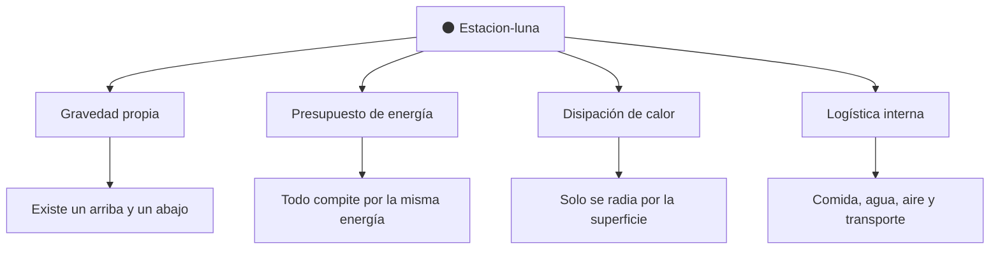

<!-- clase-meta
tipo_documento: clase
clase: 2
codigo: ESTRELLADELA-02
curso: estrella-de-la-muerte
titulo: "Características de la Estrella de la Muerte"
modalidad: "teórica aplicada"
duracion_minutos: 45
nivel: introductorio
prerrequisito: ESTRELLADELA-01
competencia: "identificacion_funcional"
resultados_aprendizaje:
  - "Explicar definición, rasgos funcionales, tipos y usos con vocabulario propio de Estrella de la Muerte."
  - "Aplicar esos conceptos a una decisión segura o a un escenario de simulación de Estrella de la Muerte."
evidencia: "Matriz comparativa y decisión justificada."
criterio_aprobacion: "La elección considera función, límites, mando y efecto en la simulación; no se apoya solo en preferencias."
fuentes: manuales/fuentes.md
ultima_revision: 2026-09-10
-->

# 📋 Características de la Estrella de la Muerte

[🏠 Inicio](../../../README.md) · [🌑 Curso: Estrella de la Muerte](../README.md) · 📋 Características

> ⚖️ Material educativo original; los derechos de las obras pertenecen a sus titulares.

Que es una estación del tamaño de una luna genérica, que rasgos la definen en la
ficción y cuales tendrían sentido físico real. Esta clase da el contexto antes
de abrir la tecnología por dentro en el Clase 4.

---

## 🧭 Definición

Una estación-mundo, en la ficción estilo "Star Wars", es una construcción
esférica del tamaño de una luna pequeña, con millones de habitantes, hangares,
ciudades interiores y una enorme concentración de energía. La imaginamos como una
base capaz de moverse por el espacio. En este curso la usamos como excusa para
estudiar que le pasa a la física cuando algo alcanza el tamaño de un cuerpo
celeste.

---

## 🧬 Características clave

| Característica | Como la muestra la ficción | Lectura física real |
| --- | --- | --- |
| Tamaño de luna | Esfera de decenas de kilómetros | A esa masa aparece gravedad propia. |
| Forma esférica | Superficie enorme y regular | Coherente: una masa grande tiende a la esfera. |
| Población inmensa | Millones de tripulantes | Exige soporte vital y logística colosales. |
| Energía concentrada | Potencia casi ilimitada | Habría un presupuesto de energía con límites. |
| Movilidad | Se desplaza por el espacio | Mover esa masa exige un empuje descomunal. |
| Autonomía | Se abastece a si misma | Muy exigente; depende de ciclos y suministros. |

---

## 🗂️ Aspectos conceptuales de la estación

```mermaid
flowchart TD
    Estacion[🌑 Estacion-luna] --> Gravedad[Gravedad propia]
    Estacion --> Energia[Presupuesto de energía]
    Estacion --> Calor[Disipación de calor]
    Estacion --> Logistica[Logística interna]
    Gravedad --> Arriba[Existe un arriba y un abajo]
    Energia --> Limite[Todo compite por la misma energía]
    Calor --> Radiar[Solo se radia por la superficie]
    Logistica --> Suministro[Comida, agua, aire y transporte]
```

| Aspecto | Idea en la ficción | Compromiso físico |
| --- | --- | --- |
| Gravedad propia | Se camina como en un planeta | A esa masa la gravedad sería real y notable. |
| Energía | Fuente casi infinita | En la realidad habría un presupuesto limitado. |
| Calor | No se menciona | Disiparlo sería un reto enorme por la escala. |
| Logística | Todo funciona sin más | Sostener millones de personas es colosal. |

---

## 🎯 Para qué sirve en el relato

- Representar una amenaza abrumadora y un símbolo de poder.
- Ofrecer un escenario colosal para las escenas de la historia.
- Concentrar en un solo lugar una fuerza que parece invencible.

En cambio, para este curso sirve como laboratorio: cada rasgo colosal nos deja
preguntar si sería posible y por qué.

## 🧭 Guía de estudio aplicada

### Pregunta guía

¿Cómo ayuda **Definición, Características clave, Aspectos conceptuales de la estación y Para qué sirve en el relato** a **elegir una configuración adecuada para falla simulada de distribución que afecta sectores distintos**?

### Explicación razonada

Una característica solo es útil cuando permite anticipar comportamiento. En Estrella de la Muerte, la relación entre reactor ficticio, distribución, propulsión y control y estación determina capacidad, respuesta y límites. Por eso «estación móvil ficticia frente a estación orbital real» no se compara por apariencia: se compara por misión, entorno, carga de trabajo y exposición al riesgo «crear un sistema invulnerable o sin propagación comprensible de fallas».

Esta clase se conecta con el resto del curso mediante **una megaestructura debe modelarse como red de subsistemas y dependencias, no como un solo vehículo**. El hilo de
seguridad consiste en reconocer a tiempo **crear un sistema invulnerable o sin propagación comprensible de fallas** y poder justificar la decisión
**mapear dependencias, redundancias y estados degradados antes de decidir**; en clases posteriores cambiará el ángulo de análisis, no esa relación causal.
La lectura funcional común sigue **reactor ficticio → distribución → propulsión y control → estación**, de modo que cada concepto pueda
ubicarse dentro del funcionamiento completo y no quede como un dato aislado.

**Apoyo documental:** [Death Star](https://www.starwars.com/databank/death-star) aporta canon narrativo de la estación;
[Spaceships and Rockets](https://www.nasa.gov/humans-in-space/spaceships-and-rockets/) se usa para naves, sistemas y misiones. Estas fuentes
se contrastan con el alcance de la clase y no sustituyen un manual de equipo concreto.

### Caso resuelto: de la observación a la decisión

1. **Definir la necesidad:** convierte «falla simulada de distribución que afecta sectores distintos» en requisitos de capacidad, entorno y respuesta.
2. **Comparar:** contrasta **estación móvil ficticia frente a estación orbital real** usando esos requisitos y la cadena **reactor ficticio → distribución → propulsión y control → estación**.
3. **Descartar:** elimina la alternativa que deja menos margen frente a **crear un sistema invulnerable o sin propagación comprensible de fallas**.
4. **Elegir:** declara la variante escogida, la evidencia usada y una limitación que todavía debe respetarse.

### Comprueba tu comprensión

1. ¿Qué característica de **estación** condiciona primero el caso «falla simulada de distribución que afecta sectores distintos»?
2. ¿Qué requisito descartaría una de las alternativas **estación móvil ficticia frente a estación orbital real**?
3. ¿Qué límite debe declararse junto con la variante elegida?

Orientación para revisar tus respuestas

- La primera respuesta debe relacionar el eslabón elegido con un efecto posterior, no solo nombrarlo.
- La segunda debe proponer una señal medible u observable y explicar qué tendencia sería preocupante.
- La tercera debe cambiar al menos una variable de capacidad, mando, entorno o margen de seguridad.

## 🎓 Cierre de clase

- **Actividad:** Compara variantes de Estrella de la Muerte mediante los ejes «definición, rasgos funcionales, tipos y usos» y elige una para un caso de uso razonado.
- **Evidencia:** Matriz comparativa y decisión justificada.
- **Criterio de aprobación:** La elección considera función, límites, mando y efecto en la simulación; no se apoya solo en preferencias.
- **Transferencia:** explica qué cambiaría al pasar a otra variante de esta máquina.

### Fuentes de esta clase

- [STARWARS-DEATHSTAR](https://www.starwars.com/databank/death-star): Death Star, Lucasfilm. Uso: canon narrativo de la estación.
- [NASA-SPACECRAFT](https://www.nasa.gov/humans-in-space/spaceships-and-rockets/): Spaceships and Rockets, NASA. Uso: naves, sistemas y misiones.
- [NASA-FLIGHT](https://www1.grc.nasa.gov/beginners-guide-to-aeronautics/): Beginner's Guide to Aeronautics, NASA. Uso: contraste con física y vuelo reales.

> Las fuentes sostienen el marco conceptual y normativo; esta clase no reemplaza el manual
> del fabricante, la formación certificada ni la habilitación exigida para operar equipos reales.

---

[⬅️ Anterior: Historia](../historia/historia-estrella-de-la-muerte.md) · [➡️ Siguiente: Modelos y variantes](../modelos/modelos-estrella-de-la-muerte.md)
