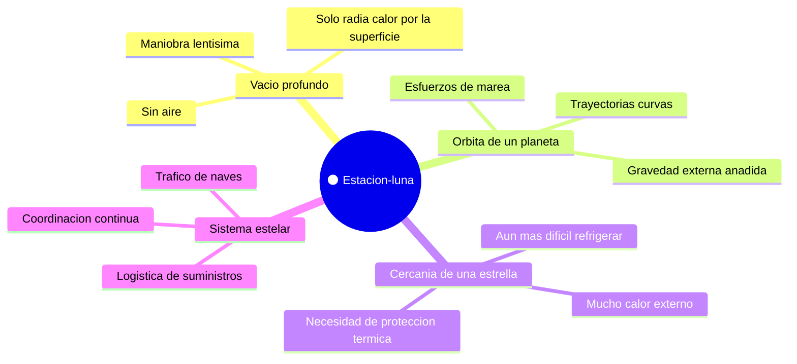

# 🌍 Entornos de la Estrella de la Muerte

[🏠 Inicio](../../../README.md) · [🌑 Curso: Estrella de la Muerte](../README.md) · 🌍 Entornos

> ⚖️ Material educativo original; los derechos de las obras pertenecen a sus titulares.

Dónde opera una estación del tamaño de una luna y cómo cambia su comportamiento
según el entorno. Cada escenario implica reglas físicas distintas, y en
simulación se traduce en condiciones diferentes de gravedad, energía y calor.

---

## 🗺️ Entornos principales

| Entorno | Características | Riesgos típicos | Ajuste de operación |
| --- | --- | --- | --- |
| Vacío profundo | Sin aire; solo radia calor. | Acumular calor, gastar energía. | Reparto cuidadoso de energía y calor. |
| Órbita de un planeta | Gravedad externa y esfuerzos de marea. | Deformación, caída o escape. | Respetar mecánica orbital, cuidar la estructura. |
| Cercanía de una estrella | Calor externo elevado. | Sobrecalentamiento. | Reforzar la disipación y la protección térmica. |
| Sistema estelar | Tráfico y suministros. | Fallos de logística. | Coordinar transporte y abastecimiento. |

---

## 🌡️ Factores del entorno

- **Gravedad**: la estación tiene la suya propia, y cerca de un planeta se suma la
  externa, que añade esfuerzos a su estructura.
- **Calor externo**: cerca de una estrella recibe calor de fuera, lo que dificulta
  aún más expulsar el que genera por dentro.
- **Energía**: el entorno no cambia el presupuesto, pero si las prioridades; en un
  entorno hostil, más energía va a protección y disipación.
- **Logística**: en un sistema estelar la estación depende del tráfico de naves
  para abastecerse, y eso condiciona su autonomía real.

---

## 🎮 Traducción a simulación

Cada entorno es un escenario con su gravedad, su calor externo y su exigencia
logística. Acercarse a una estrella o a un planeta cambia por completo el
equilibrio de energía y calor, y es una gran lección sobre los límites de una
estructura de escala planetaria. Ver cómo se modela en el
[Módulo 9: Diseño de simulación](../simulacion/diseno-simulador-estrella-de-la-muerte.md).

---

[⬅️ Anterior: Principios y operación](principios-estrella-de-la-muerte.md) · [➡️ Siguiente: Reglas del universo](../reglamentos/reglas-universo-estrella-de-la-muerte.md)
