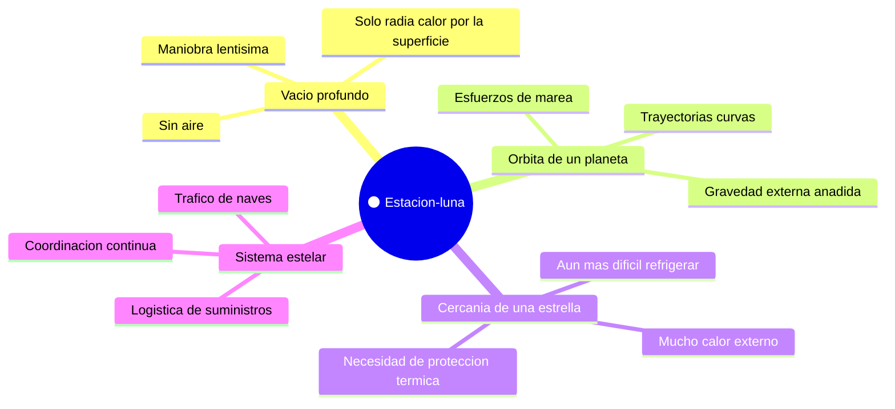

<!-- clase-meta
tipo_documento: clase
clase: 7
codigo: ESTRELLADELA-07
curso: estrella-de-la-muerte
titulo: "Entornos de la Estrella de la Muerte"
modalidad: "análisis de escenarios"
duracion_minutos: 60
nivel: introductorio
prerrequisito: ESTRELLADELA-06
competencia: "adaptacion_al_entorno"
resultados_aprendizaje:
  - "Explicar entornos, factores ambientales, riesgos y respuesta de simulación con vocabulario propio de Estrella de la Muerte."
  - "Aplicar esos conceptos a una decisión segura o a un escenario de simulación de Estrella de la Muerte."
evidencia: "Matriz entorno–cambio–riesgo–respuesta."
criterio_aprobacion: "Cada respuesta se adapta al entorno y distingue riesgos que no son intercambiables entre escenarios."
fuentes: manuales/fuentes.md
ultima_revision: 2026-09-10
-->

# 🌍 Entornos de la Estrella de la Muerte

[🏠 Inicio](../../../README.md) · [🌑 Curso: Estrella de la Muerte](../README.md) · 🌍 Entornos

> ⚖️ Material educativo original; los derechos de las obras pertenecen a sus titulares.

Dónde opera una estación del tamaño de una luna y cómo cambia su comportamiento
según el entorno. Cada escenario implica reglas físicas distintas, y en
simulación se traduce en condiciones diferentes de gravedad, energía y calor.

---

## 🗺️ Entornos principales

```mermaid
mindmap
  root((🌑 Estacion-luna))
    Vacio profundo
      Sin aire
      Solo radia calor por la superficie
      Maniobra lentisima
    Orbita de un planeta
      Gravedad externa anadida
      Esfuerzos de marea
      Trayectorias curvas
    Cercania de una estrella
      Mucho calor externo
      Aun mas dificil refrigerar
      Necesidad de proteccion termica
    Sistema estelar
      Trafico de naves
      Logistica de suministros
      Coordinacion continua
```

| Entorno | Características | Riesgos típicos | Ajuste de operación |
| --- | --- | --- | --- |
| Vacío profundo | Sin aire; solo radia calor. | Acumular calor, gastar energía. | Reparto cuidadoso de energía y calor. |
| Órbita de un planeta | Gravedad externa y esfuerzos de marea. | Deformación, caída o escape. | Respetar mecánica orbital, cuidar la estructura. |
| Cercanía de una estrella | Calor externo elevado. | Sobrecalentamiento. | Reforzar la disipación y la protección térmica. |
| Sistema estelar | Tráfico y suministros. | Fallos de logística. | Coordinar transporte y abastecimiento. |

---

## 🌡️ Factores del entorno

- **Gravedad**: la estación tiene la suya propia, y cerca de un planeta se suma la
  externa, que añade esfuerzos a su estructura.
- **Calor externo**: cerca de una estrella recibe calor de fuera, lo que dificulta
  aún más expulsar el que genera por dentro.
- **Energía**: el entorno no cambia el presupuesto, pero si las prioridades; en un
  entorno hostil, más energía va a protección y disipación.
- **Logística**: en un sistema estelar la estación depende del tráfico de naves
  para abastecerse, y eso condiciona su autonomía real.

---

## 🎮 Traducción a simulación

Cada entorno es un escenario con su gravedad, su calor externo y su exigencia
logística. Acercarse a una estrella o a un planeta cambia por completo el
equilibrio de energía y calor, y es una gran lección sobre los límites de una
estructura de escala planetaria. Ver cómo se modela en el
[Clase 9: Diseño de simulación](../simulacion/diseno-simulador-estrella-de-la-muerte.md).

## 🧭 Guía de estudio aplicada

### Pregunta guía

¿Cómo ayuda **Entornos principales, Factores del entorno, Traducción a simulación y Guía de estudio aplicada** a **adaptar falla simulada de distribución que afecta sectores distintos a tres condiciones ambientales distintas**?

### Explicación razonada

El entorno no es decoración: modifica las fuerzas, la percepción y el tiempo disponible. En el caso «falla simulada de distribución que afecta sectores distintos», cambia el comportamiento de estación y aumenta la probabilidad de crear un sistema invulnerable o sin propagación comprensible de fallas. La respuesta correcta empieza por reconocer qué variable cambió y después adaptar límites, ruta o misión.

Esta clase se conecta con el resto del curso mediante **una megaestructura debe modelarse como red de subsistemas y dependencias, no como un solo vehículo**. El hilo de
seguridad consiste en reconocer a tiempo **crear un sistema invulnerable o sin propagación comprensible de fallas** y poder justificar la decisión
**mapear dependencias, redundancias y estados degradados antes de decidir**; en clases posteriores cambiará el ángulo de análisis, no esa relación causal.
La lectura funcional común sigue **reactor ficticio → distribución → propulsión y control → estación**, de modo que cada concepto pueda
ubicarse dentro del funcionamiento completo y no quede como un dato aislado.

**Apoyo documental:** [Death Star](https://www.starwars.com/databank/death-star) aporta canon narrativo de la estación;
[Spaceships and Rockets](https://www.nasa.gov/humans-in-space/spaceships-and-rockets/) se usa para naves, sistemas y misiones. Estas fuentes
se contrastan con el alcance de la clase y no sustituyen un manual de equipo concreto.

### Caso resuelto: de la observación a la decisión

1. **Escenario base:** conserva la misión «falla simulada de distribución que afecta sectores distintos» para poder comparar.
2. **Cambiar una condición:** modifica sucesivamente superficie o medio, visibilidad y perturbación externa.
3. **Recalcular margen:** explica cómo cada cambio afecta **estación** y acerca o aleja **crear un sistema invulnerable o sin propagación comprensible de fallas**.
4. **Adaptar:** cambia límite, ruta, configuración o incluso cancela; no mantengas la misma respuesta por hábito.

### Comprueba tu comprensión

1. ¿Cómo cambiaría **estación** si empeora la perturbación externa?
2. ¿Qué condición ambiental acerca más el escenario a **crear un sistema invulnerable o sin propagación comprensible de fallas**?
3. ¿Cuándo adaptarías la maniobra y cuándo la cancelarías?

Orientación para revisar tus respuestas

- La primera respuesta debe relacionar el eslabón elegido con un efecto posterior, no solo nombrarlo.
- La segunda debe proponer una señal medible u observable y explicar qué tendencia sería preocupante.
- La tercera debe cambiar al menos una variable de capacidad, mando, entorno o margen de seguridad.

## 🎓 Cierre de clase

- **Actividad:** Contrasta tres entornos de Estrella de la Muerte a partir de entornos, factores ambientales, riesgos y respuesta de simulación y determina cómo cambian variables, percepción, riesgos y respuesta.
- **Evidencia:** Matriz entorno–cambio–riesgo–respuesta.
- **Criterio de aprobación:** Cada respuesta se adapta al entorno y distingue riesgos que no son intercambiables entre escenarios.
- **Transferencia:** explica qué cambiaría al pasar a otra variante de esta máquina.

### Fuentes de esta clase

- [STARWARS-DEATHSTAR](https://www.starwars.com/databank/death-star): Death Star, Lucasfilm. Uso: canon narrativo de la estación.
- [NASA-SPACECRAFT](https://www.nasa.gov/humans-in-space/spaceships-and-rockets/): Spaceships and Rockets, NASA. Uso: naves, sistemas y misiones.
- [NASA-FLIGHT](https://www1.grc.nasa.gov/beginners-guide-to-aeronautics/): Beginner's Guide to Aeronautics, NASA. Uso: contraste con física y vuelo reales.

> Las fuentes sostienen el marco conceptual y normativo; esta clase no reemplaza el manual
> del fabricante, la formación certificada ni la habilitación exigida para operar equipos reales.

---

[⬅️ Anterior: Principios y operación](principios-estrella-de-la-muerte.md) · [➡️ Siguiente: Reglas del universo](../reglamentos/reglas-universo-estrella-de-la-muerte.md)
