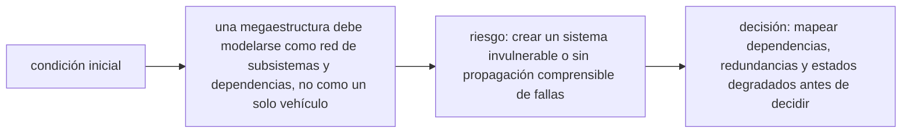

<!-- clase-meta
tipo_documento: clase
clase: 6
codigo: ESTRELLADELA-06
curso: estrella-de-la-muerte
titulo: "Principios y operación de la Estrella de la Muerte"
modalidad: "resolución de problemas"
duracion_minutos: 90
nivel: introductorio
prerrequisito: ESTRELLADELA-05
competencia: "razonamiento_operacional"
resultados_aprendizaje:
  - "Explicar principios físicos, fases de operación, decisiones y errores frecuentes con vocabulario propio de Estrella de la Muerte."
  - "Aplicar esos conceptos a una decisión segura o a un escenario de simulación de Estrella de la Muerte."
evidencia: "Resolución argumentada de un escenario operacional."
criterio_aprobacion: "Aplica los principios correctos, anticipa consecuencias y respeta los límites del curso."
fuentes: manuales/fuentes.md
ultima_revision: 2026-09-10
-->

# 🧪 Principios y operación de la Estrella de la Muerte

[🏠 Inicio](../../../README.md) · [🌑 Curso: Estrella de la Muerte](../README.md) · 🧪 Principios

> ⚖️ Material educativo original; los derechos de las obras pertenecen a sus titulares.

Documento educativo y de divulgación. Aquí está el corazón del curso: la gravedad
propia de un cuerpo del tamaño de una luna, el presupuesto de energía, la
disipación de calor y la logística. Explica que si sería posible, que no, y sobre
todo por qué.

## Gravedad propia: cuando una nave se vuelve un mundo

Toda masa atrae a lo que la rodea. Una estación del tamaño de una luna tendría
tanta masa que generaría su propia gravedad apreciable: habría un "abajo" hacia
su centro y las cosas caerían hacia el. Este es el rasgo que la ficción casi
acierta. Pero esa misma masa implica que la estructura debe soportar su propio
peso, como haría un pequeño planeta, y que moverla exige un empuje descomunal.

## Presupuesto de energía: todo compite por lo mismo

Una estación produce cierta cantidad de energía por unidad de tiempo, y ese es su
presupuesto. Soporte vital, propulsión, sensores y cualquier gran consumo compiten
por la misma energía. La consecuencia es clara: no se puede alimentar todo a la
vez sin límite. Un consumo enorme obliga a recortar en el resto. La ficción
suele mostrar energía infinita; la realidad impone un reparto cuidadoso.

## Conservación de la energía y el calor

La energía no desaparece: se transforma. Casi toda la que usa la estación termina
convertida en calor. Y ese calor hay que sacarlo de algún modo. En el vacío solo
se puede expulsar por radiación, a través de la superficie. Cuanto más energía se
usa, más calor se genera, y más superficie hace falta para radiarlo. Este es uno
de los límites más duros y menos contados de cualquier estación gigante.

## Disipación de calor: el límite oculto

La superficie de una esfera crece con el cuadrado de su tamaño, pero el volumen
(y con el, casi todo lo que genera calor) crece con el cubo. Una estación-mundo
produce muchísimo calor por dentro y solo dispone de su superficie para radiarlo.
Por eso, aunque la superficie sea enorme, puede no bastar. Refrigerar la estación
sin cocerse por dentro es un reto tan serio como producir la energía.

## Logística: sostener a millones

Una población inmensa necesita aire, agua, comida, transporte y gestión de
residuos, sin pausa. Mantener todo eso funcionando es una tarea colosal. Si la
logística falla, la estación deja de ser habitable, por mucha potencia o blindaje
que tenga. La vida cotidiana de una ciudad-mundo es, en si misma, un enorme
problema de ingeniería.

## Que si y que no

| Idea de la ficción | Que si es real | Que no es real |
| --- | --- | --- |
| Se camina con gravedad como en un planeta | A esa masa hay gravedad propia | No haría falta inventar la gravedad; ya existiría. |
| Energía prácticamente infinita | Se puede producir mucha energía | Siempre hay un presupuesto que repartir. |
| Un gran consumo sin coste | Se puede concentrar energía | Dejaría sin margen al resto de sistemas. |
| El calor no es problema | El calor se puede radiar | La superficie no basta para tanto calor. |
| Se mueve como una nave | Se puede empujar la estación | Su masa la hace lentísima de maniobrar. |
| Autonomía total | El reciclaje es posible | Sostener millones de personas es colosal. |

## Cómo sería una estación-mundo realista

- Tendría gravedad propia y una estructura pensada para su propio peso.
- Gestionaría la energía como un presupuesto, recortando donde hiciera falta.
- Dedicaría enormes superficies a radiar calor.
- Dependería de una logística gigantesca para mantener viva a su población.

## Relación con los niveles de realismo

- **Nivel 1 (educativo)**: notar que existe gravedad propia y un límite de energía.
- **Nivel 2 (simplificado)**: sumar el presupuesto de energía y el calor.
- **Nivel 3 (técnico)**: gestionar energía, calor, gravedad, masa y logística.

Ver [`docs/03-niveles-de-realismo.md`](../../../docs/03-niveles-de-realismo.md)
para el detalle de cada nivel.

## 🧭 Guía de estudio aplicada

### Pregunta guía

¿Cómo ayuda **Gravedad propia: cuando una nave se vuelve un mundo, Presupuesto de energía: todo compite por lo mismo, Conservación de la energía y el calor y Disipación de calor: el límite oculto** a **resolver falla simulada de distribución que afecta sectores distintos sin agotar el margen operacional**?

### Explicación razonada

El principio rector puede resumirse así: una megaestructura debe modelarse como red de subsistemas y dependencias, no como un solo vehículo. Esto explica por qué una misma orden produce resultados distintos cuando cambian velocidad, carga, configuración o entorno. Operar bien consiste en leer la tendencia antes de agotar el margen y tomar esta decisión: mapear dependencias, redundancias y estados degradados antes de decidir.

Esta clase se conecta con el resto del curso mediante **una megaestructura debe modelarse como red de subsistemas y dependencias, no como un solo vehículo**. El hilo de
seguridad consiste en reconocer a tiempo **crear un sistema invulnerable o sin propagación comprensible de fallas** y poder justificar la decisión
**mapear dependencias, redundancias y estados degradados antes de decidir**; en clases posteriores cambiará el ángulo de análisis, no esa relación causal.
La lectura funcional común sigue **reactor ficticio → distribución → propulsión y control → estación**, de modo que cada concepto pueda
ubicarse dentro del funcionamiento completo y no quede como un dato aislado.

**Apoyo documental:** [Death Star](https://www.starwars.com/databank/death-star) aporta canon narrativo de la estación;
[Spaceships and Rockets](https://www.nasa.gov/humans-in-space/spaceships-and-rockets/) se usa para naves, sistemas y misiones. Estas fuentes
se contrastan con el alcance de la clase y no sustituyen un manual de equipo concreto.

### Caso resuelto: de la observación a la decisión

1. **Datos:** reconoce condiciones, configuración y margen disponibles en **falla simulada de distribución que afecta sectores distintos**.
2. **Modelo:** aplica **una megaestructura debe modelarse como red de subsistemas y dependencias, no como un solo vehículo** para predecir una tendencia antes de actuar.
3. **Riesgo:** explica mediante qué cadena de causas podría ocurrir **crear un sistema invulnerable o sin propagación comprensible de fallas**.
4. **Decisión:** ejecuta mentalmente **mapear dependencias, redundancias y estados degradados antes de decidir** y define qué observación confirmaría que funcionó.

### Comprueba tu comprensión

1. ¿Qué variable del principio «una megaestructura debe modelarse como red de subsistemas y dependencias, no como un solo vehículo» cambia primero en el caso?
2. ¿Cómo se propaga ese cambio hasta **estación**?
3. ¿Qué evidencia confirmaría que **mapear dependencias, redundancias y estados degradados antes de decidir** conservó margen operacional?

Orientación para revisar tus respuestas

- La primera respuesta debe relacionar el eslabón elegido con un efecto posterior, no solo nombrarlo.
- La segunda debe proponer una señal medible u observable y explicar qué tendencia sería preocupante.
- La tercera debe cambiar al menos una variable de capacidad, mando, entorno o margen de seguridad.

## 🎓 Cierre de clase

- **Actividad:** Resuelve un escenario de Estrella de la Muerte explicando, paso a paso, cómo intervienen principios físicos, fases de operación, decisiones y errores frecuentes.
- **Evidencia:** Resolución argumentada de un escenario operacional.
- **Criterio de aprobación:** Aplica los principios correctos, anticipa consecuencias y respeta los límites del curso.
- **Transferencia:** explica qué cambiaría al pasar a otra variante de esta máquina.

### Fuentes de esta clase

- [STARWARS-DEATHSTAR](https://www.starwars.com/databank/death-star): Death Star, Lucasfilm. Uso: canon narrativo de la estación.
- [NASA-SPACECRAFT](https://www.nasa.gov/humans-in-space/spaceships-and-rockets/): Spaceships and Rockets, NASA. Uso: naves, sistemas y misiones.
- [NASA-FLIGHT](https://www1.grc.nasa.gov/beginners-guide-to-aeronautics/): Beginner's Guide to Aeronautics, NASA. Uso: contraste con física y vuelo reales.

> Las fuentes sostienen el marco conceptual y normativo; esta clase no reemplaza el manual
> del fabricante, la formación certificada ni la habilitación exigida para operar equipos reales.

---

[⬅️ Anterior: Mandos](../mandos/manual-mandos-estrella-de-la-muerte.md) · [➡️ Siguiente: Entornos](entornos-estrella-de-la-muerte.md)
