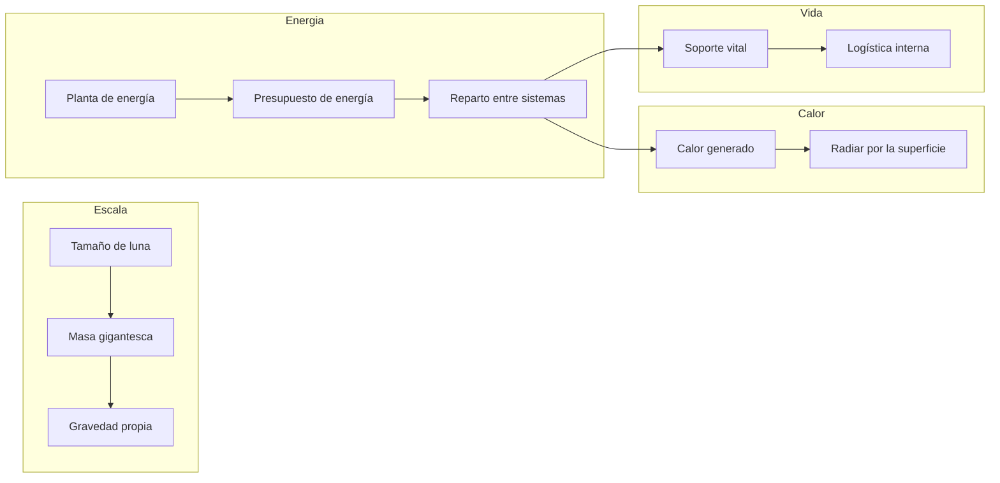
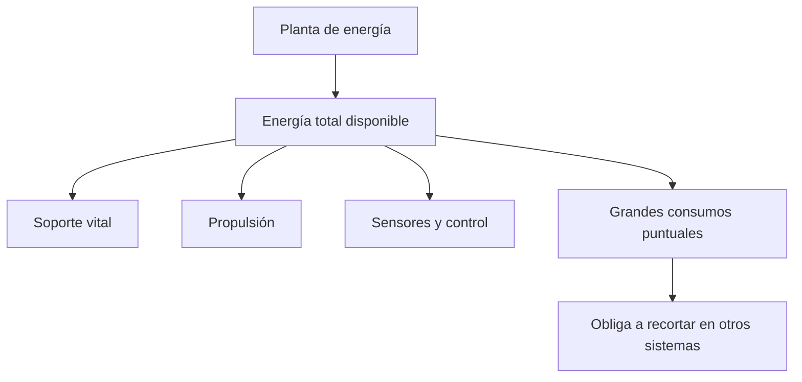
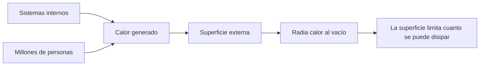
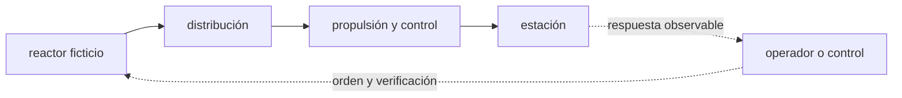

<!-- clase-meta
tipo_documento: clase
clase: 4
codigo: ESTRELLADELA-04
curso: estrella-de-la-muerte
titulo: "Sistemas mecánicos de la Estrella de la Muerte"
modalidad: "teórica aplicada"
duracion_minutos: 90
nivel: introductorio
prerrequisito: ESTRELLADELA-03
competencia: "comprension_de_sistemas"
resultados_aprendizaje:
  - "Explicar Gravedad propia, Presupuesto de energía, Disipación de calor y Propulsión de una masa colosal con vocabulario propio de Estrella de la Muerte."
  - "Aplicar esos conceptos a una decisión segura o a un escenario de simulación de Estrella de la Muerte."
evidencia: "Esquema con flujos de energía, materia o información anotados."
criterio_aprobacion: "Las conexiones esenciales son correctas y la consecuencia de la falla se propaga de manera coherente."
fuentes: manuales/fuentes.md
ultima_revision: 2026-09-10
-->

# 🔧 Sistemas mecánicos de la Estrella de la Muerte

[🏠 Inicio](../../../README.md) · [🌑 Curso: Estrella de la Muerte](../README.md) · 🔧 Sistemas mecánicos

> ⚖️ Material educativo original; los derechos de las obras pertenecen a sus titulares.

Esta clase abre la estación-mundo por dentro. Compara la tecnología imaginaria
de la ficción con la física real que la haría funcionar (o que la desmiente). La
regla del curso es clara: describimos conceptos con nuestras palabras, sin copiar
planos ni especificaciones oficiales.

---

## 1. 🪐 Gravedad propia

Aquí hay un rasgo que la ficción casi acierta. Cualquier masa atrae a lo que la
rodea; cuanto mayor es la masa, mayor es su gravedad. Una estación del tamaño de
una luna tendría tanta masa que generaría su propia gravedad apreciable: existiría
un "abajo" hacia su centro. Eso hace innecesarios muchos trucos, pero también
significa que la estructura tendría que soportar su propio peso, como un pequeño
planeta.

| Concepto de ficción | Física real que evoca | Veredicto |
| --- | --- | --- |
| Se camina como en un planeta | Gravedad por masa propia | Plausible: a esa masa habría gravedad real. |
| Un único "abajo" claro | Gravedad hacia el centro | Coherente con una esfera masiva. |
| La estructura no sufre por su peso | Resistencia de materiales | Dudoso: su propio peso sería enorme. |

---

## 2. 🔋 Presupuesto de energía

Este es el corazón del curso. Toda estación tiene un presupuesto de energía: una
cantidad que produce por unidad de tiempo y que debe repartir entre todos sus
sistemas. Soporte vital, propulsión, sensores y cualquier arma compiten por la
misma energía. En la ficción la potencia parece infinita; en la realidad, cada
gran consumo obliga a recortar en otro lado. No se puede alimentar todo a la vez
sin límite.

| Idea de la ficción | Que dice la física real |
| --- | --- |
| Energía ilimitada para todo | Hay un presupuesto; todo compite por el. |
| Un gran disparo sin consecuencias | Concentrar tanta energía dejaría sin margen a lo demás. |
| Recarga instantánea | Acumular y liberar energía lleva tiempo. |
| El calor del proceso desaparece | Toda esa energía acaba en calor que hay que expulsar. |

---

## 3. 🌡️ Disipación de calor

Casi toda la energía que usa la estación termina convertida en calor. Y en el
vacío el calor solo se puede expulsar por radiación, a través de la superficie
externa. Una estación-mundo generaría una cantidad inmensa de calor por dentro,
pero su superficie, aunque grande, es limitada. Refrigerar semejante mole sin
cocerse por dentro sería uno de sus mayores desafíos, y la ficción casi nunca lo
menciona.

- **Origen del calor**: motores, energía y la propia población.
- **Única vía**: radiación por la superficie; no hay aire que se lo lleve.
- **Reto de escala**: mucho calor dentro, superficie que no crece igual de rápido.

---

## 4. 🚀 Propulsión de una masa colosal

Mover algo del tamaño de una luna exige un empuje inimaginable. Como la
aceleración es el empuje dividido por la masa, la estación se desplazaría muy
despacio y cambiar su rumbo llevaría muchísimo tiempo. En la ficción se mueve casi
como una nave; en la realidad, sería más parecido a mover un cuerpo celeste.

| Sistema | En la ficción | En la realidad |
| --- | --- | --- |
| Desplazamiento | Se mueve con relativa soltura | Aceleración mínima por su masa. |
| Cambio de rumbo | Gira cuando conviene | Reorientar tanta masa lleva mucho tiempo. |
| Propelente | No se menciona | Mover esa masa gastaría cantidades inmensas. |

---

## 5. 📦 Logística y soporte vital

Una población de millones de personas necesita aire, agua, comida, energía,
transporte interno y gestión de residuos, de forma continua. En la ficción todo
funciona sin explicación. En la realidad, esta logística es un sistema tan grande
y crítico como cualquier otro: si falla, la estación deja de ser habitable, por
mucha potencia que tenga.

| Sistema | En la ficción | En la realidad |
| --- | --- | --- |
| Aire y agua | Siempre disponibles | Ciclos cerrados enormes y delicados. |
| Comida | Aparece sin más | Producción o suministro constante. |
| Transporte interno | Instantáneo | Red enorme para una ciudad-mundo. |

---

## 🔁 Cómo se conecta todo

1. La **escala** da a la estación masa suficiente para tener gravedad propia.
2. El **presupuesto de energía** obliga a repartir potencia entre sistemas.
3. La **disipación de calor** limita cuanta energía se puede usar sin cocerse.
4. La **propulsión** lucha contra una masa de dimensiones planetarias.
5. La **logística y el soporte vital** mantienen viva a la población.

Con esto claro, el
[Clase 5: Mandos](../mandos/manual-mandos-estrella-de-la-muerte.md) muestra como
se operaría una estación de este tamaño.

## 🧭 Guía de estudio aplicada

### Pregunta guía

¿Cómo ayuda **Gravedad propia, Presupuesto de energía, Disipación de calor y Propulsión de una masa colosal** a **seguir una alteración desde reactor ficticio hasta estación durante falla simulada de distribución que afecta sectores distintos**?

### Explicación razonada

El funcionamiento puede leerse como una cadena causal: reactor ficticio entrega o transforma energía; distribución la adapta; propulsión y control la transmite o gobierna; y estación produce el efecto observable. La cadena no es lineal en sentido estricto: sensores, estructura y operador cierran el lazo. Si un eslabón se degrada, la señal importante es cómo cambia el estado de estación y qué margen queda.

Esta clase se conecta con el resto del curso mediante **una megaestructura debe modelarse como red de subsistemas y dependencias, no como un solo vehículo**. El hilo de
seguridad consiste en reconocer a tiempo **crear un sistema invulnerable o sin propagación comprensible de fallas** y poder justificar la decisión
**mapear dependencias, redundancias y estados degradados antes de decidir**; en clases posteriores cambiará el ángulo de análisis, no esa relación causal.
La lectura funcional común sigue **reactor ficticio → distribución → propulsión y control → estación**, de modo que cada concepto pueda
ubicarse dentro del funcionamiento completo y no quede como un dato aislado.

**Apoyo documental:** [Death Star](https://www.starwars.com/databank/death-star) aporta canon narrativo de la estación;
[Spaceships and Rockets](https://www.nasa.gov/humans-in-space/spaceships-and-rockets/) se usa para naves, sistemas y misiones. Estas fuentes
se contrastan con el alcance de la clase y no sustituyen un manual de equipo concreto.

### Caso resuelto: de la observación a la decisión

1. **Entrada:** identifica el estado inicial de **reactor ficticio** durante **falla simulada de distribución que afecta sectores distintos**.
2. **Transformación:** explica qué hacen **distribución** y **propulsión y control**, y qué magnitud cambia en cada paso.
3. **Salida:** comprueba el efecto esperado en **estación** y busca una desviación temprana.
4. **Falla razonada:** si aparece **crear un sistema invulnerable o sin propagación comprensible de fallas**, retrocede por la cadena antes de ordenar otra acción.

### Comprueba tu comprensión

1. Si se degrada **distribución**, ¿qué efecto esperarías primero en **propulsión y control** y después en **estación**?
2. ¿Qué observación ayudaría a diferenciar una falla de **reactor ficticio** de una falla de **propulsión y control**?
3. ¿Por qué una segunda orden podría agravar **crear un sistema invulnerable o sin propagación comprensible de fallas**?

Orientación para revisar tus respuestas

- La primera respuesta debe relacionar el eslabón elegido con un efecto posterior, no solo nombrarlo.
- La segunda debe proponer una señal medible u observable y explicar qué tendencia sería preocupante.
- La tercera debe cambiar al menos una variable de capacidad, mando, entorno o margen de seguridad.

## 🎓 Cierre de clase

- **Actividad:** Dibuja un esquema funcional de Estrella de la Muerte que conecte Gravedad propia, Presupuesto de energía, Disipación de calor y Propulsión de una masa colosal; después predice el efecto de una falla simulada.
- **Evidencia:** Esquema con flujos de energía, materia o información anotados.
- **Criterio de aprobación:** Las conexiones esenciales son correctas y la consecuencia de la falla se propaga de manera coherente.
- **Transferencia:** explica qué cambiaría al pasar a otra variante de esta máquina.

### Fuentes de esta clase

- [STARWARS-DEATHSTAR](https://www.starwars.com/databank/death-star): Death Star, Lucasfilm. Uso: canon narrativo de la estación.
- [NASA-SPACECRAFT](https://www.nasa.gov/humans-in-space/spaceships-and-rockets/): Spaceships and Rockets, NASA. Uso: naves, sistemas y misiones.
- [NASA-FLIGHT](https://www1.grc.nasa.gov/beginners-guide-to-aeronautics/): Beginner's Guide to Aeronautics, NASA. Uso: contraste con física y vuelo reales.

> Las fuentes sostienen el marco conceptual y normativo; esta clase no reemplaza el manual
> del fabricante, la formación certificada ni la habilitación exigida para operar equipos reales.

---

[⬅️ Anterior: Modelos y variantes](../modelos/modelos-estrella-de-la-muerte.md) · [➡️ Siguiente: Mandos e instrumentos](../mandos/manual-mandos-estrella-de-la-muerte.md)
