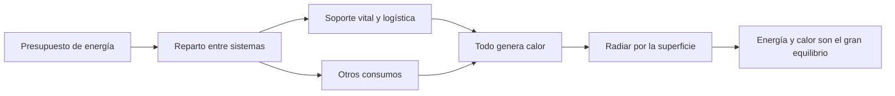

# 🧰 Recursos de la Estrella de la Muerte

[🏠 Inicio](../../../README.md) · [🌑 Curso: Estrella de la Muerte](../README.md) · 🧰 Recursos

> ⚖️ Material educativo original; los derechos de las obras pertenecen a sus titulares.

Glosario específico, enlaces y diagramas de apoyo del curso de la estación-mundo.
Amplia el [glosario general](../../../docs/05-glosario-general.md).

---

## 📖 Glosario específico

| Término | Definición |
| --- | --- |
| Gravedad propia | Atracción que genera un cuerpo por su propia masa. |
| Masa total | Cantidad de materia de la estación; a escala lunar es gigantesca. |
| Presupuesto de energía | Energía disponible por unidad de tiempo, a repartir entre sistemas. |
| Reparto de energía | Decisión de cuanta potencia recibe cada sistema. |
| Conservación de la energía | La energía no se pierde; se transforma, a menudo en calor. |
| Disipación de calor | Expulsión de calor; en el vacío, solo por radiación. |
| Radiación | Única vía de expulsar calor sin aire, a través de la superficie. |
| Soporte vital | Sistemas que mantienen aire, agua y temperatura habitables. |
| Logística | Gestión de suministros y transporte para la población. |
| Escala | Tamaño relativo; a escala de luna cambian las reglas físicas. |

---

## 🗺️ Diagrama: energía, calor y vida

```mermaid
flowchart LR
    Presu[Presupuesto de energía] --> Reparto[Reparto entre sistemas]
    Reparto --> Vida[Soporte vital y logística]
    Reparto --> Otros[Otros consumos]
    Vida --> Calor[Todo genera calor]
    Otros --> Calor
    Calor --> Radia[Radiar por la superficie]
    Radia --> Idea[Energía y calor son el gran equilibrio]
```

---

## 🔗 Enlaces y fuentes

- Portada del curso: [🌑 Curso: Estrella de la Muerte](../README.md)
- Catálogo de naves de ficción: [🌌 Naves de ficción](../../README.md)
- Glosario general: [📖 docs/05-glosario-general.md](../../../docs/05-glosario-general.md)
- Niveles de realismo: [🎚️ docs/03-niveles-de-realismo.md](../../../docs/03-niveles-de-realismo.md)
- Registro de fuentes: [📚 manuales/fuentes.md](../../../manuales/fuentes.md)

Registrar cada recurso nuevo con su origen y licencia, respetando el aviso de
derechos del catálogo de naves de ficción.

## 🎓 Cierre de clase

- **Actividad:** Selecciona términos de glosario, esquemas y trazabilidad de fuentes, explícalos en contexto de Estrella de la Muerte y verifica la procedencia de las fuentes utilizadas.
- **Evidencia:** Glosario aplicado y ficha breve de trazabilidad.
- **Criterio de aprobación:** Los términos permiten interpretar el curso y las fuentes se distinguen por autoridad, alcance y vigencia.
- **Transferencia:** explica qué cambiaría al pasar a otra variante de esta máquina.

### Fuentes de esta clase

- [STARWARS-DEATHSTAR](https://www.starwars.com/databank/death-star): Death Star, Lucasfilm. Uso: canon narrativo de la estación.
- [NASA-SPACECRAFT](https://www.nasa.gov/humans-in-space/spaceships-and-rockets/): Spaceships and Rockets, NASA. Uso: naves, sistemas y misiones.
- [NASA-FLIGHT](https://www1.grc.nasa.gov/beginners-guide-to-aeronautics/): Beginner's Guide to Aeronautics, NASA. Uso: contraste con física y vuelo reales.

> Las fuentes sostienen el marco conceptual y normativo; esta clase no reemplaza el manual
> del fabricante, la formación certificada ni la habilitación exigida para operar equipos reales.

---

[🎓 Portada del curso](../README.md) · [⬅️ Anterior: Diseño de simulación](../simulacion/diseno-simulador-estrella-de-la-muerte.md) · [➡️ Siguiente: Ejercicios](../ejercicios/ejercicios-estrella-de-la-muerte.md)
