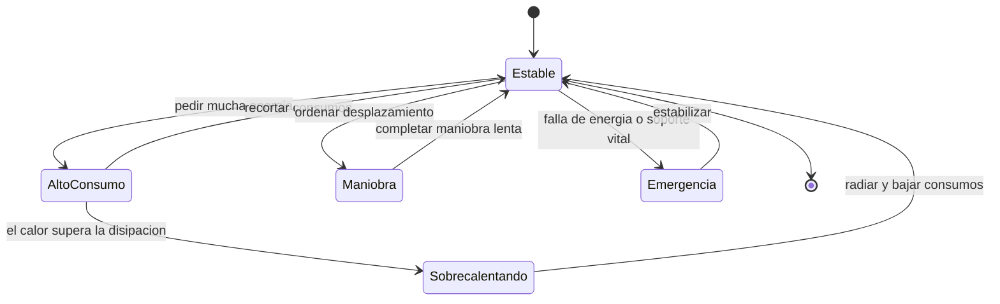

# 🎮 Diseño de simulación de la Estrella de la Muerte

[🏠 Inicio](../../../README.md) · [🌑 Curso: Estrella de la Muerte](../README.md) · 🎮 Simulación

> ⚖️ Material educativo original; los derechos de las obras pertenecen a sus titulares.

Como modelar de forma educativa y divertida una estación del tamaño de una luna.
La idea central es poder alternar entre la versión espectacular de la ficción y
la versión fiel a la física, para que el usuario compare ambas con la misma
estación, y sobre todo para que sienta el equilibrio entre energía, calor y
logística.

## Objetivo de la simulación

Que el usuario comprenda, jugando, que a la escala de una luna aparecen gravedad
propia, un presupuesto de energía que hay que repartir y un calor difícil de
expulsar. El modo ficción sirve para engancharse; el modo ciencia, para aprender.

## Modo ciencia o ficción

La variable más importante del simulador es el **modo**:

- **Modo ficción**: energía casi infinita, el calor no molesta y la estación
  maniobra con soltura. Es divertido y espectacular.
- **Modo ciencia**: se aplican la gravedad por masa, el presupuesto de energía,
  la conservación de la energía y el límite de disipación de calor. Todo hay que
  repartirlo y planificarlo.

Al cambiar de modo, la interfaz avisa que reglas se activan o desactivan, para
que la comparación sea explícita y educativa.

## Variables principales

| Variable | Tipo | Rango | Afecta a | Comentarios |
| --- | --- | --- | --- | --- |
| Modo | discreta | ciencia / ficción | Todas las reglas | Interruptor central del aprendizaje. |
| Presupuesto de energía | numérica | 0-100% | Todos los sistemas | Se reparte; no alcanza para todo a la vez. |
| Reparto de energía | numérica | por sistema | Prioridades | Soporte vital, propulsión, calor. |
| Calor acumulado | numérica | 0-100% | Riesgo térmico | Se radia lento por la superficie. |
| Gravedad propia | numérica | según masa | Interior habitable | Define el arriba y el abajo. |
| Masa total | numérica | de escala lunar | Aceleración | La hace lentísima de mover. |
| Estado logístico | numérica | 0-100% | Habitabilidad | Comida, agua, aire y transporte. |
| Calor externo | numérica | 0-alto | Disipación | Cerca de una estrella dificulta refrigerar. |

## Ciclo básico

1. Leer entrada del usuario (reparto de energía, maniobra, logística).
2. Comprobar el modo activo (ciencia o ficción).
3. En modo ciencia, restar del presupuesto de energía cada consumo.
4. Convertir la energía usada en calor generado.
5. Radiar calor según la superficie y el calor externo del entorno.
6. Actualizar soporte vital y logística con la energía asignada.
7. Aplicar maniobra: aceleración mínima por la enorme masa.
8. Refrescar instrumentos (energía, calor, soporte vital, logística).

## Modos de juego futuros

- Tutorial de energía: repartir el presupuesto sin dejar sin aire a la población.
- Reto térmico: mantener el calor bajo control al subir los consumos.
- Comparador lado a lado: misma situación en modo ciencia y en modo ficción.
- Gestión logística: sostener a la población con suministros limitados.
- Escenario cerca de una estrella con mayor exigencia de disipación.

## Elementos fuera de alcance

- Presentar la energía infinita de la ficción como si fuera física real.
- Detalles de armamento presentados como datos técnicos reales.
- Cualquier contenido que confunda espectáculo con ciencia sin distinguirlos.

## Pendientes

- [ ] Definir el reparto por defecto del presupuesto de energía.
- [ ] Prototipar el ciclo energía-calor con conservación de la energía.
- [ ] Ajustar el modelo de disipación según la superficie y el calor externo.
- [ ] Agregar fuentes de divulgación a [`manuales/fuentes.md`](../../../manuales/fuentes.md).

---

[⬅️ Anterior: Reglas del universo](../reglamentos/reglas-universo-estrella-de-la-muerte.md) · [➡️ Siguiente: Recursos](../recursos/recursos-estrella-de-la-muerte.md)
