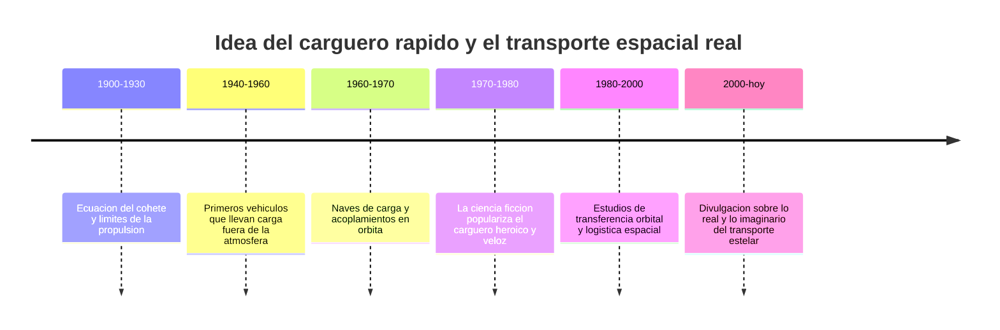

# 📜 Historia del Halcón Milenario

[🏠 Inicio](../../../README.md) · [🦅 Curso: Halcón Milenario](../README.md) · 📜 Historia

> ⚖️ Material educativo original; los derechos de las obras pertenecen a sus titulares.

Este módulo situa la idea del carguero rápido dentro de la ciencia ficción y la
compara con la historia real del transporte espacial. No describe una nave
oficial: analiza el concepto genérico de "carguero veloz" que popularizo el
estilo "Star Wars" y lo contrasta con lo que la ingeniería sabe hacer de verdad.

## De donde viene la idea

El carguero rápido de la ficción mezcla dos imagenes queridas: el barco
mercante veterano y el coche deportivo trucado. Se lo imagina viejo por fuera
pero sorprendentemente veloz, capaz de escapar de perseguidores y de cruzar la
galaxia en poco tiempo. Es una fantasía atractiva porque une la libertad del
viajero con la emoción de la velocidad. El problema es que mover masa por el
espacio tiene un coste físico que la ficción suele ignorar, y ahí empieza lo
interesante de este curso.

## Lo real frente a lo imaginado

La historia real del transporte espacial siguió otro camino. Las naves que
llevaron carga fuera de la atmósfera no corrian como coches: planificaban
maniobras, gastaban con cuidado su propelente y tardaban días o meses en llegar
a su destino. No hay atajos gratis: cada kilo de carga extra exige más empuje o
más tiempo para alcanzar la misma velocidad.

| Periodo | Hito de referencia | Importancia para el curso |
| --- | --- | --- |
| 1900-1930 | Formulación de la ecuación del cohete | Explica el límite de maniobra (delta-v). |
| 1940-1960 | Vehículos que suben carga al espacio | Muestra el coste de mover masa. |
| 1960-1970 | Acoplamientos y naves de carga | Base real de la logística orbital. |
| 1970-1980 | Auge del carguero veloz en el cine | Fija la imagen popular del transporte rápido. |
| 1980-2000 | Estudio de transferencias orbitales | Muestra cómo se viaja de verdad. |
| 2000-hoy | Divulgación de física del espacio | Separa el espectáculo de la realidad. |

## Por qué la ficción eligió el carguero veloz

Un carguero destartalado pero rápido es un gran vehículo para contar historias:
tiene personalidad, siempre parece a punto de fallar y permite fugas de último
momento. La idea de "saltar" a la velocidad de la luz resuelve un problema
narrativo: cruzar distancias enormes sin aburrir al espectador. La ficción
prioriza el ritmo sobre la física, y eso es una decisión artística legítima que
este curso respeta y analiza.

## Que aprenderemos de todo esto

- Que conceptos de física real evoca la nave aunque los exagere.
- Por qué la relación empuje/masa decide de verdad la aceleración.
- Por qué un "salto" instantáneo entre estrellas rompe las leyes conocidas.

## Fuentes

- Registrar aquí las fuentes públicas de divulgación consultadas.
- Enlazar cada fuente también en [`manuales/fuentes.md`](../../../manuales/fuentes.md).

---

[🎓 Portada del curso](../README.md) · [➡️ Siguiente: Características](../operacion/caracteristicas-halcon-milenario.md)
