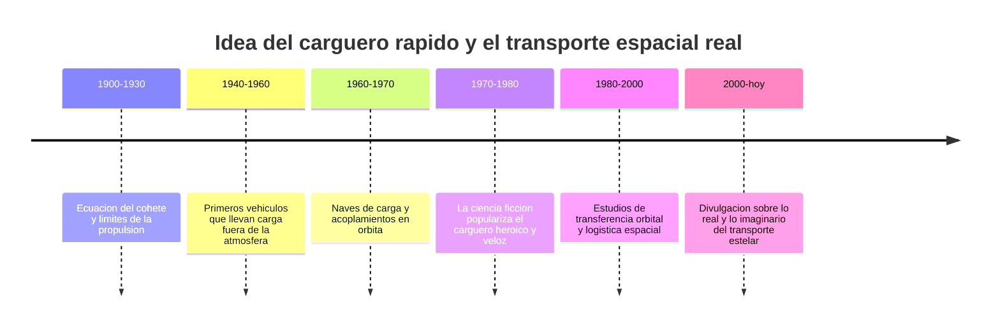

<!-- clase-meta
tipo_documento: clase
clase: 1
codigo: HALCONMILENA-01
curso: halcon-milenario
titulo: "Historia del Halcón Milenario"
modalidad: "teórica dialogada"
duracion_minutos: 45
nivel: introductorio
prerrequisito: ninguno
competencia: "contexto_historico"
resultados_aprendizaje:
  - "Explicar origen, evolución tecnológica, variantes representativas e impacto con vocabulario propio de Halcón Milenario."
  - "Aplicar esos conceptos a una decisión segura o a un escenario de simulación de Halcón Milenario."
evidencia: "Línea de tiempo comentada con cuatro hitos o más."
criterio_aprobacion: "Los hitos están ordenados, son pertinentes y dos relaciones de causa y efecto quedan justificadas."
fuentes: manuales/fuentes.md
ultima_revision: 2026-09-10
-->

# 📜 Historia del Halcón Milenario

[🏠 Inicio](../../../README.md) · [🦅 Curso: Halcón Milenario](../README.md) · 📜 Historia

> ⚖️ Material educativo original; los derechos de las obras pertenecen a sus titulares.

Esta clase situa la idea del carguero rápido dentro de la ciencia ficción y la
compara con la historia real del transporte espacial. No describe una nave
oficial: analiza el concepto genérico de "carguero veloz" que popularizo el
estilo "Star Wars" y lo contrasta con lo que la ingeniería sabe hacer de verdad.

```mermaid
timeline
    title Idea del carguero rapido y el transporte espacial real
    1900-1930 : Ecuacion del cohete y limites de la propulsion
    1940-1960 : Primeros vehiculos que llevan carga fuera de la atmosfera
    1960-1970 : Naves de carga y acoplamientos en orbita
    1970-1980 : La ciencia ficcion populariza el carguero heroico y veloz
    1980-2000 : Estudios de transferencia orbital y logistica espacial
    2000-hoy : Divulgacion sobre lo real y lo imaginario del transporte estelar
```

## De donde viene la idea

El carguero rápido de la ficción mezcla dos imagenes queridas: el barco
mercante veterano y el coche deportivo trucado. Se lo imagina viejo por fuera
pero sorprendentemente veloz, capaz de escapar de perseguidores y de cruzar la
galaxia en poco tiempo. Es una fantasía atractiva porque une la libertad del
viajero con la emoción de la velocidad. El problema es que mover masa por el
espacio tiene un coste físico que la ficción suele ignorar, y ahí empieza lo
interesante de este curso.

## Lo real frente a lo imaginado

La historia real del transporte espacial siguió otro camino. Las naves que
llevaron carga fuera de la atmósfera no corrian como coches: planificaban
maniobras, gastaban con cuidado su propelente y tardaban días o meses en llegar
a su destino. No hay atajos gratis: cada kilo de carga extra exige más empuje o
más tiempo para alcanzar la misma velocidad.

| Periodo | Hito de referencia | Importancia para el curso |
| --- | --- | --- |
| 1900-1930 | Formulación de la ecuación del cohete | Explica el límite de maniobra (delta-v). |
| 1940-1960 | Vehículos que suben carga al espacio | Muestra el coste de mover masa. |
| 1960-1970 | Acoplamientos y naves de carga | Base real de la logística orbital. |
| 1970-1980 | Auge del carguero veloz en el cine | Fija la imagen popular del transporte rápido. |
| 1980-2000 | Estudio de transferencias orbitales | Muestra cómo se viaja de verdad. |
| 2000-hoy | Divulgación de física del espacio | Separa el espectáculo de la realidad. |

## Por qué la ficción eligió el carguero veloz

Un carguero destartalado pero rápido es un gran vehículo para contar historias:
tiene personalidad, siempre parece a punto de fallar y permite fugas de último
momento. La idea de "saltar" a la velocidad de la luz resuelve un problema
narrativo: cruzar distancias enormes sin aburrir al espectador. La ficción
prioriza el ritmo sobre la física, y eso es una decisión artística legítima que
este curso respeta y analiza.

## Que aprenderemos de todo esto

- Que conceptos de física real evoca la nave aunque los exagere.
- Por qué la relación empuje/masa decide de verdad la aceleración.
- Por qué un "salto" instantáneo entre estrellas rompe las leyes conocidas.

## Fuentes

- Registrar aquí las fuentes públicas de divulgación consultadas.
- Enlazar cada fuente también en [`manuales/fuentes.md`](../../../manuales/fuentes.md).

## 🧭 Guía de estudio aplicada

### Pregunta guía

¿Cómo ayuda **De donde viene la idea, Lo real frente a lo imaginado, Por qué la ficción eligió el carguero veloz y Que aprenderemos de todo esto** a **explicar cómo la evolución hizo posibles alternativas como vuelo sublumínico frente a salto hiperespacial**?

### Explicación razonada

La evolución de Halcón Milenario se comprende mejor como una sucesión de respuestas a problemas, no como una lista de fechas. Los cambios en reactor ficticio, hiperimpulsor, control de actitud y trayectoria alteraron qué podía hacer la máquina, quién podía usarla y qué riesgos debían controlarse. El contraste «vuelo sublumínico frente a salto hiperespacial» permite observar qué decisiones de diseño permanecieron y cuáles cambiaron con la tecnología y el propósito.

Esta clase se conecta con el resto del curso mediante **contraste entre prestaciones canónicas y un modelo consistente de energía, inercia y navegación**. El hilo de
seguridad consiste en reconocer a tiempo **usar la velocidad narrativa como sustituto de decisiones y estados comprensibles** y poder justificar la decisión
**hacer visibles prerrequisitos, fallas y consecuencias de cada modo de propulsión**; en clases posteriores cambiará el ángulo de análisis, no esa relación causal.
La lectura funcional común sigue **reactor ficticio → hiperimpulsor → control de actitud → trayectoria**, de modo que cada concepto pueda
ubicarse dentro del funcionamiento completo y no quede como un dato aislado.

**Apoyo documental:** [Millennium Falcon](https://www.starwars.com/databank/millennium-falcon) aporta canon narrativo del vehículo;
[Spaceships and Rockets](https://www.nasa.gov/humans-in-space/spaceships-and-rockets/) se usa para naves, sistemas y misiones. Estas fuentes
se contrastan con el alcance de la clase y no sustituyen un manual de equipo concreto.

### Caso resuelto: de la observación a la decisión

1. **Situar:** ordena los hitos que explican cómo se llegó a **vuelo sublumínico frente a salto hiperespacial** y describe la necesidad que impulsó cada cambio.
2. **Relacionar:** explica qué se modificó en **reactor ficticio**, **hiperimpulsor**, **control de actitud** o **trayectoria**; una fecha sin mecanismo no basta.
3. **Interpretar:** vincula el cambio con una capacidad nueva y también con el riesgo **usar la velocidad narrativa como sustituto de decisiones y estados comprensibles**.
4. **Transferir:** usa la evolución para justificar por qué hoy conviene **hacer visibles prerrequisitos, fallas y consecuencias de cada modo de propulsión**.

### Comprueba tu comprensión

1. ¿Qué necesidad histórica impulsó un cambio en **reactor ficticio** o **hiperimpulsor**?
2. ¿Qué hito modificó la relación entre capacidad y **usar la velocidad narrativa como sustituto de decisiones y estados comprensibles**?
3. ¿Por qué **vuelo sublumínico frente a salto hiperespacial** no puede explicarse como una simple diferencia estética?

Orientación para revisar tus respuestas

- La primera respuesta debe relacionar el eslabón elegido con un efecto posterior, no solo nombrarlo.
- La segunda debe proponer una señal medible u observable y explicar qué tendencia sería preocupante.
- La tercera debe cambiar al menos una variable de capacidad, mando, entorno o margen de seguridad.

## 🎓 Cierre de clase

- **Actividad:** Construye una línea de tiempo de Halcón Milenario y explica cómo dos cambios históricos transformaron su función o su puesto de mando.
- **Evidencia:** Línea de tiempo comentada con cuatro hitos o más.
- **Criterio de aprobación:** Los hitos están ordenados, son pertinentes y dos relaciones de causa y efecto quedan justificadas.
- **Transferencia:** explica qué cambiaría al pasar a otra variante de esta máquina.

### Fuentes de esta clase

- [STARWARS-FALCON](https://www.starwars.com/databank/millennium-falcon): Millennium Falcon, Lucasfilm. Uso: canon narrativo del vehículo.
- [NASA-SPACECRAFT](https://www.nasa.gov/humans-in-space/spaceships-and-rockets/): Spaceships and Rockets, NASA. Uso: naves, sistemas y misiones.
- [NASA-FLIGHT](https://www1.grc.nasa.gov/beginners-guide-to-aeronautics/): Beginner's Guide to Aeronautics, NASA. Uso: contraste con física y vuelo reales.

> Las fuentes sostienen el marco conceptual y normativo; esta clase no reemplaza el manual
> del fabricante, la formación certificada ni la habilitación exigida para operar equipos reales.

---

[🎓 Portada del curso](../README.md) · [➡️ Siguiente: Características](../operacion/caracteristicas-halcon-milenario.md)
