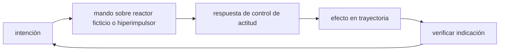

<!-- clase-meta
tipo_documento: clase
clase: 5
codigo: HALCONMILENA-05
curso: halcon-milenario
titulo: "Mandos e instrumentos del Halcón Milenario"
modalidad: "taller de simulación"
duracion_minutos: 60
nivel: introductorio
prerrequisito: HALCONMILENA-04
competencia: "lectura_y_mando"
resultados_aprendizaje:
  - "Explicar controles, instrumentos, entradas y estados del sistema con vocabulario propio de Halcón Milenario."
  - "Aplicar esos conceptos a una decisión segura o a un escenario de simulación de Halcón Milenario."
evidencia: "Mapa de mandos y resolución de dos estados del tablero."
criterio_aprobacion: "Reconoce los controles críticos y responde a los estados sin introducir acciones inseguras."
fuentes: manuales/fuentes.md
ultima_revision: 2026-09-10
-->

# 🎛️ Mandos e instrumentos del Halcón Milenario

[🏠 Inicio](../../../README.md) · [🦅 Curso: Halcón Milenario](../README.md) · 🎛️ Mandos

> ⚖️ Material educativo original; los derechos de las obras pertenecen a sus titulares.

## Vista general

El puesto de mando de un carguero rápido realista se parece más a la cabina de
una nave espacial que a la de un camión. Como la nave se mueve en tres
dimensiones y sin rozamiento, el piloto controla por separado la orientación
(hacia donde apunta) y la traslación (hacia donde se desplaza). Además, un
carguero suele volar con copiloto, porque hay que vigilar a la vez el rumbo, la
carga y la energía.

## Mapa de controles

| Zona | Control | Tipo | Función | Prioridad | Comentarios |
| --- | --- | --- | --- | --- | --- |
| Mano derecha | Palanca de orientación | Joystick 3 ejes | Rotar cabeceo, alabeo y guiñada | Alta | No cambia el rumbo por si sola. |
| Mano izquierda | Palanca de traslación | Mando 3 ejes | Empujar la nave arriba, abajo o de lado | Alta | Usa propulsores de control. |
| Mano izquierda | Aceleradores principales | Palancas lineales | Regular empuje de los motores | Alta | Cambia la velocidad, no la mantiene. |
| Panel central | Gestión de energía | Botonera | Repartir energía entre sistemas | Media | Motores, sensores, escudos. |
| Panel superior | Estado de carga | Indicadores | Vigilar masa y sujeción de la bodega | Media | La masa afecta la aceleración. |
| Panel izquierdo | Preparación de salto | Selector y secuencia | Preparar el hiperimpulso | Media | Recurso de ficción; requiere cálculo previo. |
| Consola | Instrumentos | Pantallas | Mostrar estado y sensores | Alta | Ver sección de instrumentos. |

## Instrumentos principales

| Instrumento | Muestra | Unidad | Importancia | Notas |
| --- | --- | --- | --- | --- |
| Vector de velocidad | Dirección y módulo del movimiento | m/s | Alta | Puede diferir de hacia donde apunta la nave. |
| Indicador de orientación | Hacia donde apunta la nave | grados | Alta | Cabeceo, alabeo y guiñada. |
| Masa total | Nave más carga actual | toneladas | Alta | Cuanta más masa, menos aceleración. |
| Presupuesto de maniobra | Delta-v restante | m/s | Alta | Depende del propelente que queda. |
| Nivel de propelente | Propelente restante | porcentaje | Alta | Sin propelente no hay maniobra. |
| Temperatura | Calor acumulado | grados | Media | Se disipa lento por radiadores. |
| Sensores de largo alcance | Objetos lejanos | distancia | Alta | Detectar perseguidores a tiempo. |

## Entradas de simulación

| Acción | Teclado | Controlador | Comentarios |
| --- | --- | --- | --- |
| Empuje adelante | Flecha arriba | Gatillo derecho | Acelera según empuje y masa. |
| Rotar cabeceo | W y S | Stick derecho vertical | Apunta el morro arriba o abajo. |
| Rotar guiñada | A y D | Stick derecho horizontal | Apunta el morro a los lados. |
| Rotar alabeo | Q y E | Botones laterales | Gira la nave sobre su eje. |
| Trasladar lateral | J y L | Stick izquierdo | Desplaza sin cambiar orientación. |
| Freno de rotación | Barra espaciadora | Botón central | Aplica propulsores para dejar de girar. |
| Preparar salto | H | Botón de menu | Solo en modo ficción; requiere cálculo. |

## Estados del sistema

| Estado | Descripción | Indicadores | Acciones disponibles |
| --- | --- | --- | --- |
| En reposo | Nave sin empuje, puede girar sobre su eje | Vector de velocidad casi cero | Orientar, planificar maniobra. |
| En impulso | Motores principales encendidos | Aceleradores activos | Cambiar velocidad, orientar. |
| Deriva | Sin motor, mantiene velocidad | Velocidad constante | Orientar con propulsores, planificar. |
| Preparando salto | Cálculo del hiperimpulso | Secuencia en curso | Recurso de ficción; abortable. |
| Emergencia | Falla o poco propelente | Alerta de delta-v | Ahorrar propelente, estabilizar. |

## Observaciones ergonomicas

- La interfaz debe mostrar a la vez hacia donde apunta la nave y hacia donde se
  mueve, porque en el vacío no coinciden.
- La masa total debe estar siempre visible: es la que decide cuanto responde la
  nave a los motores.
- El presupuesto de maniobra (delta-v) es tan importante como el combustible en
  un vehículo terrestre: cuando se agota, ya no hay como maniobrar.
- Conviene separar con claridad los controles de vuelo real de la secuencia de
  salto, que es un recurso de ficción.

## 🧭 Guía de estudio aplicada

### Pregunta guía

¿Cómo ayuda **Vista general, Mapa de controles, Instrumentos principales y Entradas de simulación** a **interpretar mandos e indicaciones durante escape ficticio con hiperimpulsor degradado**?

### Explicación razonada

Un mando no se aprende memorizando su nombre, sino recorriendo el ciclo intención → acción → indicación → verificación. En Halcón Milenario, el operador actúa sobre reactor ficticio o hiperimpulsor, observa la respuesta en control de actitud y confirma el efecto en trayectoria. Una indicación inesperada exige detener la secuencia mental, identificar el modo activo y evitar una segunda orden que agrave el estado.

Esta clase se conecta con el resto del curso mediante **contraste entre prestaciones canónicas y un modelo consistente de energía, inercia y navegación**. El hilo de
seguridad consiste en reconocer a tiempo **usar la velocidad narrativa como sustituto de decisiones y estados comprensibles** y poder justificar la decisión
**hacer visibles prerrequisitos, fallas y consecuencias de cada modo de propulsión**; en clases posteriores cambiará el ángulo de análisis, no esa relación causal.
La lectura funcional común sigue **reactor ficticio → hiperimpulsor → control de actitud → trayectoria**, de modo que cada concepto pueda
ubicarse dentro del funcionamiento completo y no quede como un dato aislado.

**Apoyo documental:** [Millennium Falcon](https://www.starwars.com/databank/millennium-falcon) aporta canon narrativo del vehículo;
[Spaceships and Rockets](https://www.nasa.gov/humans-in-space/spaceships-and-rockets/) se usa para naves, sistemas y misiones. Estas fuentes
se contrastan con el alcance de la clase y no sustituyen un manual de equipo concreto.

### Caso resuelto: de la observación a la decisión

1. **Intención:** formula qué cambio se necesita durante **escape ficticio con hiperimpulsor degradado**.
2. **Mando:** identifica el control que actúa sobre **reactor ficticio** o **hiperimpulsor** y el modo que debe estar activo.
3. **Lectura:** localiza la indicación que confirma la respuesta de **control de actitud** y el efecto en **trayectoria**.
4. **Verificación:** si la lectura no coincide, no acumules órdenes; estabiliza e investiga el estado.

### Comprueba tu comprensión

1. ¿Qué mando inicia la respuesta y qué instrumento confirma que el modo correcto está activo?
2. ¿Qué indicación temprana advertiría **usar la velocidad narrativa como sustituto de decisiones y estados comprensibles**?
3. ¿Qué secuencia usarías si la respuesta de **trayectoria** no coincide con la orden?

Orientación para revisar tus respuestas

- La primera respuesta debe relacionar el eslabón elegido con un efecto posterior, no solo nombrarlo.
- La segunda debe proponer una señal medible u observable y explicar qué tendencia sería preocupante.
- La tercera debe cambiar al menos una variable de capacidad, mando, entorno o margen de seguridad.

## 🎓 Cierre de clase

- **Actividad:** Recorre el puesto de mando simulado de Halcón Milenario: localiza los controles de controles, instrumentos, entradas y estados del sistema y asocia cada indicación con una decisión.
- **Evidencia:** Mapa de mandos y resolución de dos estados del tablero.
- **Criterio de aprobación:** Reconoce los controles críticos y responde a los estados sin introducir acciones inseguras.
- **Transferencia:** explica qué cambiaría al pasar a otra variante de esta máquina.

### Fuentes de esta clase

- [STARWARS-FALCON](https://www.starwars.com/databank/millennium-falcon): Millennium Falcon, Lucasfilm. Uso: canon narrativo del vehículo.
- [NASA-SPACECRAFT](https://www.nasa.gov/humans-in-space/spaceships-and-rockets/): Spaceships and Rockets, NASA. Uso: naves, sistemas y misiones.
- [NASA-FLIGHT](https://www1.grc.nasa.gov/beginners-guide-to-aeronautics/): Beginner's Guide to Aeronautics, NASA. Uso: contraste con física y vuelo reales.

> Las fuentes sostienen el marco conceptual y normativo; esta clase no reemplaza el manual
> del fabricante, la formación certificada ni la habilitación exigida para operar equipos reales.

---

[⬅️ Anterior: Sistemas mecánicos](../operacion/sistemas-mecanicos-halcon-milenario.md) · [➡️ Siguiente: Principios y operación](../operacion/principios-halcon-milenario.md)
