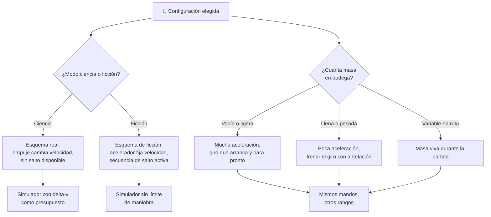

# 🧩 Modelos y variantes del Halcón Milenario

[🏠 Inicio](../../../README.md) · [🦅 Curso: Halcón Milenario](../README.md) · 🧩 Modelos

> ⚖️ Material educativo original; los derechos de las obras pertenecen a sus titulares.

El [Módulo 2](../operacion/caracteristicas-halcon-milenario.md) ya separó el
carguero rápido en tres tipos conceptuales: correo ligero, carguero mixto y
carguero pesado. Este módulo responde a lo siguiente: **esos tres tipos no son
la variante que de verdad cambia el simulador**. La variante que manda es cuánta
masa lleva la bodega en cada momento.

> 🎯 **La idea que sostiene el módulo.** Un carguero no es una máquina, es la
> misma máquina en estados de masa distintos. Vacío y lleno comparten motores,
> casco y puesto de mando, pero no comparten aceleración, delta-v ni tiempo de
> frenado del giro. La variante honesta de un carguero es su **configuración de
> carga**, no su modelo.

---

## 🧭 Por qué la configuración decide el simulador

El [Módulo 5](../mandos/manual-mandos-halcon-milenario.md) describe un puesto de
mando con aceleradores principales, palanca de traslación, palanca de
orientación y un panel superior de **estado de carga**. El
[Módulo 9](../simulacion/diseno-simulador-halcon-milenario.md) expone `Masa de
carga` con rango `0-maxima bodega`. Los dos módulos describen la **misma** nave.

Lo que separa un correo ligero de un carguero pesado, según el Módulo 2, es la
bodega frente a los motores: poca masa y motores grandes, o bodega enorme y
menos agilidad. Pero eso es exactamente lo que ya hace la variable `Masa de
carga` dentro de una sola nave. Un correo ligero es, en términos del simulador,
un carguero mixto con la bodega casi vacía. No hace falta un segundo esquema de
control: hace falta mover un número.

Lo que sí parte el simulador en dos es otra cosa, y el curso la nombra sin
rodeos: el **modo** ciencia o ficción del Módulo 9, con el hiperimpulso dentro.
Ahí no cambia un rango, cambia qué significan los mandos.

---

## 🗂️ Qué cambia en el manejo

| Configuración | Qué cambia al pilotarlo |
| --- | --- |
| Bodega vacía | El caso ágil: la relación empuje/masa es máxima, la nave salta hacia adelante y el giro arranca y se detiene pronto. |
| Bodega parcial | La referencia del curso: el carguero mixto en ruta, con carga útil y maniobra equilibradas. |
| Bodega llena | Misma potencia, mucha más masa: acelera menos, tarda más en detener la rotación y llega más justo de propelente. |
| Carga variable en ruta | La masa cambia durante la partida al cargar o soltar bodega: la misma maniobra no responde igual al principio que al final. |
| Correo ligero (Módulo 2) | Poca masa, motores grandes: se comporta como la bodega vacía de forma permanente. |
| Carguero pesado (Módulo 2) | Bodega enorme: se comporta como la bodega llena incluso sin carga extra. |
| Modo ficción con hiperimpulso | La carga deja de pesar, la nave frena al soltar el acelerador y el salto está disponible. No es otra nave: es otra física. |

---

## 🎛️ Qué cambia en el mando

| Configuración | Qué mando aparece o desaparece | Consecuencia |
| --- | --- | --- |
| Bodega vacía, parcial o llena | Ninguno: el mapa de controles del Módulo 5 aplica tal cual. | Cambian los rangos y los tiempos de respuesta, no los controles. |
| Correo ligero, mixto o pesado | Ninguno: los tres comparten puesto de mando. | Son el mismo esquema con distinta bodega. |
| Carga variable en ruta | **Asciende** el panel superior de estado de carga: deja de ser vigilancia y pasa a ser una decisión activa del piloto. | No es un mando nuevo, pero altera el resultado de todos los demás. |
| Bodega llena | **Gana peso** el freno de rotación (barra espaciadora): hay que pedirlo antes porque cuesta más detener el giro. | El mismo control, con más anticipación. |
| Modo ciencia | **Desaparece** la preparación de salto: el selector del panel izquierdo y la tecla `H` quedan fuera del vuelo real. | Se pierde la única salida "gratis" y el delta-v pasa a mandar la ruta. |
| Modo ficción | **Aparecen** el selector y la secuencia de salto. Los aceleradores principales **cambian de función**: pasan a fijar velocidad en vez de cambiarla. | Es el cambio más profundo del curso: el mismo mando significa otra cosa. |

---

## 🎮 Qué cambia en el simulador

Contrastado con las variables del
[Módulo 9](../simulacion/diseno-simulador-halcon-milenario.md):

| Configuración | Variables que cambian | Esquema de control |
| --- | --- | --- |
| Bodega parcial | Ninguna: es el caso base. | El del Módulo 5. |
| Bodega vacía | `Masa de carga` cae a cero: la aceleración por `Empuje de motores` sube y `Delta-v restante` rinde al máximo. | El mismo. |
| Bodega llena | `Masa de carga` se acerca al máximo de bodega: recorta la aceleración y `Delta-v restante` con el mismo propelente. | El mismo, más lento de responder. |
| Carga variable en ruta | `Masa de carga` deja de fijarse al empezar y pasa a variar durante la partida, arrastrando consigo `Delta-v restante`. | El mismo. |
| Correo ligero | `Masa de carga` ocupa solo la franja baja de su rango. | El mismo. |
| Carguero pesado | `Masa de carga` ocupa la franja alta y `Calor acumulado` importa más por encendidos largos. | El mismo. |
| Modo ficción | `Modo` pasa a `ficción`: `Masa de carga` se desacopla de la aceleración, `Vector de velocidad` deja de conservarse sin motor y `Delta-v restante` pierde sentido. | Otro: aceleradores tipo automóvil y secuencia de salto activa. |
| Modo ciencia | `Modo` pasa a `ciencia`: se reactivan la relación empuje/masa, la conservación del momento y el límite de delta-v. `Gravedad del entorno` vuelve a curvar el rumbo. | El del Módulo 5, sin salto. |

---

## 🗺️ De la configuración al esquema de control

---

## ⚠️ Qué configuraciones no comparten simulador

Una sola frontera no se resuelve con un ajuste de parámetros, y no es la que
sugiere la palabra "modelo":

- **El modo ficción frente al modo ciencia** es la única variante con otro
  esquema de control. Aparece una entrada que en vuelo real no existe (la
  secuencia de salto) y, sobre todo, los aceleradores principales dejan de
  cambiar la velocidad para pasar a fijarla. Es un modo de control distinto, no
  una dificultad distinta. Por eso el Módulo 9 lo llama "interruptor central del
  aprendizaje" y la interfaz avisa al cruzarlo.

- **La carga variable en ruta** frente a la carga fija obliga a que `Masa de
  carga` sea una variable viva durante la partida, no una constante que se elige
  al empezar. No añade mandos, pero cambia qué está calculando el ciclo básico en
  cada paso.

El resto de configuraciones —vacía, parcial, llena, correo ligero, mixto o
pesado— sí caben en un mismo simulador ajustando rangos, tal como plantean los
[niveles de realismo](../../../docs/03-niveles-de-realismo.md): en el nivel 1
apenas se nota que la bodega llena responde peor, y la diferencia se vuelve
decisiva cuando el nivel 3 pone el delta-v y la masa variable sobre la mesa.

Conviene decirlo sin adornos: este curso no tiene modelos, tiene estados de
carga. Y esa es justamente su lección, porque un carguero es una máquina cuya
variante principal la decide lo que lleva dentro.

> ⚖️ **El principio detrás de todo esto.** Cuánto pesa la carga y dónde va no cambia
> solo los números: cambia qué puede hacer el operador. La física común a todas las
> máquinas del catálogo —sostener, girar, equilibrar y la masa que cambia en
> marcha— está en [⚖️ carga y manejo](../../../docs/09-carga-y-manejo.md).

---

[⬅️ Anterior: Características](../operacion/caracteristicas-halcon-milenario.md) · [➡️ Siguiente: Sistemas mecánicos](../operacion/sistemas-mecanicos-halcon-milenario.md)
