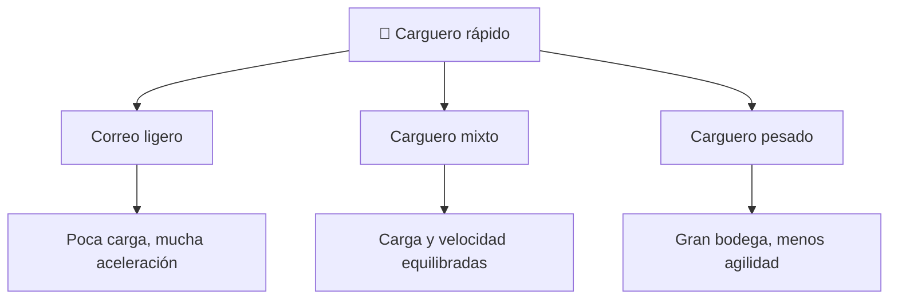

<!-- clase-meta
tipo_documento: clase
clase: 2
codigo: HALCONMILENA-02
curso: halcon-milenario
titulo: "Características del Halcón Milenario"
modalidad: "teórica aplicada"
duracion_minutos: 45
nivel: introductorio
prerrequisito: HALCONMILENA-01
competencia: "identificacion_funcional"
resultados_aprendizaje:
  - "Explicar definición, rasgos funcionales, tipos y usos con vocabulario propio de Halcón Milenario."
  - "Aplicar esos conceptos a una decisión segura o a un escenario de simulación de Halcón Milenario."
evidencia: "Matriz comparativa y decisión justificada."
criterio_aprobacion: "La elección considera función, límites, mando y efecto en la simulación; no se apoya solo en preferencias."
fuentes: manuales/fuentes.md
ultima_revision: 2026-09-10
-->

# 📋 Características del Halcón Milenario

[🏠 Inicio](../../../README.md) · [🦅 Curso: Halcón Milenario](../README.md) · 📋 Características

> ⚖️ Material educativo original; los derechos de las obras pertenecen a sus titulares.

Que es un carguero rápido genérico, que rasgos lo definen en la ficción y cuales
tendrían sentido físico real. Esta clase da el contexto antes de abrir la
tecnología por dentro en el Clase 4.

---

## 🧭 Definición

Un carguero rápido, en la ficción estilo "Star Wars", es una nave mediana
pensada para transportar carga y tripulación, pero modificada para correr y
maniobrar mucho más de lo normal. La imaginamos vieja, remendada y llena de
sorpresas bajo el capo. En este curso la usamos como excusa para estudiar como
se movería de verdad una nave así cuando arrastra masa por el vacío.

---

## 🧬 Características clave

| Característica | Como la muestra la ficción | Lectura física real |
| --- | --- | --- |
| Tamaño mediano | Bodega amplia y tripulación reducida | Razonable: más volumen exige más estructura y masa. |
| Velocidad excepcional | Corre más que naves militares | En el vacío la clave es empuje frente a masa, no la forma. |
| Motores sobredimensionados | Potencia enorme para su tamaño | Plausible: más empuje mejora la aceleración. |
| Carga variable | A veces vacía, a veces repleta | Real: cargada acelera menos, gasta más propelente. |
| Salto a la luz | Cruza la galaxia casi al instante | No físico: rompe el límite de velocidad conocido. |
| Aspecto remendado | Piezas de distintos origenes | Coherente con una nave veterana muy reparada. |

---

## 🗂️ Tipos conceptuales de carguero

| Tipo | Idea de diseño | Compromiso físico |
| --- | --- | --- |
| Correo ligero | Poca masa, motores grandes | Acelera muy rápido pero lleva poca carga. |
| Carguero mixto | Bodega media y motores potentes | Equilibrio entre carga útil y maniobra. |
| Carguero pesado | Bodega enorme | Mucha carga, pero menor aceleración y más propelente. |

---

## 🎯 Para qué sirve en el relato

- Dar libertad al héroe: una nave propia para ir a cualquier parte.
- Permitir fugas de último momento gracias a su velocidad.
- Representar el ingenio de reparar y mejorar una máquina veterana.

En cambio, para este curso sirve como laboratorio: cada rasgo llamativo nos deja
preguntar si sería posible y por qué.

## 🧭 Guía de estudio aplicada

### Pregunta guía

¿Cómo ayuda **Definición, Características clave, Tipos conceptuales de carguero y Para qué sirve en el relato** a **elegir una configuración adecuada para escape ficticio con hiperimpulsor degradado**?

### Explicación razonada

Una característica solo es útil cuando permite anticipar comportamiento. En Halcón Milenario, la relación entre reactor ficticio, hiperimpulsor, control de actitud y trayectoria determina capacidad, respuesta y límites. Por eso «vuelo sublumínico frente a salto hiperespacial» no se compara por apariencia: se compara por misión, entorno, carga de trabajo y exposición al riesgo «usar la velocidad narrativa como sustituto de decisiones y estados comprensibles».

Esta clase se conecta con el resto del curso mediante **contraste entre prestaciones canónicas y un modelo consistente de energía, inercia y navegación**. El hilo de
seguridad consiste en reconocer a tiempo **usar la velocidad narrativa como sustituto de decisiones y estados comprensibles** y poder justificar la decisión
**hacer visibles prerrequisitos, fallas y consecuencias de cada modo de propulsión**; en clases posteriores cambiará el ángulo de análisis, no esa relación causal.
La lectura funcional común sigue **reactor ficticio → hiperimpulsor → control de actitud → trayectoria**, de modo que cada concepto pueda
ubicarse dentro del funcionamiento completo y no quede como un dato aislado.

**Apoyo documental:** [Millennium Falcon](https://www.starwars.com/databank/millennium-falcon) aporta canon narrativo del vehículo;
[Spaceships and Rockets](https://www.nasa.gov/humans-in-space/spaceships-and-rockets/) se usa para naves, sistemas y misiones. Estas fuentes
se contrastan con el alcance de la clase y no sustituyen un manual de equipo concreto.

### Caso resuelto: de la observación a la decisión

1. **Definir la necesidad:** convierte «escape ficticio con hiperimpulsor degradado» en requisitos de capacidad, entorno y respuesta.
2. **Comparar:** contrasta **vuelo sublumínico frente a salto hiperespacial** usando esos requisitos y la cadena **reactor ficticio → hiperimpulsor → control de actitud → trayectoria**.
3. **Descartar:** elimina la alternativa que deja menos margen frente a **usar la velocidad narrativa como sustituto de decisiones y estados comprensibles**.
4. **Elegir:** declara la variante escogida, la evidencia usada y una limitación que todavía debe respetarse.

### Comprueba tu comprensión

1. ¿Qué característica de **trayectoria** condiciona primero el caso «escape ficticio con hiperimpulsor degradado»?
2. ¿Qué requisito descartaría una de las alternativas **vuelo sublumínico frente a salto hiperespacial**?
3. ¿Qué límite debe declararse junto con la variante elegida?

Orientación para revisar tus respuestas

- La primera respuesta debe relacionar el eslabón elegido con un efecto posterior, no solo nombrarlo.
- La segunda debe proponer una señal medible u observable y explicar qué tendencia sería preocupante.
- La tercera debe cambiar al menos una variable de capacidad, mando, entorno o margen de seguridad.

## 🎓 Cierre de clase

- **Actividad:** Compara variantes de Halcón Milenario mediante los ejes «definición, rasgos funcionales, tipos y usos» y elige una para un caso de uso razonado.
- **Evidencia:** Matriz comparativa y decisión justificada.
- **Criterio de aprobación:** La elección considera función, límites, mando y efecto en la simulación; no se apoya solo en preferencias.
- **Transferencia:** explica qué cambiaría al pasar a otra variante de esta máquina.

### Fuentes de esta clase

- [STARWARS-FALCON](https://www.starwars.com/databank/millennium-falcon): Millennium Falcon, Lucasfilm. Uso: canon narrativo del vehículo.
- [NASA-SPACECRAFT](https://www.nasa.gov/humans-in-space/spaceships-and-rockets/): Spaceships and Rockets, NASA. Uso: naves, sistemas y misiones.
- [NASA-FLIGHT](https://www1.grc.nasa.gov/beginners-guide-to-aeronautics/): Beginner's Guide to Aeronautics, NASA. Uso: contraste con física y vuelo reales.

> Las fuentes sostienen el marco conceptual y normativo; esta clase no reemplaza el manual
> del fabricante, la formación certificada ni la habilitación exigida para operar equipos reales.

---

[⬅️ Anterior: Historia](../historia/historia-halcon-milenario.md) · [➡️ Siguiente: Modelos y variantes](../modelos/modelos-halcon-milenario.md)
