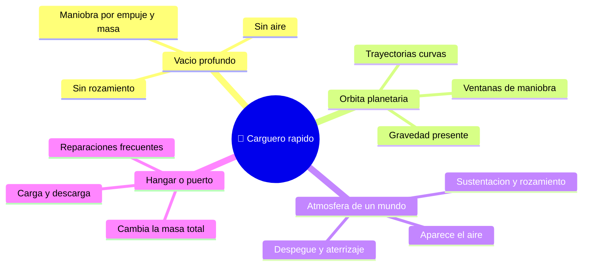

# 🌍 Entornos del Halcón Milenario

[🏠 Inicio](../../../README.md) · [🦅 Curso: Halcón Milenario](../README.md) · 🌍 Entornos

> ⚖️ Material educativo original; los derechos de las obras pertenecen a sus titulares.

Dónde opera un carguero rápido y cómo cambia su comportamiento según el entorno.
Cada escenario implica reglas físicas distintas, y en simulación se traduce en
condiciones diferentes de gravedad, atmósfera y obstáculos.

---

## 🗺️ Entornos principales

| Entorno | Características | Riesgos típicos | Ajuste de maniobra |
| --- | --- | --- | --- |
| Vacío profundo | Sin aire ni rozamiento. | Perder orientación, gastar delta-v. | Maniobras planificadas, ahorrar propelente. |
| Órbita planetaria | Gravedad que curva la trayectoria. | Caer o escapar sin control. | Respetar mecánica orbital, encender en el momento justo. |
| Atmósfera de un mundo | Aparece aire, sustentación y calor. | Recalentamiento, esfuerzo estructural. | Usar superficies aerodinámicas, controlar la velocidad. |
| Hangar o puerto | Se carga y descarga la bodega. | Sujeción de carga, exceso de masa. | Recalcular masa y delta-v tras cada operación. |

---

## 🌡️ Factores del entorno

- **Gravedad**: cerca de un planeta la trayectoria se curva; hay que tenerla en
  cuenta para no caer ni salir disparado.
- **Atmósfera**: solo al entrar en una hay aire; ahí aparecen sustentación,
  rozamiento y calor por fricción, y las superficies del casco por fin sirven.
- **Carga**: en un puerto cambia la masa total, y con ella la aceleración y el
  delta-v disponibles para el resto del viaje.
- **Calor**: en el vacío el calor no se va por el aire; se acumula y se disipa
  lentamente por radiadores.

---

## 🎮 Traducción a simulación

Cada entorno es un escenario con su gravedad, presencia o ausencia de aire y
estado de la bodega. Cargar o descargar entre misiones cambia por completo como
responde la nave, y es una gran lección sobre la relación empuje/masa. Ver como
se modela en el
[Módulo 8: Diseño de simulación](../simulacion/diseno-simulador-halcon-milenario.md).

---

[⬅️ Anterior: Principios y operación](principios-halcon-milenario.md) · [➡️ Siguiente: Reglas del universo](../reglamentos/reglas-universo-halcon-milenario.md)
