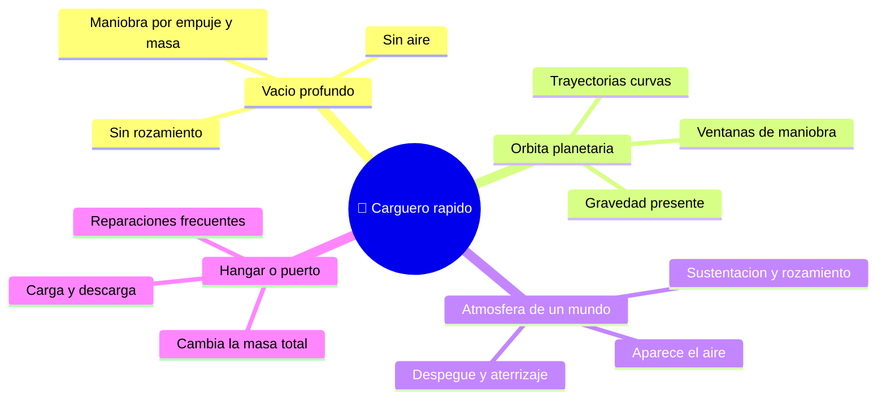

# 🌍 Entornos del Halcón Milenario

[🏠 Inicio](../../../README.md) · [🦅 Curso: Halcón Milenario](../README.md) · 🌍 Entornos

> ⚖️ Material educativo original; los derechos de las obras pertenecen a sus titulares.

Dónde opera un carguero rápido y cómo cambia su comportamiento según el entorno.
Cada escenario implica reglas físicas distintas, y en simulación se traduce en
condiciones diferentes de gravedad, atmósfera y obstáculos.

---

## 🗺️ Entornos principales

```mermaid
mindmap
  root((🦅 Carguero rapido))
    Vacio profundo
      Sin aire
      Sin rozamiento
      Maniobra por empuje y masa
    Orbita planetaria
      Gravedad presente
      Trayectorias curvas
      Ventanas de maniobra
    Atmosfera de un mundo
      Aparece el aire
      Sustentacion y rozamiento
      Despegue y aterrizaje
    Hangar o puerto
      Carga y descarga
      Cambia la masa total
      Reparaciones frecuentes
```

| Entorno | Características | Riesgos típicos | Ajuste de maniobra |
| --- | --- | --- | --- |
| Vacío profundo | Sin aire ni rozamiento. | Perder orientación, gastar delta-v. | Maniobras planificadas, ahorrar propelente. |
| Órbita planetaria | Gravedad que curva la trayectoria. | Caer o escapar sin control. | Respetar mecánica orbital, encender en el momento justo. |
| Atmósfera de un mundo | Aparece aire, sustentación y calor. | Recalentamiento, esfuerzo estructural. | Usar superficies aerodinámicas, controlar la velocidad. |
| Hangar o puerto | Se carga y descarga la bodega. | Sujeción de carga, exceso de masa. | Recalcular masa y delta-v tras cada operación. |

---

## 🌡️ Factores del entorno

- **Gravedad**: cerca de un planeta la trayectoria se curva; hay que tenerla en
  cuenta para no caer ni salir disparado.
- **Atmósfera**: solo al entrar en una hay aire; ahí aparecen sustentación,
  rozamiento y calor por fricción, y las superficies del casco por fin sirven.
- **Carga**: en un puerto cambia la masa total, y con ella la aceleración y el
  delta-v disponibles para el resto del viaje.
- **Calor**: en el vacío el calor no se va por el aire; se acumula y se disipa
  lentamente por radiadores.

---

## 🎮 Traducción a simulación

Cada entorno es un escenario con su gravedad, presencia o ausencia de aire y
estado de la bodega. Cargar o descargar entre misiones cambia por completo como
responde la nave, y es una gran lección sobre la relación empuje/masa. Ver como
se modela en el
[Módulo 9: Diseño de simulación](../simulacion/diseno-simulador-halcon-milenario.md).

## 🎓 Cierre de clase

- **Actividad:** Contrasta tres entornos de Halcón Milenario a partir de entornos, factores ambientales, riesgos y respuesta de simulación y determina cómo cambian variables, percepción, riesgos y respuesta.
- **Evidencia:** Matriz entorno–cambio–riesgo–respuesta.
- **Criterio de aprobación:** Cada respuesta se adapta al entorno y distingue riesgos que no son intercambiables entre escenarios.
- **Transferencia:** explica qué cambiaría al pasar a otra variante de esta máquina.

### Fuentes de esta clase

- [STARWARS-FALCON](https://www.starwars.com/databank/millennium-falcon): Millennium Falcon, Lucasfilm. Uso: canon narrativo del vehículo.
- [NASA-SPACECRAFT](https://www.nasa.gov/humans-in-space/spaceships-and-rockets/): Spaceships and Rockets, NASA. Uso: naves, sistemas y misiones.
- [NASA-FLIGHT](https://www1.grc.nasa.gov/beginners-guide-to-aeronautics/): Beginner's Guide to Aeronautics, NASA. Uso: contraste con física y vuelo reales.

> Las fuentes sostienen el marco conceptual y normativo; esta clase no reemplaza el manual
> del fabricante, la formación certificada ni la habilitación exigida para operar equipos reales.

---

[⬅️ Anterior: Principios y operación](principios-halcon-milenario.md) · [➡️ Siguiente: Reglas del universo](../reglamentos/reglas-universo-halcon-milenario.md)
