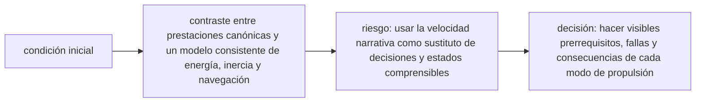

<!-- clase-meta
tipo_documento: clase
clase: 6
codigo: HALCONMILENA-06
curso: halcon-milenario
titulo: "Principios y operación del Halcón Milenario"
modalidad: "resolución de problemas"
duracion_minutos: 90
nivel: introductorio
prerrequisito: HALCONMILENA-05
competencia: "razonamiento_operacional"
resultados_aprendizaje:
  - "Explicar principios físicos, fases de operación, decisiones y errores frecuentes con vocabulario propio de Halcón Milenario."
  - "Aplicar esos conceptos a una decisión segura o a un escenario de simulación de Halcón Milenario."
evidencia: "Resolución argumentada de un escenario operacional."
criterio_aprobacion: "Aplica los principios correctos, anticipa consecuencias y respeta los límites del curso."
fuentes: manuales/fuentes.md
ultima_revision: 2026-09-10
-->

# 🧪 Principios y operación del Halcón Milenario

[🏠 Inicio](../../../README.md) · [🦅 Curso: Halcón Milenario](../README.md) · 🧪 Principios

> ⚖️ Material educativo original; los derechos de las obras pertenecen a sus titulares.

Documento educativo y de divulgación. Aquí está el corazón del curso: la
relación entre empuje, masa y aceleración, y por qué el "salto" instantáneo
entre estrellas rompe la física que conocemos. Explica que si sería posible, que
no, y sobre todo por qué.

## Empuje, masa y aceleración

La aceleración de una nave es su empuje dividido por su masa total. Esta simple
idea explica casi todo el comportamiento de un carguero:

- **Más empuje, más aceleración**: motores más potentes cambian la velocidad más
  rápido.
- **Más masa, menos aceleración**: cargar la bodega frena la respuesta de la
  nave a los mismos motores.
- **Relación empuje/masa**: es la cifra que de verdad decide si una nave se
  siente ágil o pesada. Un carguero "rápido" tendría motores muy grandes para su
  masa.

## Las leyes de Newton en el vacío

- **Primera ley (inercia)**: sin fuerzas, un objeto mantiene su velocidad. En el
  vacío no hay aire ni rozamiento, así que al apagar los motores la nave no
  frena: sigue igual para siempre.
- **Segunda ley (fuerza y masa)**: la aceleración es la fuerza dividida por la
  masa. Por eso un carguero cargado responde peor que uno vacío.
- **Tercera ley (acción y reacción)**: para moverse hay que expulsar masa hacia
  el otro lado. Sin propelente que lanzar, no hay empuje.

## Por qué la carga no viaja gratis

Cada tonelada extra en la bodega tiene dos costes. Primero, reduce la
aceleración con los mismos motores. Segundo, para lograr el mismo cambio de
velocidad hace falta gastar más propelente, así que la carga recorta el delta-v
disponible. Un carguero lleno es más lento de maniobrar y llega más justo de
propelente que uno vacío. La ficción suele ignorar esto, pero es la esencia de
transportar masa por el espacio.

## Delta-v: el presupuesto de maniobra

Cada nave lleva una cantidad limitada de propelente. La medida útil no es
"cuanto queda en el depósito", sino cuanto puede cambiar su velocidad en total:
eso se llama delta-v. Cada maniobra y cada carga extra gastan parte de ese
presupuesto. Cuando se agota, la nave ya no puede acelerar, frenar ni cambiar de
rumbo, aunque le sobre energía eléctrica.

## Por qué el "salto a la luz" rompe la física

El hiperimpulso es la licencia más grande de la ficción. En la física que
conocemos hoy, ningún objeto con masa puede alcanzar la velocidad de la luz:
cuanto más te acercas, más energía hace falta, y esa energía crece sin límite.
Cruzar la galaxia en minutos no tiene base en la física actual. No es un fallo de
la obra, sino un recurso para que la historia pueda avanzar entre mundos
lejanos.

## Que si y que no

| Idea de la ficción | Que si es real | Que no es real |
| --- | --- | --- |
| El carguero acelera con sus motores | El empuje por reacción es real | La aceleración no ignora la masa. |
| Corre igual lleno o vacío | Se puede acelerar con carga | Cargado acelera menos y gasta más. |
| Frena al soltar el acelerador | Se puede frenar con empuje contrario | No frena solo sin rozamiento. |
| Salto instantáneo entre estrellas | Se puede viajar por el espacio | No se alcanza la velocidad de la luz con masa. |
| Propulsión inagotable | El empuje por reacción es real | El propelente es finito (delta-v). |
| Persecuciones a la vista | Puede haber persecución | Ocurriría a enormes distancias con sensores. |

## Cómo sería un carguero realista

- Planearía rutas con transferencias largas para ahorrar delta-v.
- Ajustaría su carga sabiendo que cada tonelada recorta la maniobra.
- Maniobraría despacio y con antelación, no con giros bruscos.
- Cuidaría el propelente como su recurso más valioso.

## Relación con los niveles de realismo

- **Nivel 1 (educativo)**: mover la nave y notar que cargada responde peor.
- **Nivel 2 (simplificado)**: sumar relación empuje/masa y conservación del momento.
- **Nivel 3 (técnico)**: gestionar delta-v, masa variable, calor y rutas.

Ver [`docs/03-niveles-de-realismo.md`](../../../docs/03-niveles-de-realismo.md)
para el detalle de cada nivel.

## 🧭 Guía de estudio aplicada

### Pregunta guía

¿Cómo ayuda **Empuje, masa y aceleración, Las leyes de Newton en el vacío, Por qué la carga no viaja gratis y Delta-v: el presupuesto de maniobra** a **resolver escape ficticio con hiperimpulsor degradado sin agotar el margen operacional**?

### Explicación razonada

El principio rector puede resumirse así: contraste entre prestaciones canónicas y un modelo consistente de energía, inercia y navegación. Esto explica por qué una misma orden produce resultados distintos cuando cambian velocidad, carga, configuración o entorno. Operar bien consiste en leer la tendencia antes de agotar el margen y tomar esta decisión: hacer visibles prerrequisitos, fallas y consecuencias de cada modo de propulsión.

Esta clase se conecta con el resto del curso mediante **contraste entre prestaciones canónicas y un modelo consistente de energía, inercia y navegación**. El hilo de
seguridad consiste en reconocer a tiempo **usar la velocidad narrativa como sustituto de decisiones y estados comprensibles** y poder justificar la decisión
**hacer visibles prerrequisitos, fallas y consecuencias de cada modo de propulsión**; en clases posteriores cambiará el ángulo de análisis, no esa relación causal.
La lectura funcional común sigue **reactor ficticio → hiperimpulsor → control de actitud → trayectoria**, de modo que cada concepto pueda
ubicarse dentro del funcionamiento completo y no quede como un dato aislado.

**Apoyo documental:** [Millennium Falcon](https://www.starwars.com/databank/millennium-falcon) aporta canon narrativo del vehículo;
[Spaceships and Rockets](https://www.nasa.gov/humans-in-space/spaceships-and-rockets/) se usa para naves, sistemas y misiones. Estas fuentes
se contrastan con el alcance de la clase y no sustituyen un manual de equipo concreto.

### Caso resuelto: de la observación a la decisión

1. **Datos:** reconoce condiciones, configuración y margen disponibles en **escape ficticio con hiperimpulsor degradado**.
2. **Modelo:** aplica **contraste entre prestaciones canónicas y un modelo consistente de energía, inercia y navegación** para predecir una tendencia antes de actuar.
3. **Riesgo:** explica mediante qué cadena de causas podría ocurrir **usar la velocidad narrativa como sustituto de decisiones y estados comprensibles**.
4. **Decisión:** ejecuta mentalmente **hacer visibles prerrequisitos, fallas y consecuencias de cada modo de propulsión** y define qué observación confirmaría que funcionó.

### Comprueba tu comprensión

1. ¿Qué variable del principio «contraste entre prestaciones canónicas y un modelo consistente de energía, inercia y navegación» cambia primero en el caso?
2. ¿Cómo se propaga ese cambio hasta **trayectoria**?
3. ¿Qué evidencia confirmaría que **hacer visibles prerrequisitos, fallas y consecuencias de cada modo de propulsión** conservó margen operacional?

Orientación para revisar tus respuestas

- La primera respuesta debe relacionar el eslabón elegido con un efecto posterior, no solo nombrarlo.
- La segunda debe proponer una señal medible u observable y explicar qué tendencia sería preocupante.
- La tercera debe cambiar al menos una variable de capacidad, mando, entorno o margen de seguridad.

## 🎓 Cierre de clase

- **Actividad:** Resuelve un escenario de Halcón Milenario explicando, paso a paso, cómo intervienen principios físicos, fases de operación, decisiones y errores frecuentes.
- **Evidencia:** Resolución argumentada de un escenario operacional.
- **Criterio de aprobación:** Aplica los principios correctos, anticipa consecuencias y respeta los límites del curso.
- **Transferencia:** explica qué cambiaría al pasar a otra variante de esta máquina.

### Fuentes de esta clase

- [STARWARS-FALCON](https://www.starwars.com/databank/millennium-falcon): Millennium Falcon, Lucasfilm. Uso: canon narrativo del vehículo.
- [NASA-SPACECRAFT](https://www.nasa.gov/humans-in-space/spaceships-and-rockets/): Spaceships and Rockets, NASA. Uso: naves, sistemas y misiones.
- [NASA-FLIGHT](https://www1.grc.nasa.gov/beginners-guide-to-aeronautics/): Beginner's Guide to Aeronautics, NASA. Uso: contraste con física y vuelo reales.

> Las fuentes sostienen el marco conceptual y normativo; esta clase no reemplaza el manual
> del fabricante, la formación certificada ni la habilitación exigida para operar equipos reales.

---

[⬅️ Anterior: Mandos](../mandos/manual-mandos-halcon-milenario.md) · [➡️ Siguiente: Entornos](entornos-halcon-milenario.md)
