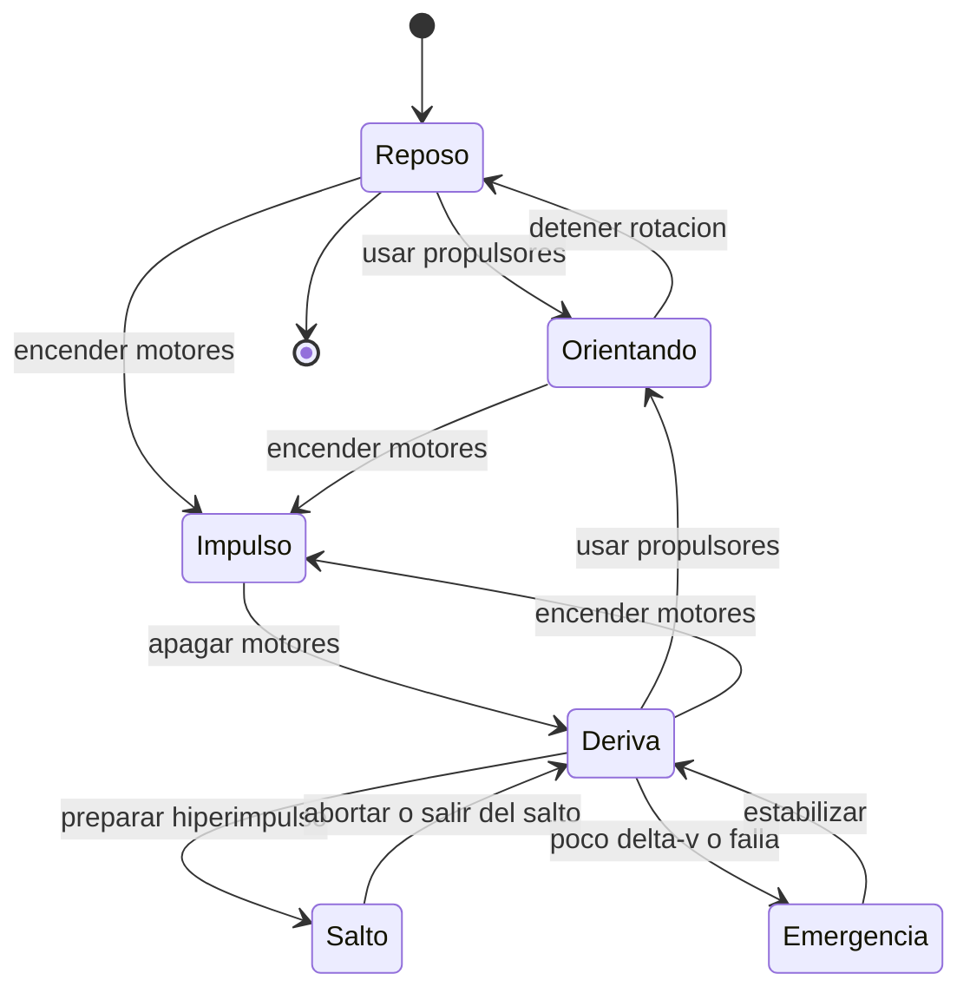

# 🎮 Diseño de simulación del Halcón Milenario

[🏠 Inicio](../../../README.md) · [🦅 Curso: Halcón Milenario](../README.md) · 🎮 Simulación

> ⚖️ Material educativo original; los derechos de las obras pertenecen a sus titulares.

Como modelar de forma educativa y divertida un carguero rápido. La idea central
es poder alternar entre la versión espectacular de la ficción y la versión fiel
a la física, para que el usuario compare ambas con la misma nave, y sobre todo
para que sienta como la carga cambia la maniobra.

## Objetivo de la simulación

Que el usuario comprenda, jugando, que en el vacío la nave no frena sola, que la
aceleración depende de la relación empuje/masa, y que cada tonelada de carga
recorta el delta-v. El modo ficción sirve para engancharse; el modo ciencia,
para aprender.

## Modo ciencia o ficción

La variable más importante del simulador es el **modo**:

- **Modo ficción**: la nave corre igual llena o vacía, frena al soltar el
  acelerador y puede "saltar" a la luz. Es divertido y familiar.
- **Modo ciencia**: se aplican las leyes de Newton, la relación empuje/masa, la
  conservación del momento y el límite de delta-v. La carga pesa de verdad y el
  salto se marca como recurso de ficción.

Al cambiar de modo, la interfaz avisa que reglas se activan o desactivan, para
que la comparación sea explícita y educativa.

## Variables principales

| Variable | Tipo | Rango | Afecta a | Comentarios |
| --- | --- | --- | --- | --- |
| Modo | discreta | ciencia / ficción | Todas las reglas | Interruptor central del aprendizaje. |
| Empuje de motores | numérica | 0-100% | Cambio de velocidad | No fija velocidad, la cambia. |
| Masa de carga | numérica | 0-maxima bodega | Aceleración y delta-v | Más carga, menos agilidad. |
| Vector de velocidad | numérica | 0-varios km/s | Movimiento | En modo ciencia se conserva sin motor. |
| Orientación | numérica | 0-360 grados por eje | Apuntado | Independiente del rumbo. |
| Delta-v restante | numérica | 0-100% | Autonomía de maniobra | La carga lo recorta. |
| Calor acumulado | numérica | 0-100% | Riesgo térmico | Se disipa lento por radiadores. |
| Gravedad del entorno | numérica | 0-alta | Trayectoria | Curva el rumbo cerca de un planeta. |

## Ciclo básico

1. Leer entrada del usuario (empuje, rotación, traslación, carga).
2. Comprobar el modo activo (ciencia o ficción).
3. Calcular la masa total sumando nave más carga.
4. Calcular la aceleración como empuje dividido por masa.
5. Aplicar reglas del modo: en ciencia, conservar momento y descontar delta-v.
6. Aplicar el entorno: gravedad, aire si lo hay, obstáculos.
7. Actualizar velocidad, posición y orientación.
8. Refrescar instrumentos (velocidad, masa, delta-v, calor, sensores).

## Modos de juego futuros

- Tutorial de carga: comparar la misma maniobra con la bodega vacía y llena.
- Reto de acoplamiento suave usando solo propulsores de control.
- Comparador lado a lado: misma maniobra en modo ciencia y en modo ficción.
- Gestión de delta-v en una ruta con propelente limitado y mucha carga.
- Escenario de reentrada donde por fin las superficies aerodinámicas sirven.

## Elementos fuera de alcance

- Presentar el "salto a la luz" como si fuera física real sin avisarlo.
- Detalles de armamento presentados como datos técnicos reales.
- Cualquier contenido que confunda espectáculo con ciencia sin distinguirlos.

## Pendientes

- [ ] Definir valores por defecto de empuje y masa por tipo de carguero.
- [ ] Prototipar el ciclo básico con relación empuje/masa.
- [ ] Ajustar el descuento de delta-v por carga añadida.
- [ ] Agregar fuentes de divulgación a [`manuales/fuentes.md`](../../../manuales/fuentes.md).

---

[⬅️ Anterior: Reglas del universo](../reglamentos/reglas-universo-halcon-milenario.md) · [➡️ Siguiente: Recursos](../recursos/recursos-halcon-milenario.md)
