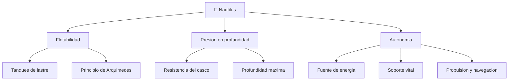

# 🐙 Curso: Nautilus

[🏠 Inicio](../../README.md) · [🌌 Naves de ficcion](../README.md) · [🎓 Guia de curso](../../docs/08-guia-de-estilo-y-curso.md)

> ⚖️ Material educativo original; el Nautilus de Julio Verne (1870) es de dominio publico; otros derechos pertenecen a sus titulares.

---

> Curso de ficcion dedicado al **Nautilus**, el submarino que Julio Verne
> imagino en 1870. Usamos esta nave visionaria para aprender fisica real:
> flotabilidad, presion en profundidad, autonomia y soporte vital. Comparamos
> lo que la novela acerto con la ingenieria submarina moderna.

---

## 🎯 Objetivos de aprendizaje

Al terminar este curso deberias poder:

- Explicar el principio de Arquimedes y por que un casco de acero puede flotar.
- Describir como los tanques de lastre permiten sumergir y emerger la nave.
- Entender por que la presion crece con la profundidad y como afecta al casco.
- Razonar sobre autonomia: energia, aire respirable y agua a bordo.
- Distinguir que imagino Verne que hoy es real y que sigue siendo ficcion.
- Traducir la flotabilidad y la presion en variables de un simulador educativo.

---

## 🗺️ Mapa conceptual

---

## 📚 Modulos del curso

| # | Modulo | Contenido | Enlace |
| :-: | --- | --- | --- |
| 1 | 📜 Historia | La novela de Verne, su contexto y la nave imaginada. | [Abrir](historia/historia-nautilus.md) |
| 2 | 📋 Caracteristicas | Que es el Nautilus, forma, tamano y capacidades. | [Abrir](operacion/caracteristicas-nautilus.md) |
| 3 | 🔧 Sistemas mecanicos | Tecnologia imaginada por Verne frente a la fisica real. | [Abrir](operacion/sistemas-mecanicos-nautilus.md) |
| 4 | 🎛️ Mandos e instrumentos | Puesto de mando, controles e instrumentos de a bordo. | [Abrir](mandos/manual-mandos-nautilus.md) |
| 5 | 🧪 Principios y operacion | Que si, que no y por que, segun la fisica. | [Abrir](operacion/principios-nautilus.md) |
| 6 | 🌍 Entornos | Superficie, aguas medias y grandes fondos oceanicos. | [Abrir](operacion/entornos-nautilus.md) |
| 7 | ⚖️ Reglas del universo | Las leyes internas de la novela, no ley real. | [Abrir](reglamentos/reglas-universo-nautilus.md) |
| 8 | 🎮 Diseno de simulacion | Variables, ciclo, estados y modo ciencia/ficcion. | [Abrir](simulacion/diseno-simulador-nautilus.md) |
| 9 | 🧰 Recursos | Glosario, enlaces y diagramas de apoyo. | [Abrir](recursos/recursos-nautilus.md) |

---

## 🧩 Requisitos previos

Ninguno. El Nautilus es un excelente caso para estudiar fisica de fluidos
porque combina un concepto simple, la flotabilidad, con un desafio extremo, la
presion de las profundidades. Conviene tener a mano el
[🎓 nivel de realismo](../../docs/03-niveles-de-realismo.md) para graduar el
detalle.

---

[➡️ Empezar por el Modulo 1: Historia](historia/historia-nautilus.md)
