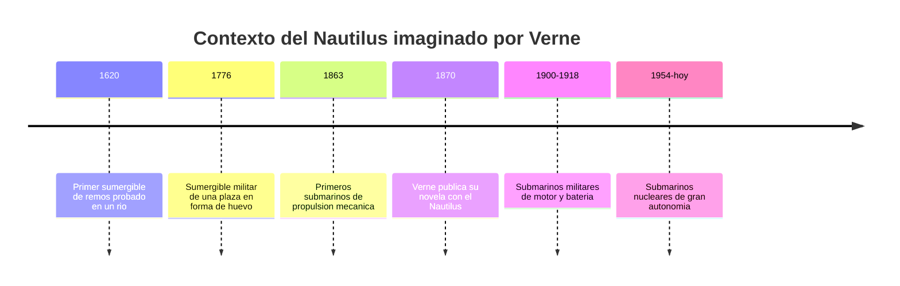

# 📜 Historia del Nautilus

[🏠 Inicio](../../../README.md) · [🐙 Curso: Nautilus](../README.md) · 📜 Historia

> ⚖️ Material educativo original; el Nautilus de Julio Verne (1870) es de dominio publico; otros derechos pertenecen a sus titulares.

## Origen de la nave

El Nautilus es la nave imaginada por el escritor frances Julio Verne y
publicada en 1870 en su novela de aventuras submarinas. En la historia es un
submarino secreto y autosuficiente, construido lejos de cualquier gobierno por
un capitan que rechaza la sociedad de su epoca y decide vivir bajo el mar.

Verne escribio en un momento en que los submarinos reales eran fragiles,
pequenos y de muy poca autonomia. Frente a esa realidad modesta, imagino una
nave enorme, comoda y capaz de recorrer los oceanos del mundo sin subir a
puerto. Ese salto de imaginacion es lo que hace al Nautilus tan interesante
para estudiar fisica: muchas de sus ideas se adelantaron a la ingenieria que
llegaria decadas despues.

## Linea de tiempo

| Periodo | Hito | Importancia |
| --- | --- | --- |
| 1620 | Primer sumergible de remos | Prueba de que un casco podia bajar y subir. |
| 1776 | Sumergible militar de una plaza | Uso de lastre de agua para sumergir. |
| 1863 | Submarinos de propulsion mecanica | Motor en vez de fuerza humana. |
| 1870 | Publicacion de la novela de Verne | Nace el Nautilus como nave visionaria. |
| 1900-1918 | Submarinos de motor y bateria | Autonomia real limitada, doble propulsion. |
| 1954-presente | Submarinos nucleares | Gran autonomia, como intuyo la ficcion. |

## Lo que Verne imagino antes de tiempo

- **Autonomia total**: una nave que no dependia de puertos ni de carbon.
- **Electricidad como energia central**: cuando casi todo funcionaba a vapor.
- **Comodidad interior**: espacios amplios, no un simple tubo de guerra.
- **Exploracion cientifica**: el mar como objeto de estudio, no solo de combate.
- **Renovacion del aire**: conciencia de que respirar bajo el agua es el limite.

## Por que sigue vigente

La nave de Verne popularizo la idea de que el ser humano podia habitar el
oceano profundo, no solo cruzarlo por la superficie. Inspiro a ingenieros e
inventores reales y dio nombre a submarinos y vehiculos posteriores. Para este
curso es una herramienta ideal: cada capitulo de la novela sugiere un problema
fisico concreto, desde por que flota un casco de metal hasta cuanto aire cabe a
bordo.

## Fuentes

- Registrar aqui las fuentes publicas consultadas sobre historia submarina.
- Enlazar cada fuente tambien en [`manuales/fuentes.md`](../../../manuales/fuentes.md).

---

[🎓 Portada del curso](../README.md) · [➡️ Siguiente: Caracteristicas](../operacion/caracteristicas-nautilus.md)
