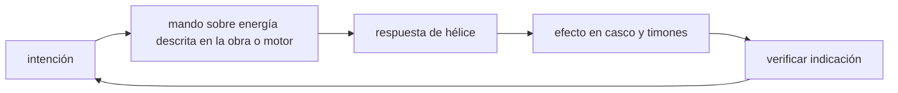

<!-- clase-meta
tipo_documento: clase
clase: 5
codigo: NAUTILUS-05
curso: nautilus
titulo: "Mandos e instrumentos del Nautilus"
modalidad: "taller de simulación"
duracion_minutos: 60
nivel: introductorio
prerrequisito: NAUTILUS-04
competencia: "lectura_y_mando"
resultados_aprendizaje:
  - "Explicar controles, instrumentos, entradas y estados del sistema con vocabulario propio de Nautilus."
  - "Aplicar esos conceptos a una decisión segura o a un escenario de simulación de Nautilus."
evidencia: "Mapa de mandos y resolución de dos estados del tablero."
criterio_aprobacion: "Reconoce los controles críticos y responde a los estados sin introducir acciones inseguras."
fuentes: manuales/fuentes.md
ultima_revision: 2026-09-10
-->

# 🎛️ Mandos e instrumentos del Nautilus

[🏠 Inicio](../../../README.md) · [🐙 Curso: Nautilus](../README.md) · 🎛️ Mandos

> ⚖️ Material educativo original; el Nautilus de Julio Verne (1870) es de dominio público; otros derechos pertenecen a sus titulares.

## Vista general

El puesto de mando de un submarino imaginado como el Nautilus se organiza
alrededor de tres decisiones: cuanto lastre llevar, hacia donde apuntar y a que
velocidad avanzar. A diferencia de un vehículo terrestre, aquí el control de la
profundidad es tan importante como el del rumbo, y todo se hace sin ver el
exterior salvo por ventanas o instrumentos.

## Mapa de controles

| Zona | Control | Tipo | Función | Prioridad | Comentarios |
| --- | --- | --- | --- | --- | --- |
| Panel de lastre | Válvulas de inundación | Palanca | Dejar entrar agua para sumergir | Alta | Aumenta el peso de la nave. |
| Panel de lastre | Purga de aire comprimido | Palanca | Expulsar agua para emerger | Alta | Reduce el peso de la nave. |
| Puesto de gobierno | Timón de dirección | Rueda | Girar a babor o estribor | Alta | Rumbo horizontal. |
| Puesto de gobierno | Timones de profundidad | Palanca | Inclinar arriba o abajo | Alta | Ajuste fino de profundidad. |
| Consola de energía | Regulador de propulsión | Mando | Regular la potencia de la hélice | Alta | Controla la velocidad. |
| Consola de energía | Corte general | Botón | Detener la propulsión | Alta | Parada de seguridad. |
| Soporte vital | Renovación de aire | Válvula | Ventilar y reponer oxígeno | Alta | Vital en inmersiones largas. |
| Observación | Iluminación exterior | Interruptor | Alumbrar el entorno | Media | Útil en aguas oscuras. |

## Instrumentos principales

| Instrumento | Mide o muestra | Unidad | Importancia | Notas |
| --- | --- | --- | --- | --- |
| Profundímetro | Profundidad actual | metros | Alta | Clave para no pasar el límite del casco. |
| Manómetro | Presión exterior | atmósferas | Alta | Sube con la profundidad. |
| Indicador de flotabilidad | Peso frente a empuje | relativa | Alta | Muestra si la nave sube o baja. |
| Brújula | Rumbo | grados | Alta | Orientación horizontal. |
| Corredera | Velocidad de avance | nudos | Media | Ayuda a estimar distancia. |
| Nivel de aire | Oxígeno disponible | fracción | Alta | Límite real de la inmersión. |
| Carga de energía | Energía restante | fracción | Alta | Define la autonomía. |

## Entradas de simulación

| Acción | Teclado | Controlador | Pantalla táctil | Comentarios |
| --- | --- | --- | --- | --- |
| Inundar lastre | Tecla F | Gatillo izquierdo | Botón bajar | Sumerge la nave, progresivo. |
| Purgar lastre | Tecla R | Gatillo derecho | Botón subir | Emerge la nave, progresivo. |
| Timón izquierda | Flecha izquierda | Stick izquierdo | Deslizar izquierda | Gira a babor. |
| Timón derecha | Flecha derecha | Stick derecho | Deslizar derecha | Gira a estribor. |
| Morro arriba | Flecha arriba | Cruceta arriba | Botón proa arriba | Timones de profundidad. |
| Morro abajo | Flecha abajo | Cruceta abajo | Botón proa abajo | Timones de profundidad. |
| Acelerar | Tecla W | Botón A | Zona derecha | Más potencia a la hélice. |
| Ventilar aire | Tecla V | Botón lateral | Botón aire | Solo posible en superficie. |

## Estados del sistema

| Estado | Descripción | Indicadores | Acciones disponibles |
| --- | --- | --- | --- |
| En superficie | Flota, aire renovable | Profundímetro en cero | Ventilar, inundar lastre, navegar. |
| Sumergiendo | Ganando profundidad | Profundidad en aumento | Ajustar timones, vigilar presión. |
| A media agua | Flotabilidad neutra | Profundidad estable | Navegar, girar, acelerar. |
| Emergiendo | Perdiendo profundidad | Profundidad en descenso | Purgar lastre, controlar ascenso. |
| Emergencia | Riesgo o falla | Testigos de alerta | Purgar lastre, cortar propulsión. |

## Observaciones ergonomicas

- El profundímetro y el manómetro deben verse siempre: marcan el límite físico.
- El nivel de aire debe estar visible para no olvidar la autonomía respirable.
- La purga de lastre de emergencia tiene que ser accesible y reconocible.
- La interfaz debe dejar claro que ventilar el aire solo es posible en la
  superficie, no sumergido.

## 🧭 Guía de estudio aplicada

### Pregunta guía

¿Cómo ayuda **Vista general, Mapa de controles, Instrumentos principales y Entradas de simulación** a **interpretar mandos e indicaciones durante inmersión narrativa cerca de relieve submarino**?

### Explicación razonada

Un mando no se aprende memorizando su nombre, sino recorriendo el ciclo intención → acción → indicación → verificación. En Nautilus, el operador actúa sobre energía descrita en la obra o motor, observa la respuesta en hélice y confirma el efecto en casco y timones. Una indicación inesperada exige detener la secuencia mental, identificar el modo activo y evitar una segunda orden que agrave el estado.

Esta clase se conecta con el resto del curso mediante **lectura doble: tecnología imaginada por Verne y principios reales de flotabilidad y presión**. El hilo de
seguridad consiste en reconocer a tiempo **colisión o exceso de profundidad al tomar la descripción literaria como procedimiento real** y poder justificar la decisión
**citar el canon y contrastar cada maniobra con física y navegación reales**; en clases posteriores cambiará el ángulo de análisis, no esa relación causal.
La lectura funcional común sigue **energía descrita en la obra → motor → hélice → casco y timones**, de modo que cada concepto pueda
ubicarse dentro del funcionamiento completo y no quede como un dato aislado.

**Apoyo documental:** [Twenty Thousand Leagues under the Sea](https://www.gutenberg.org/ebooks/164) aporta obra primaria en dominio público;
[Safety of Navigation](https://www.imo.org/en/ourwork/safety/pages/navigationdefault.aspx) se usa para navegación, SOLAS, COLREG y STCW. Estas fuentes
se contrastan con el alcance de la clase y no sustituyen un manual de equipo concreto.

### Caso resuelto: de la observación a la decisión

1. **Intención:** formula qué cambio se necesita durante **inmersión narrativa cerca de relieve submarino**.
2. **Mando:** identifica el control que actúa sobre **energía descrita en la obra** o **motor** y el modo que debe estar activo.
3. **Lectura:** localiza la indicación que confirma la respuesta de **hélice** y el efecto en **casco y timones**.
4. **Verificación:** si la lectura no coincide, no acumules órdenes; estabiliza e investiga el estado.

### Comprueba tu comprensión

1. ¿Qué mando inicia la respuesta y qué instrumento confirma que el modo correcto está activo?
2. ¿Qué indicación temprana advertiría **colisión o exceso de profundidad al tomar la descripción literaria como procedimiento real**?
3. ¿Qué secuencia usarías si la respuesta de **casco y timones** no coincide con la orden?

Orientación para revisar tus respuestas

- La primera respuesta debe relacionar el eslabón elegido con un efecto posterior, no solo nombrarlo.
- La segunda debe proponer una señal medible u observable y explicar qué tendencia sería preocupante.
- La tercera debe cambiar al menos una variable de capacidad, mando, entorno o margen de seguridad.

## 🎓 Cierre de clase

- **Actividad:** Recorre el puesto de mando simulado de Nautilus: localiza los controles de controles, instrumentos, entradas y estados del sistema y asocia cada indicación con una decisión.
- **Evidencia:** Mapa de mandos y resolución de dos estados del tablero.
- **Criterio de aprobación:** Reconoce los controles críticos y responde a los estados sin introducir acciones inseguras.
- **Transferencia:** explica qué cambiaría al pasar a otra variante de esta máquina.

### Fuentes de esta clase

- [GUTENBERG-20000](https://www.gutenberg.org/ebooks/164): Twenty Thousand Leagues under the Sea, Project Gutenberg. Uso: obra primaria en dominio público.
- [IMO-NAV](https://www.imo.org/en/ourwork/safety/pages/navigationdefault.aspx): Safety of Navigation, International Maritime Organization. Uso: navegación, SOLAS, COLREG y STCW.
- [NASA-FLIGHT](https://www1.grc.nasa.gov/beginners-guide-to-aeronautics/): Beginner's Guide to Aeronautics, NASA. Uso: contraste con física y vuelo reales.

> Las fuentes sostienen el marco conceptual y normativo; esta clase no reemplaza el manual
> del fabricante, la formación certificada ni la habilitación exigida para operar equipos reales.

---

[⬅️ Anterior: Sistemas mecánicos](../operacion/sistemas-mecanicos-nautilus.md) · [➡️ Siguiente: Principios y operación](../operacion/principios-nautilus.md)
