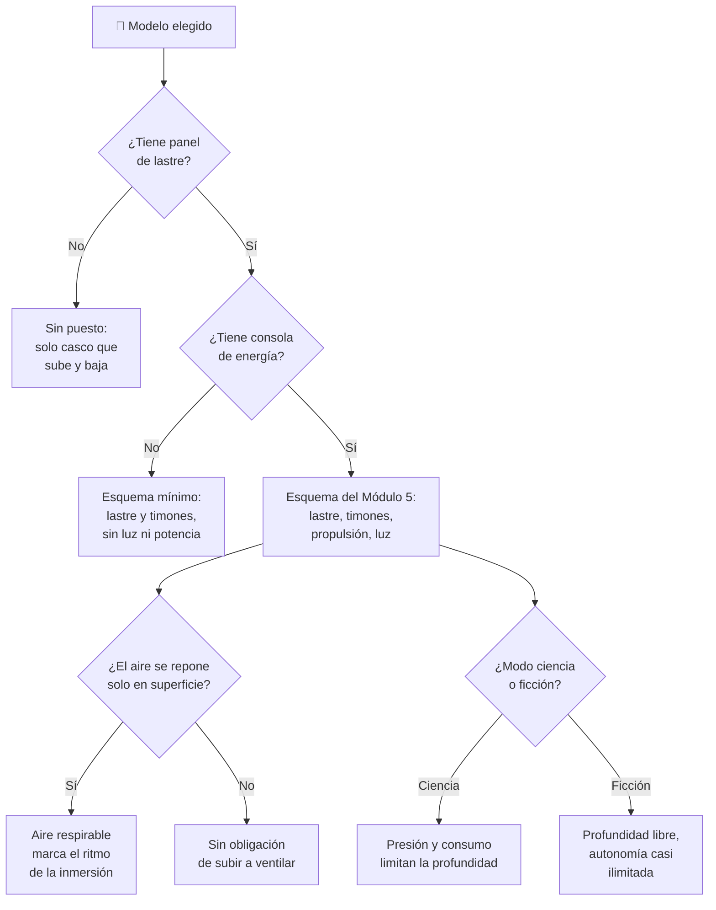

# 🧩 Modelos y variantes del Nautilus

[🏠 Inicio](../../../README.md) · [🐙 Curso: Nautilus](../README.md) · 🧩 Modelos

El [Módulo 2](../operacion/caracteristicas-nautilus.md) ya dijo qué es el
Nautilus, qué forma tiene y qué sabe hacer. Este módulo responde a lo siguiente:
**el Nautilus no es una familia de naves, es una sola**. No hay variantes que
comparar entre sí. Lo que sí se puede comparar, y es donde está la lección, es el
Nautilus frente a los submarinos que existían de verdad en su época y frente a
los que existen hoy. Ahí sí cambia qué mandos hay en el puesto, y por tanto qué
debe modelar el simulador.

> 🎯 **La idea que sostiene el módulo.** El Nautilus es una nave de ficción,
> imaginada por Julio Verne en 1870 y hoy en dominio público. Inventarle
> versiones sería inventar datos, así que este módulo no lo hace. En su lugar usa
> el eje honesto que el propio curso ya tiene abierto desde el
> [Módulo 1](../historia/historia-nautilus.md): la nave imaginada, los
> sumergibles reales de su siglo y el submarino moderno. Un simulador que
> presente un solo esquema de control está representando **una** de esas
> máquinas, aunque diga representar "un submarino".

---

## 🧭 Por qué el modelo decide el simulador

El [Módulo 5](../mandos/manual-mandos-nautilus.md) describe un puesto con panel
de lastre, timón de dirección, timones de profundidad y una **consola de
energía** con regulador de propulsión eléctrica. El
[Módulo 9](../simulacion/diseno-simulador-nautilus.md) expone una variable
`Energía` con rango `0-100%` y una variable `Modo ciencia/ficción`. Ambos
describen al Nautilus **de la novela**.

Ese puesto no es el de un sumergible de 1870. El [Módulo 1](../historia/historia-nautilus.md)
sitúa en 1863 los primeros submarinos de propulsión mecánica y recuerda que Verne
escribió cuando "casi todo funcionaba a vapor": la consola de energía eléctrica
del Módulo 5 no tenía dónde existir. Y tampoco es el de un submarino moderno: el
[Módulo 4](../operacion/sistemas-mecanicos-nautilus.md) señala que hoy se usan
generadores de oxígeno a bordo, mientras que la válvula de renovación de aire del
Nautilus solo funciona en superficie.

Si el simulador se construye sobre el puesto del Módulo 5 y luego se le "añade"
un sumergible de 1776, el resultado es un sumergible de 1776 con regulador
eléctrico, que nunca existió.

---

## 🗂️ Qué cambia en el manejo

| Modelo o variante | Qué cambia al gobernarlo |
| --- | --- |
| Nautilus, modo ficción | La referencia del curso. Sumerge y emerge de forma controlada siempre, el casco aguanta la profundidad que pida la aventura y la energía parece inagotable ([Módulo 8](../reglamentos/reglas-universo-nautilus.md)). |
| Nautilus, modo ciencia | La misma nave, pero la profundidad tiene un límite de aplastamiento y el aire y la energía se agotan. El piloto deja de explorar y empieza a administrar. |
| Sumergible de remos (1620) | Solo hay casco que baja y sube; el curso no le atribuye más. El avance depende de la fuerza humana, así que no se "gobierna" un rumbo, se rema. |
| Sumergible de lastre, una plaza (1776) | Aparece el lastre de agua para sumergir, pero una sola persona hace todo. No hay reparto de tareas entre gobierno, lastre y energía. |
| Submarino de propulsión mecánica (1863) | Motor en lugar de fuerza humana: por primera vez la velocidad es una decisión y no un esfuerzo. Autonomía muy corta. |
| Submarino de motor y batería (1900-1918) | Doble propulsión y autonomía real limitada: la superficie deja de ser un lugar al que subir a voluntad y pasa a ser una necesidad periódica. |
| Submarino nuclear (1954-hoy) | Gran autonomía, como intuyó la ficción. Subir a ventilar deja de marcar el ritmo de la misión; el límite se corre hacia la tripulación. |

---

## 🎛️ Qué cambia en el mando

| Modelo o variante | Qué mando aparece o desaparece | Consecuencia |
| --- | --- | --- |
| Nautilus, modo ficción y modo ciencia | Ninguno: el mapa de controles del Módulo 5 aplica tal cual en ambos. | Cambian los límites y los avisos, no los controles. El modo no toca el puesto, toca la física. |
| Sumergible de remos (1620) | **Desaparece** todo salvo el casco: sin panel de lastre documentado, sin consola de energía, sin timones. | No hay puesto de mando que simular; hay un casco y personas remando. |
| Sumergible de lastre, una plaza (1776) | **Aparece** el lastre de agua. Siguen sin existir la consola de energía y la iluminación exterior. | Se puede sumergir, pero no se puede alumbrar ni regular potencia: navegar a ciegas es la condición normal. |
| Submarino de propulsión mecánica (1863) | **Aparece** un mando de propulsión, pero **mecánico**, no la consola eléctrica del Módulo 5. | La velocidad ya es un mando; la energía todavía no es un instrumento que vigilar. |
| Submarino de motor y batería (1900-1918) | **Aparece** la gestión de dos fuentes de propulsión, que el puesto del Nautilus no contempla. | El piloto elige fuente, algo que el Módulo 5 nunca le pide: allí la energía es una sola. |
| Submarino nuclear (1954-hoy) | **Desaparece** la atadura de la válvula de renovación de aire a la superficie: el Módulo 4 registra generadores de oxígeno a bordo. | La acción "Ventilar aire", que el Módulo 5 marca como "solo posible en superficie", deja de ser el reloj de la inmersión. |
| Todos los reales, frente al Nautilus | **Falta** en el Nautilus cualquier mando de detección: ante la oscuridad total del [Módulo 7](../operacion/entornos-nautilus.md), su única respuesta es el interruptor de iluminación exterior. | El riesgo de choque contra el relieve del fondo queda sin instrumento propio: se ve o no se ve. |

---

## 🎮 Qué cambia en el simulador

Contrastado con las variables del
[Módulo 9](../simulacion/diseno-simulador-nautilus.md):

| Modelo o variante | Variables que cambian | Esquema de control |
| --- | --- | --- |
| Nautilus, modo ficción | `Modo ciencia/ficción` = ficción. `Aire respirable` y `Energía` dejan de ser restrictivos y `Profundidad` usa todo su rango. | El del Módulo 5. |
| Nautilus, modo ciencia | `Modo ciencia/ficción` = ciencia. `Presión exterior` limita `Profundidad`; `Aire respirable` y `Energía` se consumen de verdad. | El del Módulo 5, con avisos activos. |
| Sumergible de remos (1620) | `Energía` **desaparece** como recurso de a bordo y `Velocidad` deja de depender de un mando. `Lastre` no está documentado. | Sin puesto: no hay esquema de control que compartir. |
| Sumergible de lastre, una plaza (1776) | Quedan `Lastre`, `Flotabilidad neta` y `Profundidad`. `Energía` y `Velocidad` **se eliminan**. | Solo el panel de lastre; sin consola de energía. |
| Submarino de propulsión mecánica (1863) | Vuelve `Velocidad`, pero `Energía` no es eléctrica y su rango útil es mucho más corto. | Panel de lastre más propulsión mecánica. |
| Submarino de motor y batería (1900-1918) | `Energía` **se desdobla** en dos fuentes y `Aire respirable` marca el ritmo: la superficie es obligatoria. | El del Módulo 5 más una entrada de selección de fuente. |
| Submarino nuclear (1954-hoy) | `Energía` deja de ser el límite práctico y `Aire respirable` se repone sumergido: ninguna de las dos fuerza subir. | El del Módulo 5 sin la atadura de "ventilar solo en superficie". |

---

## 🗺️ Del modelo al esquema de control

---

## ⚠️ Qué modelos no comparten simulador

Tres casos no se resuelven ajustando parámetros, porque su esquema de control es
otro:

- **Los sumergibles anteriores a la novela** (1620 y 1776) frente al Nautilus:
  no les falta potencia, les falta el puesto entero. Sin consola de energía no
  hay regulador de propulsión ni iluminación exterior, y sin iluminación el
  entorno de gran profundidad del Módulo 7 deja de ser jugable. Es otra máquina,
  no una versión modesta de la misma.
- **El submarino de motor y batería** frente al Nautilus: obliga a que `Energía`
  sea dos recursos y no uno, y a que el piloto elija entre ellos. El puesto del
  Módulo 5 no tiene esa entrada.
- **El submarino nuclear** frente al Nautilus: rompe la regla que sostiene todo
  el diseño de la inmersión, que ventilar solo se puede en superficie. Quitarla
  no hace la partida más fácil: la deja sin reloj.

En cambio, los dos **modos** del Nautilus sí comparten simulador, y por diseño:
el Módulo 9 los resuelve con la variable `Modo ciencia/ficción` sobre el mismo
puesto de mando. Esa gradación es la misma idea que plantean los
[niveles de realismo](../../../docs/03-niveles-de-realismo.md): en el nivel 1
basta con sumergir, emerger y vigilar la profundidad, y las diferencias emergen a
medida que el nivel sube.

---

[⬅️ Anterior: Características](../operacion/caracteristicas-nautilus.md) · [➡️ Siguiente: Sistemas mecánicos](../operacion/sistemas-mecanicos-nautilus.md)
