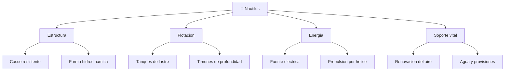

# 📋 Caracteristicas funcionales del Nautilus

[🏠 Inicio](../../../README.md) · [🐙 Curso: Nautilus](../README.md) · 📋 Caracteristicas

> ⚖️ Material educativo original; el Nautilus de Julio Verne (1870) es de dominio publico; otros derechos pertenecen a sus titulares.

Que es el Nautilus, que forma tiene y que sabe hacer. Este modulo da el
contexto antes de abrir su mecanica en el Modulo 3.

---

## 🧭 Definicion

El Nautilus es un submarino de ficcion: una nave cerrada, estanca y capaz de
navegar tanto en la superficie como sumergida a gran profundidad. A diferencia
de un barco, no flota siempre; controla su flotabilidad para hundirse y volver
a subir a voluntad. Es autosuficiente, es decir, lleva a bordo todo lo que
necesita para funcionar durante largos periodos sin apoyo externo.

---

## 🧬 Caracteristicas clave

| Caracteristica | Descripcion |
| --- | --- |
| Flotabilidad variable | Puede hundirse y emerger controlando su peso con agua. |
| Casco resistente | Estructura pensada para soportar la presion de las profundidades. |
| Forma hidrodinamica | Perfil alargado y afilado que reduce la resistencia del agua. |
| Autonomia larga | Energia, aire y provisiones para viajes muy extensos. |
| Habitabilidad | Espacios interiores amplios y comodos para la tripulacion. |
| Vocacion cientifica | Equipada para observar y estudiar el oceano. |

---

## 🗂️ Sistemas que la componen

---

## 📐 Dimensiones imaginadas

Verne describio una nave sorprendentemente grande para su epoca. Sin citar
cifras textuales de ninguna edicion, la idea general es la de un cuerpo largo,
en forma de cigarro o de pez alargado, con un espacio interior suficiente para
alojar comodamente a la tripulacion, sus reservas y sus equipos. Esa gran
escala es coherente con la fisica: un submarino necesita volumen para almacenar
aire, energia y lastre, y necesita masa distribuida para mantenerse estable.

---

## 🎯 Para que sirve en la novela

- Explorar los fondos oceanicos que en el siglo XIX eran casi desconocidos.
- Vivir de forma independiente, tomando del mar alimento y recursos.
- Desplazarse por todos los oceanos sin depender de puertos.
- Estudiar la vida marina y los fenomenos del oceano profundo.

---

[⬅️ Anterior: Historia](../historia/historia-nautilus.md) · [➡️ Siguiente: Sistemas mecanicos](sistemas-mecanicos-nautilus.md)
