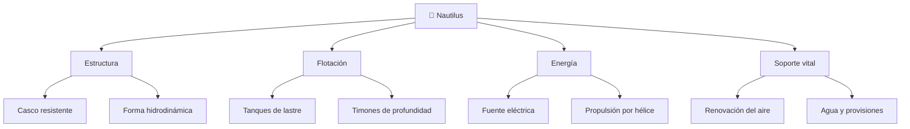

# 📋 Características funcionales del Nautilus

[🏠 Inicio](../../../README.md) · [🐙 Curso: Nautilus](../README.md) · 📋 Características

> ⚖️ Material educativo original; el Nautilus de Julio Verne (1870) es de dominio público; otros derechos pertenecen a sus titulares.

Que es el Nautilus, que forma tiene y que sabe hacer. Este módulo da el
contexto antes de abrir su mecánica en el Módulo 3.

---

## 🧭 Definición

El Nautilus es un submarino de ficción: una nave cerrada, estanca y capaz de
navegar tanto en la superficie como sumergida a gran profundidad. A diferencia
de un barco, no flota siempre; controla su flotabilidad para hundirse y volver
a subir a voluntad. Es autosuficiente, es decir, lleva a bordo todo lo que
necesita para funcionar durante largos periodos sin apoyo externo.

---

## 🧬 Características clave

| Característica | Descripción |
| --- | --- |
| Flotabilidad variable | Puede hundirse y emerger controlando su peso con agua. |
| Casco resistente | Estructura pensada para soportar la presión de las profundidades. |
| Forma hidrodinámica | Perfil alargado y afilado que reduce la resistencia del agua. |
| Autonomía larga | Energía, aire y provisiones para viajes muy extensos. |
| Habitabilidad | Espacios interiores amplios y cómodos para la tripulación. |
| Vocación científica | Equipada para observar y estudiar el océano. |

---

## 🗂️ Sistemas que la componen

---

## 📐 Dimensiones imaginadas

Verne describio una nave sorprendentemente grande para su época. Sin citar
cifras textuales de ninguna edición, la idea general es la de un cuerpo largo,
en forma de cigarro o de pez alargado, con un espacio interior suficiente para
alojar cómodamente a la tripulación, sus reservas y sus equipos. Esa gran
escala es coherente con la física: un submarino necesita volumen para almacenar
aire, energía y lastre, y necesita masa distribuida para mantenerse estable.

---

## 🎯 Para qué sirve en la novela

- Explorar los fondos oceánicos que en el siglo XIX eran casi desconocidos.
- Vivir de forma independiente, tomando del mar alimento y recursos.
- Desplazarse por todos los océanos sin depender de puertos.
- Estudiar la vida marina y los fenómenos del océano profundo.

---

[⬅️ Anterior: Historia](../historia/historia-nautilus.md) · [➡️ Siguiente: Sistemas mecánicos](sistemas-mecanicos-nautilus.md)
