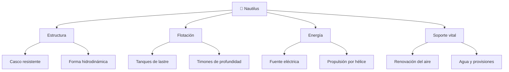

<!-- clase-meta
tipo_documento: clase
clase: 2
codigo: NAUTILUS-02
curso: nautilus
titulo: "Características funcionales del Nautilus"
modalidad: "teórica aplicada"
duracion_minutos: 45
nivel: introductorio
prerrequisito: NAUTILUS-01
competencia: "identificacion_funcional"
resultados_aprendizaje:
  - "Explicar definición, rasgos funcionales, tipos y usos con vocabulario propio de Nautilus."
  - "Aplicar esos conceptos a una decisión segura o a un escenario de simulación de Nautilus."
evidencia: "Matriz comparativa y decisión justificada."
criterio_aprobacion: "La elección considera función, límites, mando y efecto en la simulación; no se apoya solo en preferencias."
fuentes: manuales/fuentes.md
ultima_revision: 2026-09-10
-->

# 📋 Características funcionales del Nautilus

[🏠 Inicio](../../../README.md) · [🐙 Curso: Nautilus](../README.md) · 📋 Características

> ⚖️ Material educativo original; el Nautilus de Julio Verne (1870) es de dominio público; otros derechos pertenecen a sus titulares.

Que es el Nautilus, que forma tiene y que sabe hacer. Esta clase da el
contexto antes de abrir su mecánica en el Clase 4.

---

## 🧭 Definición

El Nautilus es un submarino de ficción: una nave cerrada, estanca y capaz de
navegar tanto en la superficie como sumergida a gran profundidad. A diferencia
de un barco, no flota siempre; controla su flotabilidad para hundirse y volver
a subir a voluntad. Es autosuficiente, es decir, lleva a bordo todo lo que
necesita para funcionar durante largos periodos sin apoyo externo.

---

## 🧬 Características clave

| Característica | Descripción |
| --- | --- |
| Flotabilidad variable | Puede hundirse y emerger controlando su peso con agua. |
| Casco resistente | Estructura pensada para soportar la presión de las profundidades. |
| Forma hidrodinámica | Perfil alargado y afilado que reduce la resistencia del agua. |
| Autonomía larga | Energía, aire y provisiones para viajes muy extensos. |
| Habitabilidad | Espacios interiores amplios y cómodos para la tripulación. |
| Vocación científica | Equipada para observar y estudiar el océano. |

---

## 🗂️ Sistemas que la componen

```mermaid
flowchart TD
    Nautilus[🐙 Nautilus] --> Estructura[Estructura]
    Nautilus --> Flotacion[Flotación]
    Nautilus --> Energia[Energía]
    Nautilus --> Vida[Soporte vital]
    Estructura --> Casco[Casco resistente]
    Estructura --> Forma[Forma hidrodinámica]
    Flotacion --> Lastre[Tanques de lastre]
    Flotacion --> Timones[Timones de profundidad]
    Energia --> Electrica[Fuente eléctrica]
    Energia --> Helice[Propulsión por hélice]
    Vida --> Aire[Renovación del aire]
    Vida --> Reservas[Agua y provisiones]
```

---

## 📐 Dimensiones imaginadas

Verne describio una nave sorprendentemente grande para su época. Sin citar
cifras textuales de ninguna edición, la idea general es la de un cuerpo largo,
en forma de cigarro o de pez alargado, con un espacio interior suficiente para
alojar cómodamente a la tripulación, sus reservas y sus equipos. Esa gran
escala es coherente con la física: un submarino necesita volumen para almacenar
aire, energía y lastre, y necesita masa distribuida para mantenerse estable.

---

## 🎯 Para qué sirve en la novela

- Explorar los fondos oceánicos que en el siglo XIX eran casi desconocidos.
- Vivir de forma independiente, tomando del mar alimento y recursos.
- Desplazarse por todos los océanos sin depender de puertos.
- Estudiar la vida marina y los fenómenos del océano profundo.

## 🧭 Guía de estudio aplicada

### Pregunta guía

¿Cómo ayuda **Definición, Características clave, Sistemas que la componen y Dimensiones imaginadas** a **elegir una configuración adecuada para inmersión narrativa cerca de relieve submarino**?

### Explicación razonada

Una característica solo es útil cuando permite anticipar comportamiento. En Nautilus, la relación entre energía descrita en la obra, motor, hélice y casco y timones determina capacidad, respuesta y límites. Por eso «Nautilus literario frente a submarino moderno» no se compara por apariencia: se compara por misión, entorno, carga de trabajo y exposición al riesgo «colisión o exceso de profundidad al tomar la descripción literaria como procedimiento real».

Esta clase se conecta con el resto del curso mediante **lectura doble: tecnología imaginada por Verne y principios reales de flotabilidad y presión**. El hilo de
seguridad consiste en reconocer a tiempo **colisión o exceso de profundidad al tomar la descripción literaria como procedimiento real** y poder justificar la decisión
**citar el canon y contrastar cada maniobra con física y navegación reales**; en clases posteriores cambiará el ángulo de análisis, no esa relación causal.
La lectura funcional común sigue **energía descrita en la obra → motor → hélice → casco y timones**, de modo que cada concepto pueda
ubicarse dentro del funcionamiento completo y no quede como un dato aislado.

**Apoyo documental:** [Twenty Thousand Leagues under the Sea](https://www.gutenberg.org/ebooks/164) aporta obra primaria en dominio público;
[Safety of Navigation](https://www.imo.org/en/ourwork/safety/pages/navigationdefault.aspx) se usa para navegación, SOLAS, COLREG y STCW. Estas fuentes
se contrastan con el alcance de la clase y no sustituyen un manual de equipo concreto.

### Caso resuelto: de la observación a la decisión

1. **Definir la necesidad:** convierte «inmersión narrativa cerca de relieve submarino» en requisitos de capacidad, entorno y respuesta.
2. **Comparar:** contrasta **Nautilus literario frente a submarino moderno** usando esos requisitos y la cadena **energía descrita en la obra → motor → hélice → casco y timones**.
3. **Descartar:** elimina la alternativa que deja menos margen frente a **colisión o exceso de profundidad al tomar la descripción literaria como procedimiento real**.
4. **Elegir:** declara la variante escogida, la evidencia usada y una limitación que todavía debe respetarse.

### Comprueba tu comprensión

1. ¿Qué característica de **casco y timones** condiciona primero el caso «inmersión narrativa cerca de relieve submarino»?
2. ¿Qué requisito descartaría una de las alternativas **Nautilus literario frente a submarino moderno**?
3. ¿Qué límite debe declararse junto con la variante elegida?

Orientación para revisar tus respuestas

- La primera respuesta debe relacionar el eslabón elegido con un efecto posterior, no solo nombrarlo.
- La segunda debe proponer una señal medible u observable y explicar qué tendencia sería preocupante.
- La tercera debe cambiar al menos una variable de capacidad, mando, entorno o margen de seguridad.

## 🎓 Cierre de clase

- **Actividad:** Compara variantes de Nautilus mediante los ejes «definición, rasgos funcionales, tipos y usos» y elige una para un caso de uso razonado.
- **Evidencia:** Matriz comparativa y decisión justificada.
- **Criterio de aprobación:** La elección considera función, límites, mando y efecto en la simulación; no se apoya solo en preferencias.
- **Transferencia:** explica qué cambiaría al pasar a otra variante de esta máquina.

### Fuentes de esta clase

- [GUTENBERG-20000](https://www.gutenberg.org/ebooks/164): Twenty Thousand Leagues under the Sea, Project Gutenberg. Uso: obra primaria en dominio público.
- [IMO-NAV](https://www.imo.org/en/ourwork/safety/pages/navigationdefault.aspx): Safety of Navigation, International Maritime Organization. Uso: navegación, SOLAS, COLREG y STCW.
- [NASA-FLIGHT](https://www1.grc.nasa.gov/beginners-guide-to-aeronautics/): Beginner's Guide to Aeronautics, NASA. Uso: contraste con física y vuelo reales.

> Las fuentes sostienen el marco conceptual y normativo; esta clase no reemplaza el manual
> del fabricante, la formación certificada ni la habilitación exigida para operar equipos reales.

---

[⬅️ Anterior: Historia](../historia/historia-nautilus.md) · [➡️ Siguiente: Modelos y variantes](../modelos/modelos-nautilus.md)
