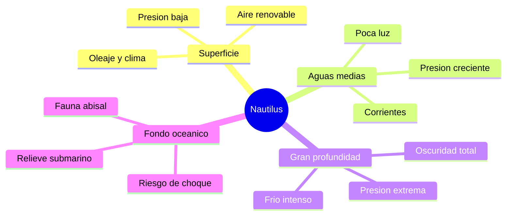

# 🌍 Entornos del Nautilus

[🏠 Inicio](../../../README.md) · [🐙 Curso: Nautilus](../README.md) · 🌍 Entornos

> ⚖️ Material educativo original; el Nautilus de Julio Verne (1870) es de dominio publico; otros derechos pertenecen a sus titulares.

Donde opera el Nautilus y como cambia la fisica segun la profundidad. Cada
franja del oceano tiene su presion, su luz y sus riesgos, y en simulacion se
traduce en escenarios distintos.

---

## 🗺️ Entornos principales

| Entorno | Caracteristicas | Riesgos tipicos | Ajuste de operacion |
| --- | --- | --- | --- |
| Superficie | Aire renovable, presion baja. | Oleaje, clima, ser visto. | Ventilar, cargar energia, navegar suave. |
| Aguas medias | Poca luz, presion moderada. | Corrientes, desorientacion. | Flotabilidad neutra, rumbo estable. |
| Gran profundidad | Oscuridad y presion muy alta. | Aplastamiento del casco. | No pasar la profundidad limite. |
| Fondo oceanico | Relieve, fauna, sedimento. | Choque, quedar atrapado. | Velocidad baja, iluminacion, cautela. |

---

## 🌡️ Factores del entorno

- **Presion**: aumenta de forma continua con la profundidad; es el factor que
  marca hasta donde puede bajar la nave.
- **Luz**: se pierde rapido bajo la superficie; a partir de cierta profundidad
  reina la oscuridad total y hace falta iluminacion propia.
- **Temperatura**: el agua profunda es muy fria, lo que afecta a equipos y
  tripulacion.
- **Corrientes**: empujan la nave y complican mantener rumbo y posicion.
- **Relieve del fondo**: montanas, fosas y cananos submarinos que hay que
  esquivar cerca del lecho.

---

## 🎮 Traduccion a simulacion

Cada entorno es un escenario con su presion, su luz y sus corrientes. La
profundidad deja de ser un numero y se vuelve el eje del desafio: cuanto mas
abajo, mas cerca del limite del casco y mas dependencia de la energia y el aire.
Ver como se modela en el
[Modulo 8: Diseno de simulacion](../simulacion/diseno-simulador-nautilus.md).

---

[⬅️ Anterior: Principios y operacion](principios-nautilus.md) · [➡️ Siguiente: Reglas del universo](../reglamentos/reglas-universo-nautilus.md)
