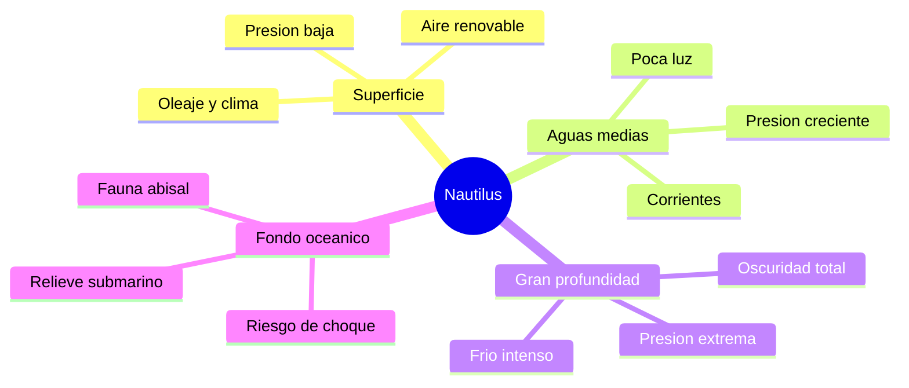

# 🌍 Entornos del Nautilus

[🏠 Inicio](../../../README.md) · [🐙 Curso: Nautilus](../README.md) · 🌍 Entornos

> ⚖️ Material educativo original; el Nautilus de Julio Verne (1870) es de dominio público; otros derechos pertenecen a sus titulares.

Dónde opera el Nautilus y cómo cambia la física según la profundidad. Cada
franja del océano tiene su presión, su luz y sus riesgos, y en simulación se
traduce en escenarios distintos.

---

## 🗺️ Entornos principales

```mermaid
mindmap
  root((Nautilus))
    Superficie
      Aire renovable
      Presion baja
      Oleaje y clima
    Aguas medias
      Poca luz
      Presion creciente
      Corrientes
    Gran profundidad
      Oscuridad total
      Presion extrema
      Frio intenso
    Fondo oceanico
      Relieve submarino
      Fauna abisal
      Riesgo de choque
```

| Entorno | Características | Riesgos típicos | Ajuste de operación |
| --- | --- | --- | --- |
| Superficie | Aire renovable, presión baja. | Oleaje, clima, ser visto. | Ventilar, cargar energía, navegar suave. |
| Aguas medias | Poca luz, presión moderada. | Corrientes, desorientación. | Flotabilidad neutra, rumbo estable. |
| Gran profundidad | Oscuridad y presión muy alta. | Aplastamiento del casco. | No pasar la profundidad límite. |
| Fondo oceánico | Relieve, fauna, sedimento. | Choque, quedar atrapado. | Velocidad baja, iluminación, cautela. |

---

## 🌡️ Factores del entorno

- **Presión**: aumenta de forma continua con la profundidad; es el factor que
  marca hasta donde puede bajar la nave.
- **Luz**: se pierde rápido bajo la superficie; a partir de cierta profundidad
  reina la oscuridad total y hace falta iluminación propia.
- **Temperatura**: el agua profunda es muy fría, lo que afecta a equipos y
  tripulación.
- **Corrientes**: empujan la nave y complican mantener rumbo y posición.
- **Relieve del fondo**: montañas, fosas y cananos submarinos que hay que
  esquivar cerca del lecho.

---

## 🎮 Traducción a simulación

Cada entorno es un escenario con su presión, su luz y sus corrientes. La
profundidad deja de ser un número y se vuelve el eje del desafío: cuanto más
abajo, más cerca del límite del casco y más dependencia de la energía y el aire.
Ver cómo se modela en el
[Módulo 9: Diseño de simulación](../simulacion/diseno-simulador-nautilus.md).

## 🎓 Cierre de clase

- **Actividad:** Contrasta tres entornos de Nautilus a partir de entornos, factores ambientales, riesgos y respuesta de simulación y determina cómo cambian variables, percepción, riesgos y respuesta.
- **Evidencia:** Matriz entorno–cambio–riesgo–respuesta.
- **Criterio de aprobación:** Cada respuesta se adapta al entorno y distingue riesgos que no son intercambiables entre escenarios.
- **Transferencia:** explica qué cambiaría al pasar a otra variante de esta máquina.

### Fuentes de esta clase

- [GUTENBERG-20000](https://www.gutenberg.org/ebooks/164): Twenty Thousand Leagues under the Sea, Project Gutenberg. Uso: obra primaria en dominio público.
- [IMO-NAV](https://www.imo.org/en/ourwork/safety/pages/navigationdefault.aspx): Safety of Navigation, International Maritime Organization. Uso: navegación, SOLAS, COLREG y STCW.
- [NASA-FLIGHT](https://www1.grc.nasa.gov/beginners-guide-to-aeronautics/): Beginner's Guide to Aeronautics, NASA. Uso: contraste con física y vuelo reales.

> Las fuentes sostienen el marco conceptual y normativo; esta clase no reemplaza el manual
> del fabricante, la formación certificada ni la habilitación exigida para operar equipos reales.

---

[⬅️ Anterior: Principios y operación](principios-nautilus.md) · [➡️ Siguiente: Reglas del universo](../reglamentos/reglas-universo-nautilus.md)
