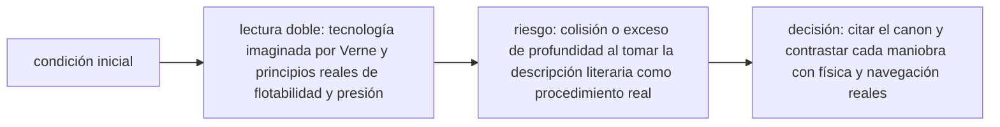

<!-- clase-meta
tipo_documento: clase
clase: 6
codigo: NAUTILUS-06
curso: nautilus
titulo: "Principios y operación del Nautilus"
modalidad: "resolución de problemas"
duracion_minutos: 90
nivel: introductorio
prerrequisito: NAUTILUS-05
competencia: "razonamiento_operacional"
resultados_aprendizaje:
  - "Explicar principios físicos, fases de operación, decisiones y errores frecuentes con vocabulario propio de Nautilus."
  - "Aplicar esos conceptos a una decisión segura o a un escenario de simulación de Nautilus."
evidencia: "Resolución argumentada de un escenario operacional."
criterio_aprobacion: "Aplica los principios correctos, anticipa consecuencias y respeta los límites del curso."
fuentes: manuales/fuentes.md
ultima_revision: 2026-09-10
-->

# 🧪 Principios y operación del Nautilus

[🏠 Inicio](../../../README.md) · [🐙 Curso: Nautilus](../README.md) · 🧪 Principios

> ⚖️ Material educativo original; el Nautilus de Julio Verne (1870) es de dominio público; otros derechos pertenecen a sus titulares.

Documento educativo. Analiza que cosas del Nautilus son físicamente posibles,
cuales no, y por qué. La gracia de esta nave es que Verne acerto en casi todo lo
esencial del submarino, así que sirve para separar la buena intuición científica
de la licencia narrativa.

## Principios de funcionamiento

- **Flotabilidad**: la nave sube o baja según su peso frente al empuje de
  Arquímedes. Los tanques de lastre cambian ese peso a voluntad.
- **Presión**: crece con la profundidad, cerca de una atmósfera cada diez
  metros, y aprieta el casco desde todas direcciones.
- **Estructura**: un casco redondeado y resistente reparte esa presión y evita
  el aplastamiento hasta cierta profundidad límite.
- **Energía**: una fuente eléctrica alimenta la propulsión y los sistemas de a
  bordo, dando autonomía sin quemar combustible en cada viaje.
- **Soporte vital**: el aire respirable es el recurso más crítico; hay que
  reponer oxígeno y retirar el dioxido de carbono.

## Que si, que no y por qué

| Aspecto de la novela | Veredicto físico | Por qué |
| --- | --- | --- |
| Sumergir con tanques de lastre | Posible | Es el método real de todo submarino. |
| Casco resistente a la presión | Posible | Existe, con una profundidad límite. |
| Energía eléctrica de a bordo | Posible | Los submarinos dependen de ella. |
| Extraer energía del mar | Parcial | Hay baterías de sodio, pero con límites. |
| Renovar el aire | Posible | Se repone oxígeno y se retira el CO2. |
| Profundidades sin límite | No | Todo casco se aplasta a cierta presión. |
| Autonomía casi ilimitada | Exagerado | La energía y el aire siempre se agotan. |

## Ficción frente a realidad

| Tema | Nautilus (ficción) | Submarino real |
| --- | --- | --- |
| Sumergir y emerger | Tanques de lastre | Tanques de lastre. |
| Rumbo y profundidad | Timones vertical y horizontales | Timones vertical y de buceo. |
| Propulsión | Hélice movida por electricidad | Hélice movida por motor eléctrico. |
| Fuente de energía | Electricidad del mar | Baterías, diesel o reactor nuclear. |
| Límite de la inmersión | Sobre todo el aire | Presión del casco y aire disponible. |

## Fases de operación

| Fase | Que ocurre | Puntos clave |
| --- | --- | --- |
| Preparación | Revisión en superficie | Aire renovado, energía cargada, casco estanco. |
| Inmersión | Ganar profundidad | Inundar lastre, controlar el descenso. |
| Crucero sumergido | Navegar a media agua | Flotabilidad neutra, rumbo y velocidad. |
| Observación | Estudiar el entorno | Iluminación, ventanas, instrumentos. |
| Ascenso | Volver a superficie | Purgar lastre, controlar la velocidad de subida. |
| Ventilación | Renovar el aire | Solo en superficie, reponer oxígeno. |

## Errores comunes que la simulación puede enseñar a evitar

- Bajar más allá de la profundidad límite del casco.
- Olvidar el nivel de aire durante una inmersión larga.
- Ascender demasiado rápido al purgar todo el lastre de golpe.
- Confundir flotabilidad neutra con estar detenido: la nave puede derivar.
- Gastar toda la energía lejos de la superficie.

## Relación con los niveles de realismo

- **Nivel 1 (educativo)**: sumergir, emerger, girar y vigilar la profundidad.
- **Nivel 2 (simplificado)**: añadir presión creciente, límite de casco y
  consumo de aire.
- **Nivel 3 (técnico)**: sumar flotabilidad neutra fina, energía limitada y
  velocidad de ascenso segura.

Ver [`docs/03-niveles-de-realismo.md`](../../../docs/03-niveles-de-realismo.md)
para el detalle de cada nivel.

## 🧭 Guía de estudio aplicada

### Pregunta guía

¿Cómo ayuda **Principios de funcionamiento, Que si, que no y por qué, Ficción frente a realidad y Fases de operación** a **resolver inmersión narrativa cerca de relieve submarino sin agotar el margen operacional**?

### Explicación razonada

El principio rector puede resumirse así: lectura doble: tecnología imaginada por Verne y principios reales de flotabilidad y presión. Esto explica por qué una misma orden produce resultados distintos cuando cambian velocidad, carga, configuración o entorno. Operar bien consiste en leer la tendencia antes de agotar el margen y tomar esta decisión: citar el canon y contrastar cada maniobra con física y navegación reales.

Esta clase se conecta con el resto del curso mediante **lectura doble: tecnología imaginada por Verne y principios reales de flotabilidad y presión**. El hilo de
seguridad consiste en reconocer a tiempo **colisión o exceso de profundidad al tomar la descripción literaria como procedimiento real** y poder justificar la decisión
**citar el canon y contrastar cada maniobra con física y navegación reales**; en clases posteriores cambiará el ángulo de análisis, no esa relación causal.
La lectura funcional común sigue **energía descrita en la obra → motor → hélice → casco y timones**, de modo que cada concepto pueda
ubicarse dentro del funcionamiento completo y no quede como un dato aislado.

**Apoyo documental:** [Twenty Thousand Leagues under the Sea](https://www.gutenberg.org/ebooks/164) aporta obra primaria en dominio público;
[Safety of Navigation](https://www.imo.org/en/ourwork/safety/pages/navigationdefault.aspx) se usa para navegación, SOLAS, COLREG y STCW. Estas fuentes
se contrastan con el alcance de la clase y no sustituyen un manual de equipo concreto.

### Caso resuelto: de la observación a la decisión

1. **Datos:** reconoce condiciones, configuración y margen disponibles en **inmersión narrativa cerca de relieve submarino**.
2. **Modelo:** aplica **lectura doble: tecnología imaginada por Verne y principios reales de flotabilidad y presión** para predecir una tendencia antes de actuar.
3. **Riesgo:** explica mediante qué cadena de causas podría ocurrir **colisión o exceso de profundidad al tomar la descripción literaria como procedimiento real**.
4. **Decisión:** ejecuta mentalmente **citar el canon y contrastar cada maniobra con física y navegación reales** y define qué observación confirmaría que funcionó.

### Comprueba tu comprensión

1. ¿Qué variable del principio «lectura doble: tecnología imaginada por Verne y principios reales de flotabilidad y presión» cambia primero en el caso?
2. ¿Cómo se propaga ese cambio hasta **casco y timones**?
3. ¿Qué evidencia confirmaría que **citar el canon y contrastar cada maniobra con física y navegación reales** conservó margen operacional?

Orientación para revisar tus respuestas

- La primera respuesta debe relacionar el eslabón elegido con un efecto posterior, no solo nombrarlo.
- La segunda debe proponer una señal medible u observable y explicar qué tendencia sería preocupante.
- La tercera debe cambiar al menos una variable de capacidad, mando, entorno o margen de seguridad.

## 🎓 Cierre de clase

- **Actividad:** Resuelve un escenario de Nautilus explicando, paso a paso, cómo intervienen principios físicos, fases de operación, decisiones y errores frecuentes.
- **Evidencia:** Resolución argumentada de un escenario operacional.
- **Criterio de aprobación:** Aplica los principios correctos, anticipa consecuencias y respeta los límites del curso.
- **Transferencia:** explica qué cambiaría al pasar a otra variante de esta máquina.

### Fuentes de esta clase

- [GUTENBERG-20000](https://www.gutenberg.org/ebooks/164): Twenty Thousand Leagues under the Sea, Project Gutenberg. Uso: obra primaria en dominio público.
- [IMO-NAV](https://www.imo.org/en/ourwork/safety/pages/navigationdefault.aspx): Safety of Navigation, International Maritime Organization. Uso: navegación, SOLAS, COLREG y STCW.
- [NASA-FLIGHT](https://www1.grc.nasa.gov/beginners-guide-to-aeronautics/): Beginner's Guide to Aeronautics, NASA. Uso: contraste con física y vuelo reales.

> Las fuentes sostienen el marco conceptual y normativo; esta clase no reemplaza el manual
> del fabricante, la formación certificada ni la habilitación exigida para operar equipos reales.

---

[⬅️ Anterior: Mandos](../mandos/manual-mandos-nautilus.md) · [➡️ Siguiente: Entornos](entornos-nautilus.md)
