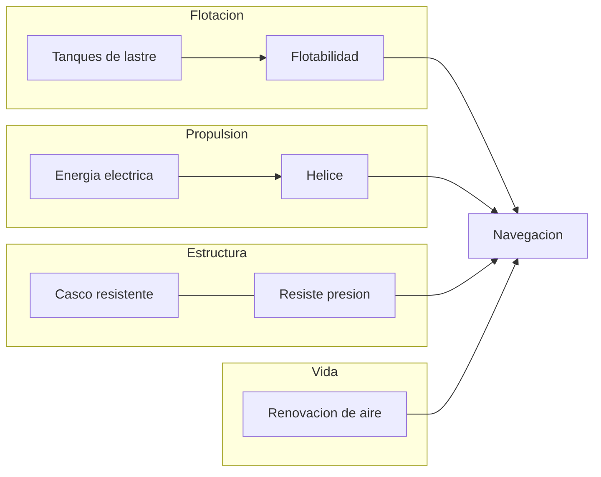
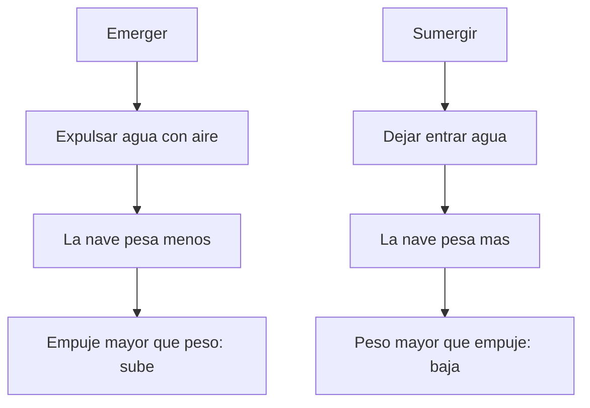

# 🔧 Sistemas mecanicos del Nautilus

[🏠 Inicio](../../../README.md) · [🐙 Curso: Nautilus](../README.md) · 🔧 Sistemas mecanicos

> ⚖️ Material educativo original; el Nautilus de Julio Verne (1870) es de dominio publico; otros derechos pertenecen a sus titulares.

Este modulo abre el Nautilus por dentro. Explica cada sistema imaginado por
Verne y lo compara con la fisica real del submarino moderno. La sorpresa es que
gran parte de lo que la novela describio coincide con la ingenieria que se
desarrollo despues. Es la base tecnica para entender los mandos (Modulo 4) y la
fisica de operacion (Modulo 5).

---

## 1. 🌊 Flotabilidad y tanques de lastre

El corazon de cualquier submarino es el control de la flotabilidad. Aqui Verne
acerto de lleno.

### Principio de Arquimedes

Todo cuerpo sumergido recibe un empuje hacia arriba igual al peso del agua que
desplaza. Si el peso de la nave es **menor** que ese empuje, sube; si es
**mayor**, baja; si son iguales, queda en equilibrio a media agua. Un submarino
no cambia su volumen, asi que juega con su peso: para eso sirven los tanques de
lastre.

### Como funcionan los tanques

- Para **sumergir**, se abren valvulas y el agua entra en los tanques: la nave
  gana peso y se hunde.
- Para **emerger**, se inyecta aire comprimido que expulsa el agua: la nave
  pierde peso y sube.
- Para navegar a **profundidad constante**, se busca la flotabilidad neutra y se
  ajusta con los timones de profundidad mientras la nave avanza.

### Ficcion frente a realidad

| Tema | Lo que imagino Verne | Fisica e ingenieria real |
| --- | --- | --- |
| Sumergir y emerger | Llenar y vaciar depositos de agua | Identico: tanques de lastre reales. |
| Flotabilidad neutra | Equilibrar peso y empuje a media agua | Concepto central del submarinismo. |
| Control fino | Ajuste de profundidad a voluntad | Se combina lastre y timones de buceo. |

---

## 2. 🛡️ Casco y presion en profundidad

### Por que aumenta la presion

Cada metro de agua sobre la nave anade peso encima. Por eso la presion crece de
forma continua con la profundidad: aproximadamente una atmosfera adicional cada
diez metros. A gran profundidad, el agua aprieta el casco con una fuerza
enorme desde todas direcciones.

### El casco resistente

Verne intuyo que la nave debia ser muy robusta para soportar esas
profundidades, e imagino un casco fuerte, de metal, capaz de resistir ese
abrazo del oceano. La ingenieria real confirma la idea: los submarinos usan un
**casco de presion** de forma redondeada, casi cilindrica o esferica, porque
esa geometria reparte la carga y evita puntos debiles.

| Tema | Lo que imagino Verne | Fisica e ingenieria real |
| --- | --- | --- |
| Presion con profundidad | La nave sufre mas cuanto mas baja | Sube cerca de 1 atmosfera cada 10 m. |
| Casco fuerte de metal | Estructura robusta contra el agua | Casco de presion de acero o titanio. |
| Forma de la nave | Cuerpo alargado y redondeado | Formas curvas reparten mejor la carga. |
| Limite de profundidad | Profundidades extremas alcanzables | Existe una profundidad de aplastamiento. |

Aqui aparece una diferencia importante: la novela sugiere profundidades muy
grandes con gran libertad, mientras que en la realidad cada casco tiene una
**profundidad limite** mas alla de la cual la presion lo aplastaria.

---

## 3. ⚡ Energia

Verne fue especialmente visionario al elegir la **electricidad** como fuente de
energia, en una epoca dominada por el vapor y el carbon. En la novela, la nave
obtiene esa electricidad del propio mar, con ideas cercanas a las baterias que
usan sodio y otros elementos presentes en el agua salada.

| Tema | Lo que imagino Verne | Fisica e ingenieria real |
| --- | --- | --- |
| Energia electrica | Todo funciona con electricidad | Los submarinos modernos dependen de ella. |
| Energia del mar | Extraer energia del agua salada | Existen baterias y celdas basadas en sodio. |
| Sin repostar carbon | Autonomia sin puertos | Los reactores nucleares dan gran autonomia. |
| Motor limpio y silencioso | Propulsion sin humo | El motor electrico es silencioso y limpio. |

La intuicion de fondo, una nave que no depende de quemar combustible en cada
viaje, se cumplio decadas despues con la propulsion nuclear, aunque por un
camino tecnico distinto al que describio la novela.

---

## 4. 🌀 Propulsion y navegacion

- **Propulsion**: la energia electrica mueve una helice en la popa que empuja
  la nave hacia adelante. Es exactamente el esquema de un submarino real de
  motor electrico.
- **Direccion horizontal**: un timon vertical, como el de un barco, hace girar
  la nave a babor o estribor.
- **Direccion vertical**: timones de profundidad, unas aletas horizontales, que
  inclinan la nave hacia arriba o hacia abajo mientras avanza.
- **Navegacion**: instrumentos para conocer rumbo, velocidad y profundidad, mas
  observacion directa del entorno.

---

## 5. 💨 Soporte vital y renovacion del aire

El limite real de vivir bajo el agua no es la presion, sino el **aire
respirable**. Las personas consumen oxigeno y producen dioxido de carbono, que
se vuelve toxico si se acumula. Verne fue consciente de esto: en la novela la
nave sube periodicamente a renovar el aire y almacena reservas para permanecer
sumergida.

| Tema | Lo que imagino Verne | Fisica e ingenieria real |
| --- | --- | --- |
| Consumo de oxigeno | El aire se agota con el tiempo | Cierto: hay que reponer oxigeno. |
| Aire viciado | El dioxido de carbono es un peligro | Debe retirarse para poder respirar. |
| Reservas de aire | Guardar aire a presion a bordo | Se usan tanques y generadores de oxigeno. |
| Subir a ventilar | Renovar el aire en superficie | Los submarinos clasicos lo hacian asi. |

---

## 🔁 Como se conecta todo

1. Los **tanques de lastre** deciden si la nave sube, baja o se queda.
2. El **casco resistente** permite bajar sin ser aplastado por la presion.
3. La **energia electrica** alimenta motores y sistemas de a bordo.
4. La **helice y los timones** dan movimiento y rumbo.
5. El **soporte vital** mantiene el aire respirable y las reservas.

Con esto claro, el [Modulo 4: Mandos](../mandos/manual-mandos-nautilus.md)
muestra como la tripulacion opera cada uno de estos sistemas.

---

[⬅️ Anterior: Caracteristicas](caracteristicas-nautilus.md) · [➡️ Siguiente: Mandos e instrumentos](../mandos/manual-mandos-nautilus.md)
