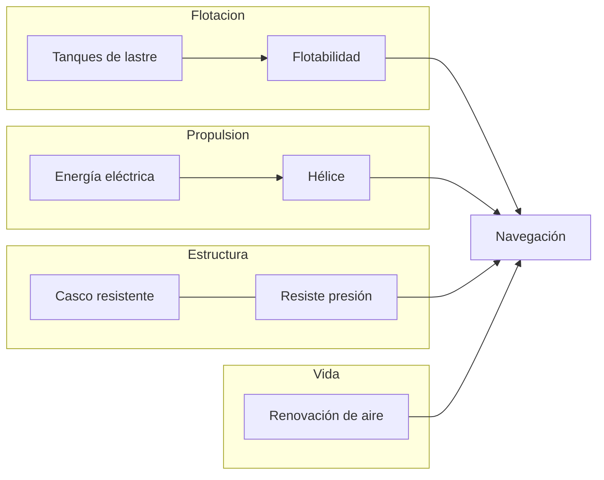
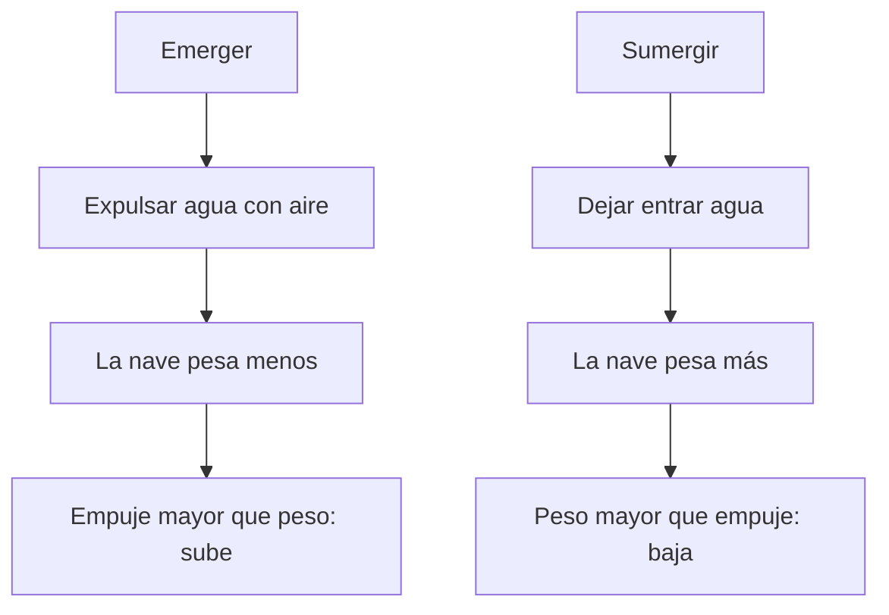
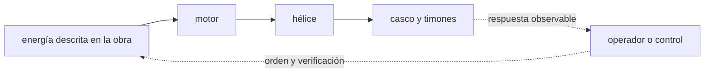

<!-- clase-meta
tipo_documento: clase
clase: 4
codigo: NAUTILUS-04
curso: nautilus
titulo: "Sistemas mecánicos del Nautilus"
modalidad: "teórica aplicada"
duracion_minutos: 90
nivel: introductorio
prerrequisito: NAUTILUS-03
competencia: "comprension_de_sistemas"
resultados_aprendizaje:
  - "Explicar Flotabilidad y tanques de lastre, Casco y presión en profundidad, Energía y Propulsión y navegación con vocabulario propio de Nautilus."
  - "Aplicar esos conceptos a una decisión segura o a un escenario de simulación de Nautilus."
evidencia: "Esquema con flujos de energía, materia o información anotados."
criterio_aprobacion: "Las conexiones esenciales son correctas y la consecuencia de la falla se propaga de manera coherente."
fuentes: manuales/fuentes.md
ultima_revision: 2026-09-10
-->

# 🔧 Sistemas mecánicos del Nautilus

[🏠 Inicio](../../../README.md) · [🐙 Curso: Nautilus](../README.md) · 🔧 Sistemas mecánicos

> ⚖️ Material educativo original; el Nautilus de Julio Verne (1870) es de dominio público; otros derechos pertenecen a sus titulares.

Esta clase abre el Nautilus por dentro. Explica cada sistema imaginado por
Verne y lo compara con la física real del submarino moderno. La sorpresa es que
gran parte de lo que la novela describio coincide con la ingeniería que se
desarrollo después. Es la base técnica para entender los mandos (Clase 5) y la
física de operación (Clase 6).

```mermaid
flowchart LR
    subgraph Flotacion
        L[Tanques de lastre] --> B[Flotabilidad]
    end
    subgraph Estructura
        C[Casco resistente] --- P[Resiste presión]
    end
    subgraph Propulsion
        E[Energía eléctrica] --> H[Hélice]
    end
    subgraph Vida
        A[Renovación de aire]
    end
    B --> Navega[Navegación]
    H --> Navega
    P --> Navega
    A --> Navega
```

---

## 1. 🌊 Flotabilidad y tanques de lastre

El corazón de cualquier submarino es el control de la flotabilidad. Aquí Verne
acerto de lleno.

### Principio de Arquímedes

Todo cuerpo sumergido recibe un empuje hacia arriba igual al peso del agua que
desplaza. Si el peso de la nave es **menor** que ese empuje, sube; si es
**mayor**, baja; si son iguales, queda en equilibrio a media agua. Un submarino
no cambia su volumen, así que juega con su peso: para eso sirven los tanques de
lastre.

### Cómo funcionan los tanques

```mermaid
flowchart TD
    Emerger[Emerger] --> Vaciar[Expulsar agua con aire]
    Vaciar --> Ligero[La nave pesa menos]
    Ligero --> Sube[Empuje mayor que peso: sube]
    Sumergir[Sumergir] --> Llenar[Dejar entrar agua]
    Llenar --> Pesada[La nave pesa más]
    Pesada --> Baja[Peso mayor que empuje: baja]
```

- Para **sumergir**, se abren válvulas y el agua entra en los tanques: la nave
  gana peso y se hunde.
- Para **emerger**, se inyecta aire comprimido que expulsa el agua: la nave
  pierde peso y sube.
- Para navegar a **profundidad constante**, se busca la flotabilidad neutra y se
  ajusta con los timones de profundidad mientras la nave avanza.

### Ficción frente a realidad

| Tema | Lo que imagino Verne | Física e ingeniería real |
| --- | --- | --- |
| Sumergir y emerger | Llenar y vaciar depósitos de agua | Idéntico: tanques de lastre reales. |
| Flotabilidad neutra | Equilibrar peso y empuje a media agua | Concepto central del submarinismo. |
| Control fino | Ajuste de profundidad a voluntad | Se combina lastre y timones de buceo. |

---

## 2. 🛡️ Casco y presión en profundidad

### Por qué aumenta la presión

Cada metro de agua sobre la nave añade peso encima. Por eso la presión crece de
forma continua con la profundidad: aproximadamente una atmósfera adicional cada
diez metros. A gran profundidad, el agua aprieta el casco con una fuerza
enorme desde todas direcciones.

### El casco resistente

Verne intuyo que la nave debía ser muy robusta para soportar esas
profundidades, e imagino un casco fuerte, de metal, capaz de resistir ese
abrazo del océano. La ingeniería real confirma la idea: los submarinos usan un
**casco de presión** de forma redondeada, casi cilíndrica o esférica, porque
esa geometría reparte la carga y evita puntos débiles.

| Tema | Lo que imagino Verne | Física e ingeniería real |
| --- | --- | --- |
| Presión con profundidad | La nave sufre más cuanto más baja | Sube cerca de 1 atmósfera cada 10 m. |
| Casco fuerte de metal | Estructura robusta contra el agua | Casco de presión de acero o titanio. |
| Forma de la nave | Cuerpo alargado y redondeado | Formas curvas reparten mejor la carga. |
| Límite de profundidad | Profundidades extremas alcanzables | Existe una profundidad de aplastamiento. |

Aquí aparece una diferencia importante: la novela sugiere profundidades muy
grandes con gran libertad, mientras que en la realidad cada casco tiene una
**profundidad límite** más allá de la cual la presión lo aplastaría.

---

## 3. ⚡ Energía

Verne fue especialmente visionario al elegir la **electricidad** como fuente de
energía, en una época dominada por el vapor y el carbón. En la novela, la nave
obtiene esa electricidad del propio mar, con ideas cercanas a las baterías que
usan sodio y otros elementos presentes en el agua salada.

| Tema | Lo que imagino Verne | Física e ingeniería real |
| --- | --- | --- |
| Energía eléctrica | Todo funciona con electricidad | Los submarinos modernos dependen de ella. |
| Energía del mar | Extraer energía del agua salada | Existen baterías y celdas basadas en sodio. |
| Sin repostar carbón | Autonomía sin puertos | Los reactores nucleares dan gran autonomía. |
| Motor limpio y silencioso | Propulsión sin humo | El motor eléctrico es silencioso y limpio. |

La intuición de fondo, una nave que no depende de quemar combustible en cada
viaje, se cumplio decadas después con la propulsión nuclear, aunque por un
camino técnico distinto al que describio la novela.

---

## 4. 🌀 Propulsión y navegación

- **Propulsión**: la energía eléctrica mueve una hélice en la popa que empuja
  la nave hacia adelante. Es exactamente el esquema de un submarino real de
  motor eléctrico.
- **Dirección horizontal**: un timón vertical, como el de un barco, hace girar
  la nave a babor o estribor.
- **Dirección vertical**: timones de profundidad, unas aletas horizontales, que
  inclinan la nave hacia arriba o hacia abajo mientras avanza.
- **Navegación**: instrumentos para conocer rumbo, velocidad y profundidad, más
  observación directa del entorno.

---

## 5. 💨 Soporte vital y renovación del aire

El límite real de vivir bajo el agua no es la presión, sino el **aire
respirable**. Las personas consumen oxígeno y producen dioxido de carbono, que
se vuelve tóxico si se acumula. Verne fue consciente de esto: en la novela la
nave sube periódicamente a renovar el aire y almacena reservas para permanecer
sumergida.

| Tema | Lo que imagino Verne | Física e ingeniería real |
| --- | --- | --- |
| Consumo de oxígeno | El aire se agota con el tiempo | Cierto: hay que reponer oxígeno. |
| Aire viciado | El dioxido de carbono es un peligro | Debe retirarse para poder respirar. |
| Reservas de aire | Guardar aire a presión a bordo | Se usan tanques y generadores de oxígeno. |
| Subir a ventilar | Renovar el aire en superficie | Los submarinos clásicos lo hacían así. |

---

## 🔁 Cómo se conecta todo

1. Los **tanques de lastre** deciden si la nave sube, baja o se queda.
2. El **casco resistente** permite bajar sin ser aplastado por la presión.
3. La **energía eléctrica** alimenta motores y sistemas de a bordo.
4. La **hélice y los timones** dan movimiento y rumbo.
5. El **soporte vital** mantiene el aire respirable y las reservas.

Con esto claro, el [Clase 5: Mandos](../mandos/manual-mandos-nautilus.md)
muestra cómo la tripulación opera cada uno de estos sistemas.

## 🧭 Guía de estudio aplicada

### Pregunta guía

¿Cómo ayuda **Flotabilidad y tanques de lastre, Casco y presión en profundidad, Energía y Propulsión y navegación** a **seguir una alteración desde energía descrita en la obra hasta casco y timones durante inmersión narrativa cerca de relieve submarino**?

### Explicación razonada

El funcionamiento puede leerse como una cadena causal: energía descrita en la obra entrega o transforma energía; motor la adapta; hélice la transmite o gobierna; y casco y timones produce el efecto observable. La cadena no es lineal en sentido estricto: sensores, estructura y operador cierran el lazo. Si un eslabón se degrada, la señal importante es cómo cambia el estado de casco y timones y qué margen queda.

```mermaid
flowchart LR
    A["energía descrita en la obra"] --> B["motor"] --> C["hélice"] --> D["casco y timones"]
    D -. respuesta observable .-> O["operador o control"]
    O -. orden y verificación .-> A
```

Esta clase se conecta con el resto del curso mediante **lectura doble: tecnología imaginada por Verne y principios reales de flotabilidad y presión**. El hilo de
seguridad consiste en reconocer a tiempo **colisión o exceso de profundidad al tomar la descripción literaria como procedimiento real** y poder justificar la decisión
**citar el canon y contrastar cada maniobra con física y navegación reales**; en clases posteriores cambiará el ángulo de análisis, no esa relación causal.
La lectura funcional común sigue **energía descrita en la obra → motor → hélice → casco y timones**, de modo que cada concepto pueda
ubicarse dentro del funcionamiento completo y no quede como un dato aislado.

**Apoyo documental:** [Twenty Thousand Leagues under the Sea](https://www.gutenberg.org/ebooks/164) aporta obra primaria en dominio público;
[Safety of Navigation](https://www.imo.org/en/ourwork/safety/pages/navigationdefault.aspx) se usa para navegación, SOLAS, COLREG y STCW. Estas fuentes
se contrastan con el alcance de la clase y no sustituyen un manual de equipo concreto.

### Caso resuelto: de la observación a la decisión

1. **Entrada:** identifica el estado inicial de **energía descrita en la obra** durante **inmersión narrativa cerca de relieve submarino**.
2. **Transformación:** explica qué hacen **motor** y **hélice**, y qué magnitud cambia en cada paso.
3. **Salida:** comprueba el efecto esperado en **casco y timones** y busca una desviación temprana.
4. **Falla razonada:** si aparece **colisión o exceso de profundidad al tomar la descripción literaria como procedimiento real**, retrocede por la cadena antes de ordenar otra acción.

### Comprueba tu comprensión

1. Si se degrada **motor**, ¿qué efecto esperarías primero en **hélice** y después en **casco y timones**?
2. ¿Qué observación ayudaría a diferenciar una falla de **energía descrita en la obra** de una falla de **hélice**?
3. ¿Por qué una segunda orden podría agravar **colisión o exceso de profundidad al tomar la descripción literaria como procedimiento real**?

Orientación para revisar tus respuestas

- La primera respuesta debe relacionar el eslabón elegido con un efecto posterior, no solo nombrarlo.
- La segunda debe proponer una señal medible u observable y explicar qué tendencia sería preocupante.
- La tercera debe cambiar al menos una variable de capacidad, mando, entorno o margen de seguridad.

## 🎓 Cierre de clase

- **Actividad:** Dibuja un esquema funcional de Nautilus que conecte Flotabilidad y tanques de lastre, Casco y presión en profundidad, Energía y Propulsión y navegación; después predice el efecto de una falla simulada.
- **Evidencia:** Esquema con flujos de energía, materia o información anotados.
- **Criterio de aprobación:** Las conexiones esenciales son correctas y la consecuencia de la falla se propaga de manera coherente.
- **Transferencia:** explica qué cambiaría al pasar a otra variante de esta máquina.

### Fuentes de esta clase

- [GUTENBERG-20000](https://www.gutenberg.org/ebooks/164): Twenty Thousand Leagues under the Sea, Project Gutenberg. Uso: obra primaria en dominio público.
- [IMO-NAV](https://www.imo.org/en/ourwork/safety/pages/navigationdefault.aspx): Safety of Navigation, International Maritime Organization. Uso: navegación, SOLAS, COLREG y STCW.
- [NASA-FLIGHT](https://www1.grc.nasa.gov/beginners-guide-to-aeronautics/): Beginner's Guide to Aeronautics, NASA. Uso: contraste con física y vuelo reales.

> Las fuentes sostienen el marco conceptual y normativo; esta clase no reemplaza el manual
> del fabricante, la formación certificada ni la habilitación exigida para operar equipos reales.

---

[⬅️ Anterior: Modelos y variantes](../modelos/modelos-nautilus.md) · [➡️ Siguiente: Mandos e instrumentos](../mandos/manual-mandos-nautilus.md)
