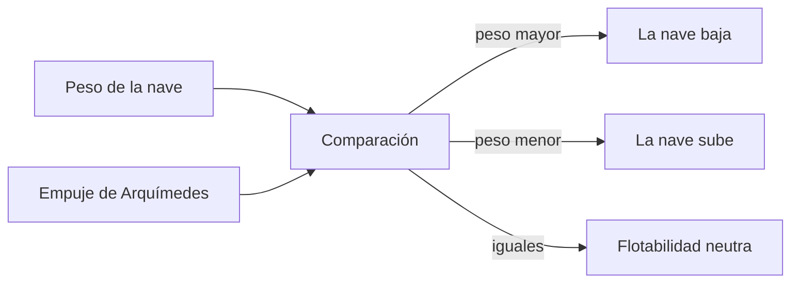

# 🧰 Recursos del Nautilus

[🏠 Inicio](../../../README.md) · [🐙 Curso: Nautilus](../README.md) · 🧰 Recursos

> ⚖️ Material educativo original; el Nautilus de Julio Verne (1870) es de dominio público; otros derechos pertenecen a sus titulares.

Glosario específico, enlaces y diagramas de apoyo del curso del Nautilus. Amplia
el [glosario general](../../../docs/05-glosario-general.md).

---

## 📖 Glosario específico

| Término | Definición |
| --- | --- |
| Flotabilidad | Tendencia de un cuerpo a subir o bajar según su peso frente al empuje del agua. |
| Principio de Arquímedes | Todo cuerpo sumergido recibe un empuje igual al peso del agua que desplaza. |
| Tanque de lastre | Depósito que se llena de agua o aire para variar el peso de la nave. |
| Flotabilidad neutra | Estado en que peso y empuje se igualan y la nave se mantiene a media agua. |
| Casco de presión | Estructura resistente que soporta la presión del agua a profundidad. |
| Profundidad límite | Profundidad máxima antes de que la presión aplaste el casco. |
| Timón de profundidad | Aleta horizontal que inclina la nave hacia arriba o hacia abajo. |
| Soporte vital | Conjunto de sistemas que mantienen el aire respirable a bordo. |

---

## 🗺️ Diagrama de flotabilidad

---

## 🔗 Enlaces y fuentes

- Glosario general: [📚 docs/05-glosario-general.md](../../../docs/05-glosario-general.md)
- Portada del curso: [🐙 README del Nautilus](../README.md)
- Catálogo de naves de ficción: [🌌 README de ficción](../../README.md)
- Registro de fuentes: [📚 manuales/fuentes.md](../../../manuales/fuentes.md)

Registrar cada recurso nuevo con su origen y licencia, siguiendo
[`recursos/README.md`](../../../recursos/README.md).

---

[🎓 Portada del curso](../README.md) · [⬅️ Anterior: Diseño de simulación](../simulacion/diseno-simulador-nautilus.md)
