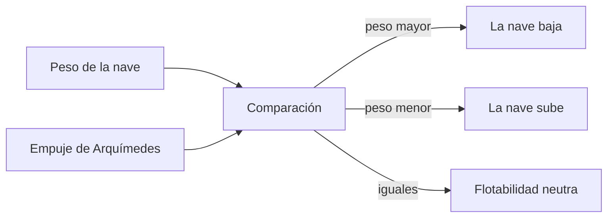

<!-- clase-meta
tipo_documento: clase
clase: 10
codigo: NAUTILUS-10
curso: nautilus
titulo: "Recursos del Nautilus"
modalidad: "taller documental"
duracion_minutos: 45
nivel: introductorio
prerrequisito: NAUTILUS-09
competencia: "alfabetizacion_tecnica"
resultados_aprendizaje:
  - "Explicar glosario, esquemas y trazabilidad de fuentes con vocabulario propio de Nautilus."
  - "Aplicar esos conceptos a una decisión segura o a un escenario de simulación de Nautilus."
evidencia: "Glosario aplicado y ficha breve de trazabilidad."
criterio_aprobacion: "Los términos permiten interpretar el curso y las fuentes se distinguen por autoridad, alcance y vigencia."
fuentes: manuales/fuentes.md
ultima_revision: 2026-09-10
-->

# 🧰 Recursos del Nautilus

[🏠 Inicio](../../../README.md) · [🐙 Curso: Nautilus](../README.md) · 🧰 Recursos

> ⚖️ Material educativo original; el Nautilus de Julio Verne (1870) es de dominio público; otros derechos pertenecen a sus titulares.

Glosario específico, enlaces y diagramas de apoyo del curso del Nautilus. Amplia
el [glosario general](../../../docs/05-glosario-general.md).

---

## 📖 Glosario específico

| Término | Definición |
| --- | --- |
| Flotabilidad | Tendencia de un cuerpo a subir o bajar según su peso frente al empuje del agua. |
| Principio de Arquímedes | Todo cuerpo sumergido recibe un empuje igual al peso del agua que desplaza. |
| Tanque de lastre | Depósito que se llena de agua o aire para variar el peso de la nave. |
| Flotabilidad neutra | Estado en que peso y empuje se igualan y la nave se mantiene a media agua. |
| Casco de presión | Estructura resistente que soporta la presión del agua a profundidad. |
| Profundidad límite | Profundidad máxima antes de que la presión aplaste el casco. |
| Timón de profundidad | Aleta horizontal que inclina la nave hacia arriba o hacia abajo. |
| Soporte vital | Conjunto de sistemas que mantienen el aire respirable a bordo. |

---

## 🗺️ Diagrama de flotabilidad

```mermaid
flowchart LR
    Peso[Peso de la nave] --> Balance[Comparación]
    Empuje[Empuje de Arquímedes] --> Balance
    Balance -->|peso mayor| Baja[La nave baja]
    Balance -->|peso menor| Sube[La nave sube]
    Balance -->|iguales| Neutra[Flotabilidad neutra]
```

---

## 🔗 Enlaces y fuentes

- Glosario general: [📚 docs/05-glosario-general.md](../../../docs/05-glosario-general.md)
- Portada del curso: [🐙 README del Nautilus](../README.md)
- Catálogo de naves de ficción: [🌌 README de ficción](../../README.md)
- Registro de fuentes: [📚 manuales/fuentes.md](../../../manuales/fuentes.md)

Registrar cada recurso nuevo con su origen y licencia, siguiendo
[`recursos/README.md`](../../../recursos/README.md).

## 🧭 Guía de estudio aplicada

### Pregunta guía

¿Cómo ayuda **Glosario específico, Diagrama de flotabilidad, Enlaces y fuentes y Guía de estudio aplicada** a **explicar con fuentes los términos energía descrita en la obra, motor, hélice y casco y timones**?

### Explicación razonada

El vocabulario técnico organiza relaciones: energía descrita en la obra, motor, hélice y casco y timones nombran partes distintas de una misma cadena funcional. Una fuente se usa para sostener una afirmación concreta —principio, límite, procedimiento o contexto— y debe distinguirse del manual particular de un fabricante o de una regla narrativa.

Esta clase se conecta con el resto del curso mediante **lectura doble: tecnología imaginada por Verne y principios reales de flotabilidad y presión**. El hilo de
seguridad consiste en reconocer a tiempo **colisión o exceso de profundidad al tomar la descripción literaria como procedimiento real** y poder justificar la decisión
**citar el canon y contrastar cada maniobra con física y navegación reales**; en clases posteriores cambiará el ángulo de análisis, no esa relación causal.
La lectura funcional común sigue **energía descrita en la obra → motor → hélice → casco y timones**, de modo que cada concepto pueda
ubicarse dentro del funcionamiento completo y no quede como un dato aislado.

**Apoyo documental:** [Twenty Thousand Leagues under the Sea](https://www.gutenberg.org/ebooks/164) aporta obra primaria en dominio público;
[Safety of Navigation](https://www.imo.org/en/ourwork/safety/pages/navigationdefault.aspx) se usa para navegación, SOLAS, COLREG y STCW. Estas fuentes
se contrastan con el alcance de la clase y no sustituyen un manual de equipo concreto.

### Caso resuelto: de la observación a la decisión

1. **Definir en contexto:** explica **energía descrita en la obra**, **motor**, **hélice** y **casco y timones** por su función y relación.
2. **Respaldar:** enlaza cada afirmación importante con una fuente identificable y declara su alcance.
3. **Contrastar:** separa principios generales, requisitos locales, manual de fabricante y —si aplica— canon ficticio.
4. **Reformular:** convierte una definición copiada en una explicación propia con un ejemplo de **Nautilus**.

### Comprueba tu comprensión

1. Explica la diferencia funcional entre **motor** y **hélice** sin copiar una definición.
2. ¿Qué fuente respalda el principio «lectura doble: tecnología imaginada por Verne y principios reales de flotabilidad y presión» y cuál es su alcance?
3. ¿Qué dato exigiría un manual de fabricante en vez de una fuente general?

Orientación para revisar tus respuestas

- La primera respuesta debe relacionar el eslabón elegido con un efecto posterior, no solo nombrarlo.
- La segunda debe proponer una señal medible u observable y explicar qué tendencia sería preocupante.
- La tercera debe cambiar al menos una variable de capacidad, mando, entorno o margen de seguridad.

## 🎓 Cierre de clase

- **Actividad:** Selecciona términos de glosario, esquemas y trazabilidad de fuentes, explícalos en contexto de Nautilus y verifica la procedencia de las fuentes utilizadas.
- **Evidencia:** Glosario aplicado y ficha breve de trazabilidad.
- **Criterio de aprobación:** Los términos permiten interpretar el curso y las fuentes se distinguen por autoridad, alcance y vigencia.
- **Transferencia:** explica qué cambiaría al pasar a otra variante de esta máquina.

### Fuentes de esta clase

- [GUTENBERG-20000](https://www.gutenberg.org/ebooks/164): Twenty Thousand Leagues under the Sea, Project Gutenberg. Uso: obra primaria en dominio público.
- [IMO-NAV](https://www.imo.org/en/ourwork/safety/pages/navigationdefault.aspx): Safety of Navigation, International Maritime Organization. Uso: navegación, SOLAS, COLREG y STCW.
- [NASA-FLIGHT](https://www1.grc.nasa.gov/beginners-guide-to-aeronautics/): Beginner's Guide to Aeronautics, NASA. Uso: contraste con física y vuelo reales.

> Las fuentes sostienen el marco conceptual y normativo; esta clase no reemplaza el manual
> del fabricante, la formación certificada ni la habilitación exigida para operar equipos reales.

---

[🎓 Portada del curso](../README.md) · [⬅️ Anterior: Diseño de simulación](../simulacion/diseno-simulador-nautilus.md) · [➡️ Siguiente: Ejercicios](../ejercicios/ejercicios-nautilus.md)
