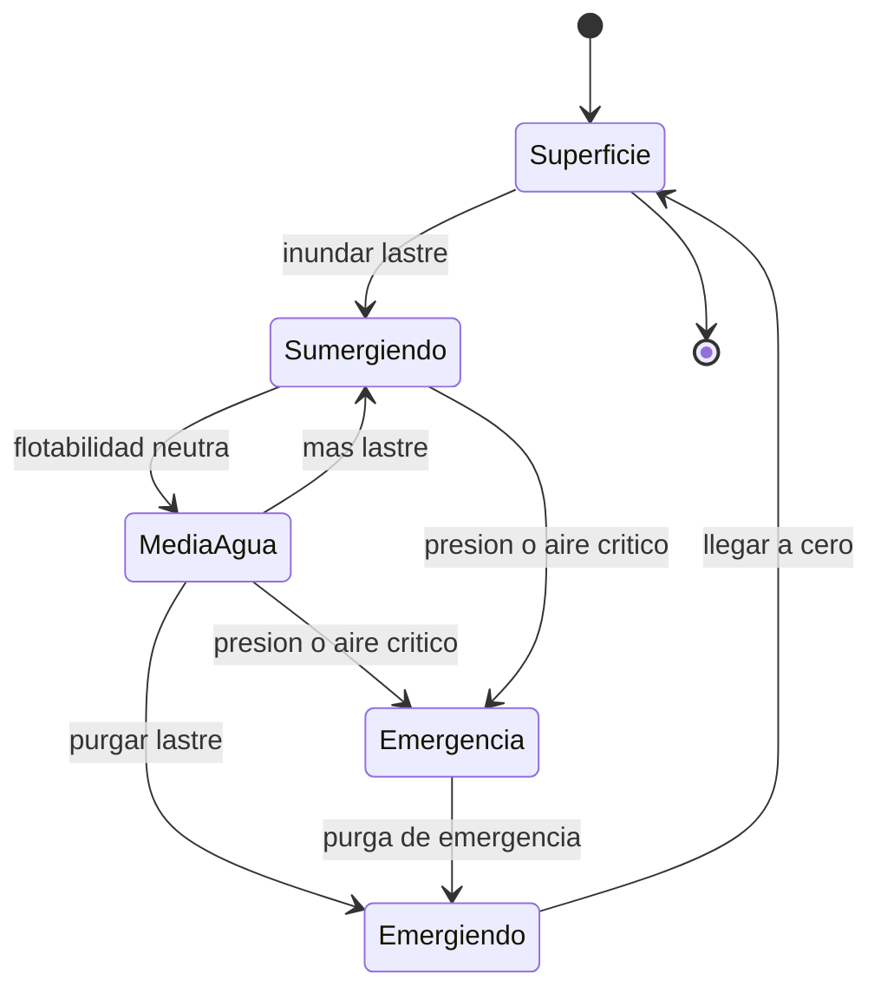

# 🎮 Diseño de simulación del Nautilus

[🏠 Inicio](../../../README.md) · [🐙 Curso: Nautilus](../README.md) · 🎮 Simulación

> ⚖️ Material educativo original; el Nautilus de Julio Verne (1870) es de dominio público; otros derechos pertenecen a sus titulares.

## Objetivo de la simulación

Que el usuario entienda la flotabilidad, la presión y la autonomía manejando el
Nautilus: sumergir y emerger con los tanques de lastre, vigilar la profundidad
frente al límite del casco, y administrar la energía y el aire durante la
inmersión.

## Modo ciencia / ficción

La simulación incluye una variable central, el **modo ciencia/ficción**, que
decide cómo se comporta la nave:

- **Modo ciencia**: se aplica la física real del Módulo 5. El aire y la energía
  se agotan, la presión crece con la profundidad y el casco tiene un límite de
  aplastamiento.
- **Modo ficción**: se aplican las reglas del universo del Módulo 7. La
  autonomía es casi ilimitada y la nave puede alcanzar profundidades propias del
  relato, priorizando la aventura sobre el rigor.

## Nivel de realismo

- Nivel elegido: se ofrece del 1 al 3 (ver `docs/03-niveles-de-realismo.md`).
- Justificación: el Nautilus permite enseñar flotabilidad y presión con un
  modelo claro, y el modo ciencia/ficción deja graduar cuanta física se aplica.

## Variables principales

| Variable | Tipo | Rango | Afecta a | Comentarios |
| --- | --- | --- | --- | --- |
| Profundidad | numérica | 0-11000 m | Presión y riesgo | Eje central del desafío. |
| Lastre | numérica | 0-100% | Flotabilidad | Define si sube o baja. |
| Flotabilidad neta | numérica | -1..1 | Ascenso o descenso | Cero es neutra. |
| Presión exterior | numérica | 1-1100 atm | Carga sobre el casco | Sube con la profundidad. |
| Aire respirable | numérica | 0-100% | Autonomía bajo el agua | Solo se repone en superficie. |
| Energía | numérica | 0-100% | Propulsión y sistemas | Limitada en modo ciencia. |
| Velocidad | numérica | 0-25 nudos | Avance y rumbo | Movida por la hélice. |
| Modo ciencia/ficción | discreta | ciencia, ficción | Toda la física | Elige rigor o aventura. |

## Ciclo básico

1. Leer entrada del usuario (lastre, timones, propulsión, ventilación).
2. Actualizar flotabilidad neta a partir del lastre y la profundidad.
3. Calcular presión exterior según la profundidad.
4. Actualizar consumo de aire y energía (según el modo activo).
5. Actualizar profundidad, rumbo y velocidad.
6. Refrescar instrumentos y avisos (profundímetro, manómetro, nivel de aire).

## Modos de juego futuros

- Tutorial guiado de inmersión y ascenso.
- Práctica libre de flotabilidad neutra.
- Misiones de exploración de fondos oceánicos.
- Gestión de autonomía en inmersiones largas.
- Situaciones de emergencia controladas (falla de lastre) sin contenido sensible.

## Elementos fuera de alcance

- Presentar el aplastamiento del casco como algo trivial o espectacular.
- Reproducir maniobras peligrosas como objetivo recomendable del juego.
- Datos técnicos que permitan alterar sistemas reales de un submarino.

## Pendientes

- [ ] Definir valores por defecto de cada variable por modo de juego.
- [ ] Prototipar el ciclo básico de flotabilidad en un motor simple.
- [ ] Ajustar el modelo de consumo de aire y energía.
- [ ] Agregar fuentes técnicas públicas a [`manuales/fuentes.md`](../../../manuales/fuentes.md).

---

[⬅️ Anterior: Reglas del universo](../reglamentos/reglas-universo-nautilus.md) · [➡️ Siguiente: Recursos](../recursos/recursos-nautilus.md)
