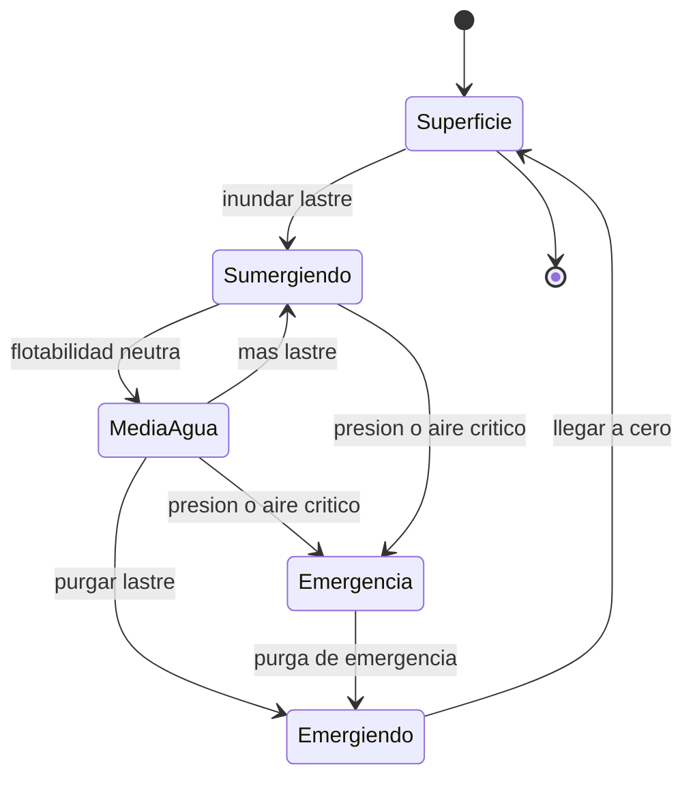

# 🎮 Diseno de simulacion del Nautilus

[🏠 Inicio](../../../README.md) · [🐙 Curso: Nautilus](../README.md) · 🎮 Simulacion

> ⚖️ Material educativo original; el Nautilus de Julio Verne (1870) es de dominio publico; otros derechos pertenecen a sus titulares.

## Objetivo de la simulacion

Que el usuario entienda la flotabilidad, la presion y la autonomia manejando el
Nautilus: sumergir y emerger con los tanques de lastre, vigilar la profundidad
frente al limite del casco, y administrar la energia y el aire durante la
inmersion.

## Modo ciencia / ficcion

La simulacion incluye una variable central, el **modo ciencia/ficcion**, que
decide como se comporta la nave:

- **Modo ciencia**: se aplica la fisica real del Modulo 5. El aire y la energia
  se agotan, la presion crece con la profundidad y el casco tiene un limite de
  aplastamiento.
- **Modo ficcion**: se aplican las reglas del universo del Modulo 7. La
  autonomia es casi ilimitada y la nave puede alcanzar profundidades propias del
  relato, priorizando la aventura sobre el rigor.

## Nivel de realismo

- Nivel elegido: se ofrece del 1 al 3 (ver `docs/03-niveles-de-realismo.md`).
- Justificacion: el Nautilus permite ensenar flotabilidad y presion con un
  modelo claro, y el modo ciencia/ficcion deja graduar cuanta fisica se aplica.

## Variables principales

| Variable | Tipo | Rango | Afecta a | Comentarios |
| --- | --- | --- | --- | --- |
| Profundidad | numerica | 0-11000 m | Presion y riesgo | Eje central del desafio. |
| Lastre | numerica | 0-100% | Flotabilidad | Define si sube o baja. |
| Flotabilidad neta | numerica | -1..1 | Ascenso o descenso | Cero es neutra. |
| Presion exterior | numerica | 1-1100 atm | Carga sobre el casco | Sube con la profundidad. |
| Aire respirable | numerica | 0-100% | Autonomia bajo el agua | Solo se repone en superficie. |
| Energia | numerica | 0-100% | Propulsion y sistemas | Limitada en modo ciencia. |
| Velocidad | numerica | 0-25 nudos | Avance y rumbo | Movida por la helice. |
| Modo ciencia/ficcion | discreta | ciencia, ficcion | Toda la fisica | Elige rigor o aventura. |

## Ciclo basico

1. Leer entrada del usuario (lastre, timones, propulsion, ventilacion).
2. Actualizar flotabilidad neta a partir del lastre y la profundidad.
3. Calcular presion exterior segun la profundidad.
4. Actualizar consumo de aire y energia (segun el modo activo).
5. Actualizar profundidad, rumbo y velocidad.
6. Refrescar instrumentos y avisos (profundimetro, manometro, nivel de aire).

## Modos de juego futuros

- Tutorial guiado de inmersion y ascenso.
- Practica libre de flotabilidad neutra.
- Misiones de exploracion de fondos oceanicos.
- Gestion de autonomia en inmersiones largas.
- Situaciones de emergencia controladas (falla de lastre) sin contenido sensible.

## Elementos fuera de alcance

- Presentar el aplastamiento del casco como algo trivial o espectacular.
- Reproducir maniobras peligrosas como objetivo recomendable del juego.
- Datos tecnicos que permitan alterar sistemas reales de un submarino.

## Pendientes

- [ ] Definir valores por defecto de cada variable por modo de juego.
- [ ] Prototipar el ciclo basico de flotabilidad en un motor simple.
- [ ] Ajustar el modelo de consumo de aire y energia.
- [ ] Agregar fuentes tecnicas publicas a [`manuales/fuentes.md`](../../../manuales/fuentes.md).

---

[⬅️ Anterior: Reglas del universo](../reglamentos/reglas-universo-nautilus.md) · [➡️ Siguiente: Recursos](../recursos/recursos-nautilus.md)
