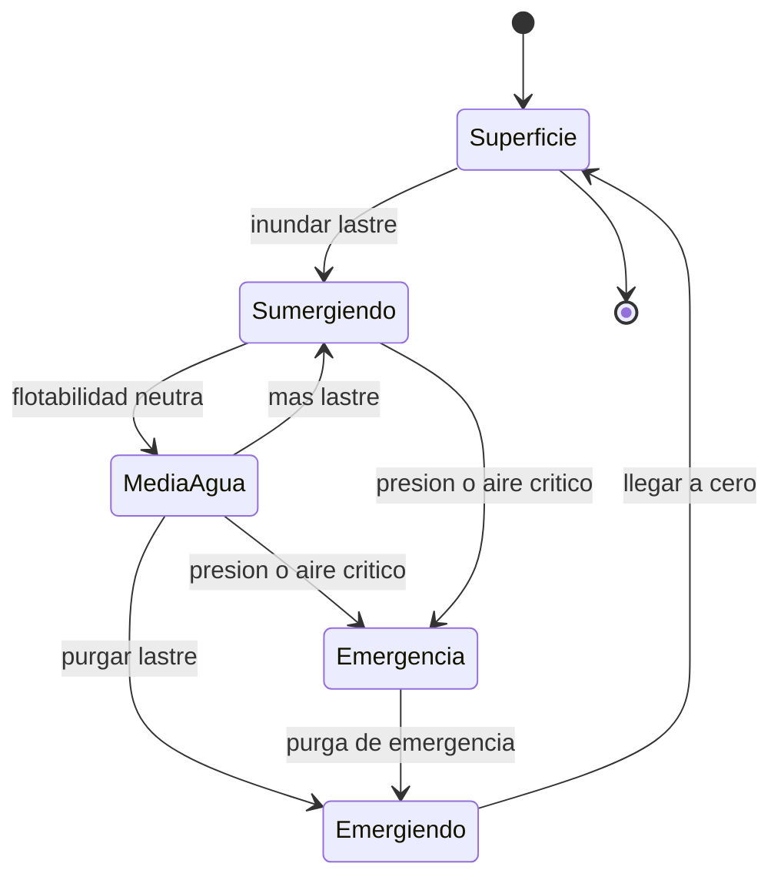
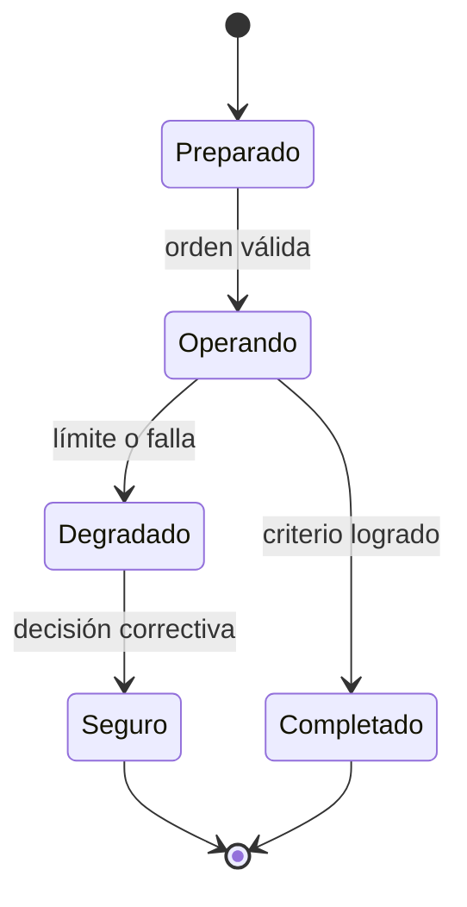

<!-- clase-meta
tipo_documento: clase
clase: 9
codigo: NAUTILUS-09
curso: nautilus
titulo: "Diseño de simulación del Nautilus"
modalidad: "laboratorio de diseño"
duracion_minutos: 90
nivel: introductorio
prerrequisito: NAUTILUS-08
competencia: "modelado_de_simulacion"
resultados_aprendizaje:
  - "Explicar objetivo, variables, estados, ciclo y escenarios de simulación con vocabulario propio de Nautilus."
  - "Aplicar esos conceptos a una decisión segura o a un escenario de simulación de Nautilus."
evidencia: "Ficha de escenario y diagrama de estados."
criterio_aprobacion: "El modelo es específico de la máquina, medible, seguro y trazable a clases anteriores."
fuentes: manuales/fuentes.md
ultima_revision: 2026-09-10
-->

# 🎮 Diseño de simulación del Nautilus

[🏠 Inicio](../../../README.md) · [🐙 Curso: Nautilus](../README.md) · 🎮 Simulación

> ⚖️ Material educativo original; el Nautilus de Julio Verne (1870) es de dominio público; otros derechos pertenecen a sus titulares.

```mermaid
stateDiagram-v2
    [*] --> Superficie
    Superficie --> Sumergiendo: inundar lastre
    Sumergiendo --> MediaAgua: flotabilidad neutra
    MediaAgua --> Sumergiendo: mas lastre
    MediaAgua --> Emergiendo: purgar lastre
    Emergiendo --> Superficie: llegar a cero
    MediaAgua --> Emergencia: presion o aire critico
    Sumergiendo --> Emergencia: presion o aire critico
    Emergencia --> Emergiendo: purga de emergencia
    Superficie --> [*]
```

## Objetivo de la simulación

Que el usuario entienda la flotabilidad, la presión y la autonomía manejando el
Nautilus: sumergir y emerger con los tanques de lastre, vigilar la profundidad
frente al límite del casco, y administrar la energía y el aire durante la
inmersión.

## Modo ciencia / ficción

La simulación incluye una variable central, el **modo ciencia/ficción**, que
decide cómo se comporta la nave:

- **Modo ciencia**: se aplica la física real del Clase 6. El aire y la energía
  se agotan, la presión crece con la profundidad y el casco tiene un límite de
  aplastamiento.
- **Modo ficción**: se aplican las reglas del universo del Clase 8. La
  autonomía es casi ilimitada y la nave puede alcanzar profundidades propias del
  relato, priorizando la aventura sobre el rigor.

## Nivel de realismo

- Nivel elegido: se ofrece del 1 al 3 (ver `docs/03-niveles-de-realismo.md`).
- Justificación: el Nautilus permite enseñar flotabilidad y presión con un
  modelo claro, y el modo ciencia/ficción deja graduar cuanta física se aplica.

## Variables principales

| Variable | Tipo | Rango | Afecta a | Comentarios |
| --- | --- | --- | --- | --- |
| Profundidad | numérica | 0-11000 m | Presión y riesgo | Eje central del desafío. |
| Lastre | numérica | 0-100% | Flotabilidad | Define si sube o baja. |
| Flotabilidad neta | numérica | -1..1 | Ascenso o descenso | Cero es neutra. |
| Presión exterior | numérica | 1-1100 atm | Carga sobre el casco | Sube con la profundidad. |
| Aire respirable | numérica | 0-100% | Autonomía bajo el agua | Solo se repone en superficie. |
| Energía | numérica | 0-100% | Propulsión y sistemas | Limitada en modo ciencia. |
| Velocidad | numérica | 0-25 nudos | Avance y rumbo | Movida por la hélice. |
| Modo ciencia/ficción | discreta | ciencia, ficción | Toda la física | Elige rigor o aventura. |

## Ciclo básico

1. Leer entrada del usuario (lastre, timones, propulsión, ventilación).
2. Actualizar flotabilidad neta a partir del lastre y la profundidad.
3. Calcular presión exterior según la profundidad.
4. Actualizar consumo de aire y energía (según el modo activo).
5. Actualizar profundidad, rumbo y velocidad.
6. Refrescar instrumentos y avisos (profundímetro, manómetro, nivel de aire).

## Modos de juego futuros

- Tutorial guiado de inmersión y ascenso.
- Práctica libre de flotabilidad neutra.
- Misiones de exploración de fondos oceánicos.
- Gestión de autonomía en inmersiones largas.
- Situaciones de emergencia controladas (falla de lastre) sin contenido sensible.

## Elementos fuera de alcance

- Presentar el aplastamiento del casco como algo trivial o espectacular.
- Reproducir maniobras peligrosas como objetivo recomendable del juego.
- Datos técnicos que permitan alterar sistemas reales de un submarino.

## Pendientes

- [ ] Definir valores por defecto de cada variable por modo de juego.
- [ ] Prototipar el ciclo básico de flotabilidad en un motor simple.
- [ ] Ajustar el modelo de consumo de aire y energía.
- [ ] Agregar fuentes técnicas públicas a [`manuales/fuentes.md`](../../../manuales/fuentes.md).

## 🧭 Guía de estudio aplicada

### Pregunta guía

¿Cómo ayuda **Objetivo de la simulación, Modo ciencia / ficción, Nivel de realismo y Variables principales** a **modelar inmersión narrativa cerca de relieve submarino como estados, variables y decisiones observables**?

### Explicación razonada

Una simulación de Nautilus es educativa si representa decisiones y consecuencias. Como mínimo debe modelar el estado de energía descrita en la obra, la respuesta de motor, la transición en hélice y el resultado en casco y timones. El escenario «inmersión narrativa cerca de relieve submarino» es valioso porque obliga a observar, formular una hipótesis, actuar y comprobar.

```mermaid
stateDiagram-v2
    [*] --> Preparado
    Preparado --> Operando: orden válida
    Operando --> Degradado: límite o falla
    Degradado --> Seguro: decisión correctiva
    Operando --> Completado: criterio logrado
    Seguro --> [*]
    Completado --> [*]
```

Esta clase se conecta con el resto del curso mediante **lectura doble: tecnología imaginada por Verne y principios reales de flotabilidad y presión**. El hilo de
seguridad consiste en reconocer a tiempo **colisión o exceso de profundidad al tomar la descripción literaria como procedimiento real** y poder justificar la decisión
**citar el canon y contrastar cada maniobra con física y navegación reales**; en clases posteriores cambiará el ángulo de análisis, no esa relación causal.
La lectura funcional común sigue **energía descrita en la obra → motor → hélice → casco y timones**, de modo que cada concepto pueda
ubicarse dentro del funcionamiento completo y no quede como un dato aislado.

**Apoyo documental:** [Twenty Thousand Leagues under the Sea](https://www.gutenberg.org/ebooks/164) aporta obra primaria en dominio público;
[Safety of Navigation](https://www.imo.org/en/ourwork/safety/pages/navigationdefault.aspx) se usa para navegación, SOLAS, COLREG y STCW. Estas fuentes
se contrastan con el alcance de la clase y no sustituyen un manual de equipo concreto.

### Caso resuelto: de la observación a la decisión

1. **Estado inicial:** representa inmersión narrativa cerca de relieve submarino con valores observables para **energía descrita en la obra**, **motor**, **hélice** y **casco y timones**.
2. **Decisión del estudiante:** ofrece una elección que cambie el estado, no una animación automática.
3. **Consecuencia:** modela la tendencia hacia **colisión o exceso de profundidad al tomar la descripción literaria como procedimiento real** y una señal previa que permita corregir.
4. **Cierre:** evalúa la explicación de la decisión, además de si el estudiante “ganó” el escenario.

### Comprueba tu comprensión

1. ¿Qué cuatro estados mínimos necesita el escenario «inmersión narrativa cerca de relieve submarino»?
2. ¿Qué variable anticipa **colisión o exceso de profundidad al tomar la descripción literaria como procedimiento real** antes de llegar al estado de falla?
3. ¿Cómo evaluarías la explicación del estudiante y no solo el resultado final?

Orientación para revisar tus respuestas

- La primera respuesta debe relacionar el eslabón elegido con un efecto posterior, no solo nombrarlo.
- La segunda debe proponer una señal medible u observable y explicar qué tendencia sería preocupante.
- La tercera debe cambiar al menos una variable de capacidad, mando, entorno o margen de seguridad.

## 🎓 Cierre de clase

- **Actividad:** Diseña un escenario educativo de Nautilus basado en objetivo, variables, estados, ciclo y escenarios de simulación, con entradas, estados, variables y criterio de cierre.
- **Evidencia:** Ficha de escenario y diagrama de estados.
- **Criterio de aprobación:** El modelo es específico de la máquina, medible, seguro y trazable a clases anteriores.
- **Transferencia:** explica qué cambiaría al pasar a otra variante de esta máquina.

### Fuentes de esta clase

- [GUTENBERG-20000](https://www.gutenberg.org/ebooks/164): Twenty Thousand Leagues under the Sea, Project Gutenberg. Uso: obra primaria en dominio público.
- [IMO-NAV](https://www.imo.org/en/ourwork/safety/pages/navigationdefault.aspx): Safety of Navigation, International Maritime Organization. Uso: navegación, SOLAS, COLREG y STCW.
- [NASA-FLIGHT](https://www1.grc.nasa.gov/beginners-guide-to-aeronautics/): Beginner's Guide to Aeronautics, NASA. Uso: contraste con física y vuelo reales.

> Las fuentes sostienen el marco conceptual y normativo; esta clase no reemplaza el manual
> del fabricante, la formación certificada ni la habilitación exigida para operar equipos reales.

---

[⬅️ Anterior: Reglas del universo](../reglamentos/reglas-universo-nautilus.md) · [➡️ Siguiente: Recursos](../recursos/recursos-nautilus.md)
