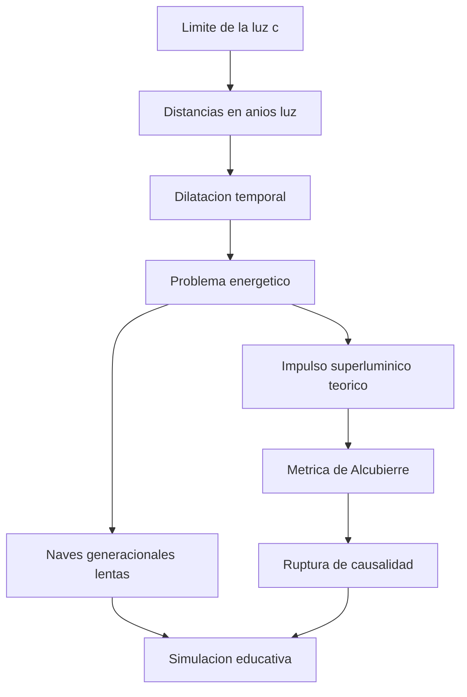

# 🌌 Curso: Nave de exploracion

[🏠 Inicio](../../README.md) · [🌌 Naves de ficcion](../README.md) · [🎓 Guia de curso](../../docs/08-guia-de-estilo-y-curso.md)

> ⚖️ Material educativo original; los derechos de las obras pertenecen a sus titulares.

---

> Curso de ficcion inspirado en el estilo "Star Trek". Usamos una nave de
> exploracion interestelar imaginaria como excusa para aprender fisica real:
> el limite de la velocidad de la luz, las distancias entre estrellas, la
> relatividad y el enorme problema energetico de viajar entre mundos.

---

## 🎯 Objetivos de aprendizaje

Al terminar este curso deberias poder:

- Explicar por que la velocidad de la luz es un limite y no un simple record.
- Medir distancias interestelares en anios luz y captar su escala real.
- Entender la dilatacion temporal: por que el tiempo pasa distinto a gran velocidad.
- Estimar la energia gigantesca que exige acelerar una nave grande.
- Distinguir lo posible (naves generacionales lentas) de lo teorico (metrica de Alcubierre).
- Comprender por que superar la luz romperia la causalidad.

---

## 🗺️ Mapa conceptual del curso

---

## 📚 Modulos del curso

| # | Modulo | Contenido | Enlace |
| :-: | --- | --- | --- |
| 1 | 📜 Historia | Como la ficcion imagino el viaje interestelar. | [Abrir](historia/historia-nave-exploracion.md) |
| 2 | 📋 Caracteristicas | Que es una nave de exploracion imaginaria y para que sirve. | [Abrir](operacion/caracteristicas-nave-exploracion.md) |
| 3 | 🔧 Sistemas mecanicos | Tecnologia imaginaria frente a la fisica real. | [Abrir](operacion/sistemas-mecanicos-nave-exploracion.md) |
| 4 | 🎛️ Mandos e instrumentos | Puente de mando, controles y tablero. | [Abrir](mandos/manual-mandos-nave-exploracion.md) |
| 5 | 🧪 Principios y operacion | Que si, que no y por que, segun la fisica. | [Abrir](operacion/principios-nave-exploracion.md) |
| 6 | 🌍 Entornos | El vacio, sistemas estelares y espacio profundo. | [Abrir](operacion/entornos-nave-exploracion.md) |
| 7 | ⚖️ Reglas del universo | Las leyes internas de la ficcion, no leyes reales. | [Abrir](reglamentos/reglas-universo-nave-exploracion.md) |
| 8 | 🎮 Diseno de simulacion | Variables, ciclo y modo ciencia o ficcion. | [Abrir](simulacion/diseno-simulador-nave-exploracion.md) |
| 9 | 🧰 Recursos | Glosario, enlaces y diagramas. | [Abrir](recursos/recursos-nave-exploracion.md) |

---

## 🧩 Requisitos previos

Ninguno. Basta curiosidad por el espacio. Este curso mezcla imaginacion y
fisica real para mostrar donde termina lo posible y empieza lo inventado.

---

[➡️ Empezar por el Modulo 1: Historia](historia/historia-nave-exploracion.md)
