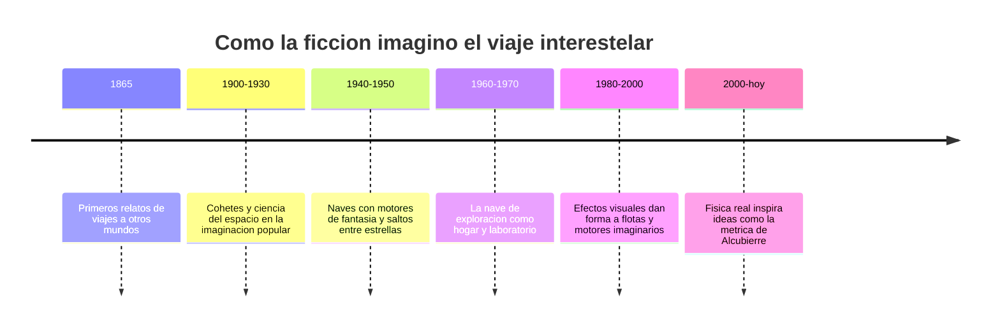

# 📜 Historia de la nave de exploracion

[🏠 Inicio](../../../README.md) · [🌌 Curso: Nave de exploracion](../README.md) · 📜 Historia

> ⚖️ Material educativo original; los derechos de las obras pertenecen a sus titulares.

Este modulo repasa, con nuestras palabras, como la ciencia ficcion imagino el
viaje entre estrellas. No contamos guiones ni tramas concretas: seguimos la
idea general de una nave de exploracion que recorre la galaxia, al estilo
"Star Trek", y la usamos para entender que ideas nacieron antes en la ciencia
y cuales son pura invencion narrativa.

## Origen de la idea

Mucho antes de que existieran cohetes reales, los escritores ya sonaban con
llegar a la Luna y a otros planetas. Al principio imaginaban canones enormes o
maquinas fantasticas. Con el tiempo, a medida que la astronomia revelaba lo
inmensas que son las distancias, la ficcion necesito inventar motores capaces
de acortar viajes que, en la realidad, tomarian miles de anios.

## Linea de tiempo

| Periodo | Hito imaginado | Importancia narrativa |
| --- | --- | --- |
| 1865 | Viajes a la Luna en la literatura | Nace la aventura espacial popular. |
| 1900-1930 | Cohetes y mundos lejanos en revistas | Se populariza el espacio como destino. |
| 1940-1950 | Motores de fantasia entre estrellas | Aparece el viaje interestelar rapido. |
| 1960-1970 | Nave de exploracion con tripulacion estable | El espacio se vuelve hogar y trabajo. |
| 1980-2000 | Efectos visuales de flotas y motores | La imagen del viaje se hace icono. |
| 2000-hoy | Dialogo con la fisica teorica | La ciencia real inspira nuevas ideas. |

## De la ciencia a la ficcion y de vuelta

Lo interesante es el ida y vuelta. La ficcion tomo prestada la idea real de que
la luz tiene una velocidad finita y que las estrellas estan lejisimos. Para no
aburrir al publico con viajes eternos, invento un "impulso" capaz de superar la
luz. Decadas despues, algunos fisicos jugaron con las ecuaciones de la
relatividad general y propusieron ideas teoricas, como deformar el propio
espacio, que suenan a ficcion pero nacen de matematicas serias.

## Que aporto cada epoca

- **Escala**: entender que un vecino estelar esta a anios luz, no a un viaje corto.
- **Tripulacion**: la nave como comunidad que vive, trabaja e investiga a bordo.
- **Motores imaginarios**: la excusa narrativa para saltar entre sistemas.
- **Exploracion pacifica**: el foco en descubrir, mapear y estudiar mundos.
- **Dialogo con la ciencia**: ideas de ficcion que empujan preguntas reales.

## Por que sigue fascinando

La nave de exploracion representa un deseo humano muy antiguo: mirar el cielo y
querer ir mas alla. Aunque la fisica pone limites duros, imaginar esos viajes
nos ayuda a entender mejor el universo real y a valorar lo dificil, y lo
hermoso, que seria cruzar el vacio entre estrellas.

## Fuentes

- Registrar aqui las fuentes publicas y divulgativas consultadas.
- Enlazar cada fuente tambien en [`manuales/fuentes.md`](../../../manuales/fuentes.md).

---

[🎓 Portada del curso](../README.md) · [➡️ Siguiente: Caracteristicas](../operacion/caracteristicas-nave-exploracion.md)
