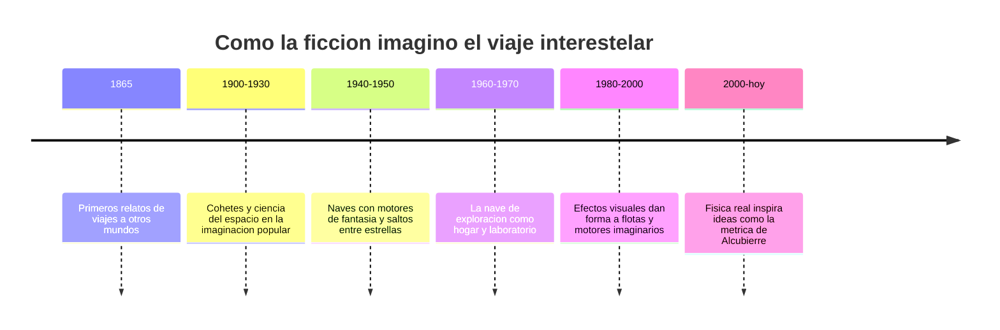

<!-- clase-meta
tipo_documento: clase
clase: 1
codigo: NAVEEXPLORAC-01
curso: nave-exploracion
titulo: "Historia de la nave de exploración"
modalidad: "teórica dialogada"
duracion_minutos: 45
nivel: introductorio
prerrequisito: ninguno
competencia: "contexto_historico"
resultados_aprendizaje:
  - "Explicar origen, evolución tecnológica, variantes representativas e impacto con vocabulario propio de Nave de exploración."
  - "Aplicar esos conceptos a una decisión segura o a un escenario de simulación de Nave de exploración."
evidencia: "Línea de tiempo comentada con cuatro hitos o más."
criterio_aprobacion: "Los hitos están ordenados, son pertinentes y dos relaciones de causa y efecto quedan justificadas."
fuentes: manuales/fuentes.md
ultima_revision: 2026-09-10
-->

# 📜 Historia de la nave de exploración

[🏠 Inicio](../../../README.md) · [🌌 Curso: Nave de exploración](../README.md) · 📜 Historia

> ⚖️ Material educativo original; los derechos de las obras pertenecen a sus titulares.

Esta clase repasa, con nuestras palabras, como la ciencia ficción imagino el
viaje entre estrellas. No contamos guiones ni tramas concretas: seguimos la
idea general de una nave de exploración que recorre la galaxia, al estilo
"Star Trek", y la usamos para entender que ideas nacieron antes en la ciencia
y cuales son pura invención narrativa.

```mermaid
timeline
    title Como la ficcion imagino el viaje interestelar
    1865 : Primeros relatos de viajes a otros mundos
    1900-1930 : Cohetes y ciencia del espacio en la imaginacion popular
    1940-1950 : Naves con motores de fantasia y saltos entre estrellas
    1960-1970 : La nave de exploracion como hogar y laboratorio
    1980-2000 : Efectos visuales dan forma a flotas y motores imaginarios
    2000-hoy : Fisica real inspira ideas como la metrica de Alcubierre
```

## Origen de la idea

Mucho antes de que existieran cohetes reales, los escritores ya soñaban con
llegar a la Luna y a otros planetas. Al principio imaginaban canones enormes o
máquinas fantasticas. Con el tiempo, a medida que la astronomía revelaba lo
inmensas que son las distancias, la ficción necesito inventar motores capaces
de acortar viajes que, en la realidad, tomarían miles de años.

## Línea de tiempo

| Periodo | Hito imaginado | Importancia narrativa |
| --- | --- | --- |
| 1865 | Viajes a la Luna en la literatura | Nace la aventura espacial popular. |
| 1900-1930 | Cohetes y mundos lejanos en revistas | Se populariza el espacio como destino. |
| 1940-1950 | Motores de fantasía entre estrellas | Aparece el viaje interestelar rápido. |
| 1960-1970 | Nave de exploración con tripulación estable | El espacio se vuelve hogar y trabajo. |
| 1980-2000 | Efectos visuales de flotas y motores | La imagen del viaje se hace icono. |
| 2000-hoy | Diálogo con la física teórica | La ciencia real inspira nuevas ideas. |

## De la ciencia a la ficción y de vuelta

Lo interesante es el ida y vuelta. La ficción tomo prestada la idea real de que
la luz tiene una velocidad finita y que las estrellas están lejísimos. Para no
aburrir al público con viajes eternos, inventó un "impulso" capaz de superar la
luz. Decadas después, algunos físicos jugaron con las ecuaciones de la
relatividad general y propusieron ideas teóricas, como deformar el propio
espacio, que suenan a ficción pero nacen de matematicas serias.

## Que aporto cada época

- **Escala**: entender que un vecino estelar está a años luz, no a un viaje corto.
- **Tripulación**: la nave como comunidad que vive, trabaja e investiga a bordo.
- **Motores imaginarios**: la excusa narrativa para saltar entre sistemas.
- **Exploración pacífica**: el foco en descubrir, mapear y estudiar mundos.
- **Diálogo con la ciencia**: ideas de ficción que empujan preguntas reales.

## Por qué sigue fascinando

La nave de exploración representa un deseo humano muy antiguo: mirar el cielo y
querer ir más allá. Aunque la física pone límites duros, imaginar esos viajes
nos ayuda a entender mejor el universo real y a valorar lo difícil, y lo
hermoso, que sería cruzar el vacío entre estrellas.

## Fuentes

- Registrar aquí las fuentes públicas y divulgativas consultadas.
- Enlazar cada fuente también en [`manuales/fuentes.md`](../../../manuales/fuentes.md).

## 🧭 Guía de estudio aplicada

### Pregunta guía

¿Cómo ayuda **Origen de la idea, Línea de tiempo, De la ciencia a la ficción y de vuelta y Que aporto cada época** a **explicar cómo la evolución hizo posibles alternativas como crucero de exploración ficticio frente a sonda real**?

### Explicación razonada

La evolución de Nave de exploración se comprende mejor como una sucesión de respuestas a problemas, no como una lista de fechas. Los cambios en energía ficticia, propulsión, navegación y misión científica alteraron qué podía hacer la máquina, quién podía usarla y qué riesgos debían controlarse. El contraste «crucero de exploración ficticio frente a sonda real» permite observar qué decisiones de diseño permanecieron y cuáles cambiaron con la tecnología y el propósito.

Esta clase se conecta con el resto del curso mediante **la exploración exige administrar incertidumbre, sensores, energía y distancia además de propulsión**. El hilo de
seguridad consiste en reconocer a tiempo **perder capacidad de retirada al consumir energía o confiar en un único sensor** y poder justificar la decisión
**establecer distancia de seguridad, redundancia de medición y criterio de retirada**; en clases posteriores cambiará el ángulo de análisis, no esa relación causal.
La lectura funcional común sigue **energía ficticia → propulsión → navegación → misión científica**, de modo que cada concepto pueda
ubicarse dentro del funcionamiento completo y no quede como un dato aislado.

**Apoyo documental:** [Star Trek Database](https://www.startrek.com/database) aporta canon narrativo y tecnologías de ficción;
[Spaceships and Rockets](https://www.nasa.gov/humans-in-space/spaceships-and-rockets/) se usa para naves, sistemas y misiones. Estas fuentes
se contrastan con el alcance de la clase y no sustituyen un manual de equipo concreto.

### Caso resuelto: de la observación a la decisión

1. **Situar:** ordena los hitos que explican cómo se llegó a **crucero de exploración ficticio frente a sonda real** y describe la necesidad que impulsó cada cambio.
2. **Relacionar:** explica qué se modificó en **energía ficticia**, **propulsión**, **navegación** o **misión científica**; una fecha sin mecanismo no basta.
3. **Interpretar:** vincula el cambio con una capacidad nueva y también con el riesgo **perder capacidad de retirada al consumir energía o confiar en un único sensor**.
4. **Transferir:** usa la evolución para justificar por qué hoy conviene **establecer distancia de seguridad, redundancia de medición y criterio de retirada**.

### Comprueba tu comprensión

1. ¿Qué necesidad histórica impulsó un cambio en **energía ficticia** o **propulsión**?
2. ¿Qué hito modificó la relación entre capacidad y **perder capacidad de retirada al consumir energía o confiar en un único sensor**?
3. ¿Por qué **crucero de exploración ficticio frente a sonda real** no puede explicarse como una simple diferencia estética?

Orientación para revisar tus respuestas

- La primera respuesta debe relacionar el eslabón elegido con un efecto posterior, no solo nombrarlo.
- La segunda debe proponer una señal medible u observable y explicar qué tendencia sería preocupante.
- La tercera debe cambiar al menos una variable de capacidad, mando, entorno o margen de seguridad.

## 🎓 Cierre de clase

- **Actividad:** Construye una línea de tiempo de Nave de exploración y explica cómo dos cambios históricos transformaron su función o su puesto de mando.
- **Evidencia:** Línea de tiempo comentada con cuatro hitos o más.
- **Criterio de aprobación:** Los hitos están ordenados, son pertinentes y dos relaciones de causa y efecto quedan justificadas.
- **Transferencia:** explica qué cambiaría al pasar a otra variante de esta máquina.

### Fuentes de esta clase

- [STARTREK-DATABASE](https://www.startrek.com/database): Star Trek Database, Paramount. Uso: canon narrativo y tecnologías de ficción.
- [NASA-SPACECRAFT](https://www.nasa.gov/humans-in-space/spaceships-and-rockets/): Spaceships and Rockets, NASA. Uso: naves, sistemas y misiones.
- [NASA-FLIGHT](https://www1.grc.nasa.gov/beginners-guide-to-aeronautics/): Beginner's Guide to Aeronautics, NASA. Uso: contraste con física y vuelo reales.

> Las fuentes sostienen el marco conceptual y normativo; esta clase no reemplaza el manual
> del fabricante, la formación certificada ni la habilitación exigida para operar equipos reales.

---

[🎓 Portada del curso](../README.md) · [➡️ Siguiente: Características](../operacion/caracteristicas-nave-exploracion.md)
