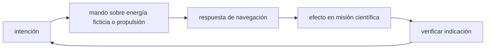

<!-- clase-meta
tipo_documento: clase
clase: 5
codigo: NAVEEXPLORAC-05
curso: nave-exploracion
titulo: "Mandos e instrumentos de la nave de exploración"
modalidad: "taller de simulación"
duracion_minutos: 60
nivel: introductorio
prerrequisito: NAVEEXPLORAC-04
competencia: "lectura_y_mando"
resultados_aprendizaje:
  - "Explicar controles, instrumentos, entradas y estados del sistema con vocabulario propio de Nave de exploración."
  - "Aplicar esos conceptos a una decisión segura o a un escenario de simulación de Nave de exploración."
evidencia: "Mapa de mandos y resolución de dos estados del tablero."
criterio_aprobacion: "Reconoce los controles críticos y responde a los estados sin introducir acciones inseguras."
fuentes: manuales/fuentes.md
ultima_revision: 2026-09-10
-->

# 🎛️ Mandos e instrumentos de la nave de exploración

[🏠 Inicio](../../../README.md) · [🌌 Curso: Nave de exploración](../README.md) · 🎛️ Mandos

> ⚖️ Material educativo original; los derechos de las obras pertenecen a sus titulares.

Esta clase describe, de forma genérica y original, el puesto de mando de una
nave de exploración imaginaria y como cada control se relaciona con la física
que ya vimos. No reproducimos consolas ni diseños oficiales: son roles y
funciones conceptuales, útiles además para pensar un simulador.

## 🧑‍🚀 El puente de mando

El puente reune a las personas que operan los sistemas. La idea de fondo es
sencilla: cada control traduce una decisión humana en una orden para un sistema
físico, y cada instrumento devuelve información medida por sensores.

## Controles principales

| Control | Función | Sistema que opera |
| --- | --- | --- |
| Palanca de propulsión subluminica | Ajusta el empuje realista | Motor subluminico. |
| Selector de impulso | Activa el viaje rápido imaginario | Impulso superluminico. |
| Timón de rumbo | Fija dirección y orientación | Control de actitud. |
| Regulador de energía | Reparte potencia entre sistemas | Reactor. |
| Mando de sensores | Orienta y enfoca la observación | Sensores. |
| Control de soporte vital | Ajusta aire, agua y temperatura | Soporte vital. |

## Instrumentos del tablero

| Instrumento | Que muestra | Base física |
| --- | --- | --- |
| Indicador de velocidad | Fracción de la velocidad de la luz | Real. |
| Reloj doble | Tiempo a bordo y tiempo externo | Dilatación temporal real. |
| Mapa estelar | Distancias en años luz | Real. |
| Nivel de energía | Reserva del reactor | Real en concepto. |
| Estado del impulso | Si el viaje rápido está activo | Imaginario. |
| Alerta de radiación | Riesgo del entorno | Real. |

## Flujo de una orden

Cuando la tripulación decide moverse, la orden pasa del control al sistema y el
resultado vuelve como lectura en el tablero. Ese ciclo de mando y respuesta es
justo lo que un simulador debe modelar.

## Entradas de simulación

| Entrada | Tipo | Rango | Efecto principal |
| --- | --- | --- | --- |
| Empuje subluminico | numérica | 0-100% | Aceleración realista. |
| Activar impulso | booleana | si / no | Cambia a modo viaje rápido. |
| Rumbo | numérica | 0-360 grados | Dirección de la nave. |
| Reparto de energía | numérica | 0-100% por sistema | Prioridad de potencia. |
| Enfoque de sensores | discreta | corto / medio / largo | Alcance de observación. |
| Nivel de soporte vital | numérica | 0-100% | Confort y seguridad a bordo. |

## Puente hacia los principios

Ya sabemos que controles existen. El siguiente módulo explica que decisiones son
físicamente posibles, cuales no y por qué, comparando ficción y realidad.

## 🧭 Guía de estudio aplicada

### Pregunta guía

¿Cómo ayuda **El puente de mando, Controles principales, Instrumentos del tablero y Flujo de una orden** a **interpretar mandos e indicaciones durante aproximación a un fenómeno desconocido con lecturas contradictorias**?

### Explicación razonada

Un mando no se aprende memorizando su nombre, sino recorriendo el ciclo intención → acción → indicación → verificación. En Nave de exploración, el operador actúa sobre energía ficticia o propulsión, observa la respuesta en navegación y confirma el efecto en misión científica. Una indicación inesperada exige detener la secuencia mental, identificar el modo activo y evitar una segunda orden que agrave el estado.

Esta clase se conecta con el resto del curso mediante **la exploración exige administrar incertidumbre, sensores, energía y distancia además de propulsión**. El hilo de
seguridad consiste en reconocer a tiempo **perder capacidad de retirada al consumir energía o confiar en un único sensor** y poder justificar la decisión
**establecer distancia de seguridad, redundancia de medición y criterio de retirada**; en clases posteriores cambiará el ángulo de análisis, no esa relación causal.
La lectura funcional común sigue **energía ficticia → propulsión → navegación → misión científica**, de modo que cada concepto pueda
ubicarse dentro del funcionamiento completo y no quede como un dato aislado.

**Apoyo documental:** [Star Trek Database](https://www.startrek.com/database) aporta canon narrativo y tecnologías de ficción;
[Spaceships and Rockets](https://www.nasa.gov/humans-in-space/spaceships-and-rockets/) se usa para naves, sistemas y misiones. Estas fuentes
se contrastan con el alcance de la clase y no sustituyen un manual de equipo concreto.

### Caso resuelto: de la observación a la decisión

1. **Intención:** formula qué cambio se necesita durante **aproximación a un fenómeno desconocido con lecturas contradictorias**.
2. **Mando:** identifica el control que actúa sobre **energía ficticia** o **propulsión** y el modo que debe estar activo.
3. **Lectura:** localiza la indicación que confirma la respuesta de **navegación** y el efecto en **misión científica**.
4. **Verificación:** si la lectura no coincide, no acumules órdenes; estabiliza e investiga el estado.

### Comprueba tu comprensión

1. ¿Qué mando inicia la respuesta y qué instrumento confirma que el modo correcto está activo?
2. ¿Qué indicación temprana advertiría **perder capacidad de retirada al consumir energía o confiar en un único sensor**?
3. ¿Qué secuencia usarías si la respuesta de **misión científica** no coincide con la orden?

Orientación para revisar tus respuestas

- La primera respuesta debe relacionar el eslabón elegido con un efecto posterior, no solo nombrarlo.
- La segunda debe proponer una señal medible u observable y explicar qué tendencia sería preocupante.
- La tercera debe cambiar al menos una variable de capacidad, mando, entorno o margen de seguridad.

## 🎓 Cierre de clase

- **Actividad:** Recorre el puesto de mando simulado de Nave de exploración: localiza los controles de controles, instrumentos, entradas y estados del sistema y asocia cada indicación con una decisión.
- **Evidencia:** Mapa de mandos y resolución de dos estados del tablero.
- **Criterio de aprobación:** Reconoce los controles críticos y responde a los estados sin introducir acciones inseguras.
- **Transferencia:** explica qué cambiaría al pasar a otra variante de esta máquina.

### Fuentes de esta clase

- [STARTREK-DATABASE](https://www.startrek.com/database): Star Trek Database, Paramount. Uso: canon narrativo y tecnologías de ficción.
- [NASA-SPACECRAFT](https://www.nasa.gov/humans-in-space/spaceships-and-rockets/): Spaceships and Rockets, NASA. Uso: naves, sistemas y misiones.
- [NASA-FLIGHT](https://www1.grc.nasa.gov/beginners-guide-to-aeronautics/): Beginner's Guide to Aeronautics, NASA. Uso: contraste con física y vuelo reales.

> Las fuentes sostienen el marco conceptual y normativo; esta clase no reemplaza el manual
> del fabricante, la formación certificada ni la habilitación exigida para operar equipos reales.

---

[⬅️ Anterior: Sistemas mecánicos](../operacion/sistemas-mecanicos-nave-exploracion.md) · [➡️ Siguiente: Principios y operación](../operacion/principios-nave-exploracion.md)
