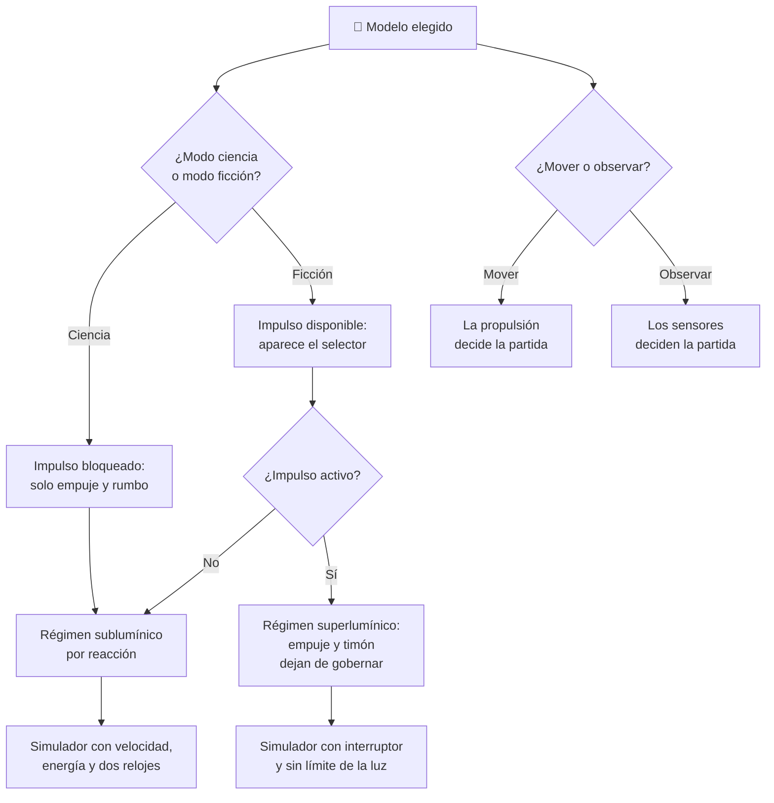

# 🧩 Modelos y variantes de la nave de exploración

[🏠 Inicio](../../../README.md) · [🌌 Curso: Nave de exploración](../README.md) · 🧩 Modelos

El [Módulo 2](../operacion/caracteristicas-nave-exploracion.md) ya dijo qué es
una nave de exploración imaginaria, qué partes tiene y en qué se diferencia de
una nave de guerra o de carga. Este módulo responde a lo siguiente: **una misma
nave no se pilota igual en todos sus regímenes**, y esa diferencia no es de
matiz. Cambia qué mandos gobiernan de verdad la máquina y, por tanto, qué debe
modelar el simulador.

> 🎯 **La idea que sostiene el módulo.** "La nave" no es una sola máquina desde
> el punto de vista del mando. El motor sublumínico por reacción y el impulso
> superlumínico son dos regímenes distintos: en el primero el empuje y el rumbo
> deciden el movimiento; en el segundo, según la idea teórica que el curso
> describe, no es la nave la que se mueve por el espacio, así que esos mandos
> dejan de gobernar. Un simulador que presente un único esquema de control está
> representando un régimen concreto aunque diga representarlos todos. Todo esto
> es ficción educativa: los derechos de las obras que la inspiran pertenecen a
> sus titulares.

---

## 🧭 Por qué el modelo decide el simulador

El [Módulo 5](../mandos/manual-mandos-nave-exploracion.md) describe un puesto de
mando con una palanca de propulsión sublumínica (`0-100%`), un timón de rumbo
(`0-360 grados`) y un selector de impulso booleano (`si / no`). El
[Módulo 9](../simulacion/diseno-simulador-nave-exploracion.md) expone una
variable `Modo` con valores `ciencia / ficción` y una variable `Impulso activo`
que solo tiene sentido en uno de esos dos valores.

Ahí está el punto: el propio curso ya declaró que el simulador **no es uno**. En
modo ciencia, el selector de impulso está bloqueado y el mando no existe a
efectos prácticos; el reloj doble y el nivel de energía llevan la partida. En
modo ficción, el selector de impulso aparece y con él se apaga buena parte de lo
que el [Módulo 6](../operacion/principios-nave-exploracion.md) enseña como
límite duro. Si el simulador se construye sobre un solo régimen y luego se le
"añade" el otro, el resultado es una nave que acelera por reacción hacia una
velocidad que ninguna reacción alcanza.

---

## 🗂️ Qué cambia en el manejo

| Modelo o régimen | Qué cambia al pilotarla |
| --- | --- |
| Régimen sublumínico (motor por reacción) | La referencia realista del curso: se acelera expulsando masa, lento y constante, hasta una fracción de la velocidad de la luz. La energía y el tiempo son el problema central. |
| Régimen superlumínico (impulso imaginario) | El viaje deja de sentirse como acelerar: se activa o no se activa. Las distancias en años luz dejan de imponer la duración de la partida. |
| Modo ciencia | El impulso queda bloqueado. Cada maniobra se paga en energía y en años; los dos relojes se separan y hay que convivir con ello. |
| Modo ficción | El atajo está disponible, pero la regla interna del [Módulo 8](../reglamentos/reglas-universo-nave-exploracion.md) lo reserva para grandes distancias, no para cada maniobra. |
| Nave generacional (vía lenta) | Se pilota a velocidad modesta durante siglos: el objetivo deja de ser llegar y pasa a ser sostener el hábitat y el soporte vital generación tras generación. |
| Misión de cartografía o investigación | El movimiento importa menos que el enfoque de sensores: la nave se coloca y observa. |
| Misión de rescate lejano | Aparece la prisa contra un límite que no se negocia: la energía y la velocidad de la luz fijan lo que se puede prometer. |
| Nave de carga o de guerra (fuera del curso) | No es el vehículo de este curso: cambia la misión, y con ella el peso del laboratorio y de los sensores frente al resto. |

---

## 🎛️ Qué cambia en el mando

| Modelo o régimen | Qué mando aparece o desaparece | Consecuencia |
| --- | --- | --- |
| Régimen sublumínico | Ninguno: el mapa de controles del Módulo 5 aplica tal cual. La palanca de propulsión y el timón mandan. | Cambian los rangos y los tiempos, no los controles. |
| Régimen superlumínico | **Aparece** el selector de impulso, que es booleano. La palanca de propulsión sublumínica y el timón de rumbo **dejan de gobernar** el avance mientras el impulso está activo. | Un control continuo de empuje se sustituye por un interruptor: no hay "más" ni "menos" impulso que dosificar. |
| Modo ciencia | El selector de impulso **desaparece** de la partida: está bloqueado por diseño. | El puesto de mando se reduce a empuje, rumbo, energía, sensores y soporte vital. |
| Modo ficción | El selector de impulso **se habilita**. | El regulador de energía cambia de papel: deja de ser el muro del Módulo 6 y pasa a ser una regla interna de la ficción. |
| Nave generacional | Ningún mando nuevo, pero el **control de soporte vital** pasa a primer plano y el selector de impulso no se usa nunca. | El mando que decide la partida no es el de moverse, sino el de mantener vivo el hábitat. |
| Misiones de observación (cartografía, estudio, primer contacto) | El **mando de sensores** deja de ser accesorio y se vuelve el control principal. | Su enfoque (`corto / medio / largo`) decide el resultado más que el empuje. |

---

## 🎮 Qué cambia en el simulador

Contrastado con las variables del
[Módulo 9](../simulacion/diseno-simulador-nave-exploracion.md):

| Modelo o régimen | Variables que cambian | Esquema de control |
| --- | --- | --- |
| Régimen sublumínico | Ninguna: es el caso base. `Velocidad sublumínica` (`0-99% de c`), `Energía` y `Distancia al destino` llevan el cálculo. | El del Módulo 5. |
| Régimen superlumínico | `Impulso activo` pasa a `si` y `Velocidad sublumínica` deja de explicar el avance. `Distancia al destino` se recorre sin que la velocidad la justifique. | Sin entrada continua de empuje: un interruptor sustituye a la palanca. |
| Modo ciencia | `Modo` = `ciencia` bloquea `Impulso activo`. `Tiempo a bordo` y `Tiempo externo` divergen y son el resultado que se observa. | El del Módulo 5, con el selector de impulso inerte. |
| Modo ficción | `Modo` = `ficción` habilita `Impulso activo`. La comprobación del paso 2 del ciclo básico deja pasar acciones que el modo ciencia rechaza. | El del Módulo 5 más el interruptor de impulso. |
| Nave generacional | `Tiempo externo` crece hasta siglos y `Tiempo a bordo` deja de ser el reloj interesante. `Energía` se gasta en sostener, no en acelerar. | El del Módulo 5, sin impulso, con el soporte vital como entrada crítica. |
| Misiones de observación | `Radiación del entorno` y el enfoque de sensores mandan sobre el resto; la posición cuenta más que la velocidad. | El del Módulo 5, con el mando de sensores al frente. |
| Misión de rescate lejano | `Distancia al destino` y `Energía` se leen contra un plazo: la partida se pierde por física, no por pilotaje. | El del Módulo 5. |

---

## 🗺️ Del modelo al esquema de control

---

## ⚠️ Qué modelos no comparten simulador

Dos parejas no se resuelven con un ajuste de parámetros, porque su esquema de
control es otro:

- **El régimen sublumínico frente al superlumínico**: no es que uno sea más
  rápido. En uno, un mando continuo (`0-100%` de empuje) produce aceleración
  contra un límite duro; en el otro, un booleano produce llegada. El
  [Módulo 4](../operacion/sistemas-mecanicos-nave-exploracion.md) lo dice sin
  rodeos: en la idea teórica no se mueve la nave, se deforma el espacio. Un
  mando que empuja y un mando que se enciende no son el mismo mando con otro
  rango.
- **El modo ciencia frente al modo ficción**: el propio Módulo 9 los define como
  un interruptor central que decide **qué acciones se comprueban**. No es
  dificultad distinta: es un conjunto de reglas distinto, y el simulador debe
  rechazar en uno lo que acepta en el otro.

El resto de variantes —tipos de misión, nave generacional, perfiles de
observación— sí caben en un mismo simulador ajustando rangos y prioridades, tal
como plantean los
[niveles de realismo](../../../docs/03-niveles-de-realismo.md): en el nivel 1 la
diferencia apenas se nota, y emerge a medida que el nivel sube y la física real
empieza a cobrar sus facturas.

---

[⬅️ Anterior: Características](../operacion/caracteristicas-nave-exploracion.md) · [➡️ Siguiente: Sistemas mecánicos](../operacion/sistemas-mecanicos-nave-exploracion.md)
