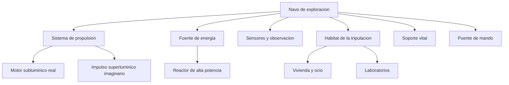

# 📋 Caracteristicas de la nave de exploracion

[🏠 Inicio](../../../README.md) · [🌌 Curso: Nave de exploracion](../README.md) · 📋 Caracteristicas

> ⚖️ Material educativo original; los derechos de las obras pertenecen a sus titulares.

Aqui describimos, con nuestras palabras, que seria una nave de exploracion
interestelar imaginaria: para que sirve, que partes tiene y que la diferencia
de una nave de guerra o de carga. Todo es concepto generico inspirado en el
estilo "Star Trek", sin planos ni especificaciones oficiales.

## Que es y para que sirve

Una nave de exploracion es una comunidad movil pensada para viajar lejos,
estudiar lo que encuentra y sostener a su tripulacion durante mucho tiempo.
No busca conquistar: busca observar, medir, mapear y aprender. Por eso combina
laboratorios, sensores, vivienda y motores de largo alcance.

## 🧩 Partes conceptuales

## Perfil general

| Rasgo | Descripcion conceptual | Base real o inventada |
| --- | --- | --- |
| Mision | Explorar, estudiar y mapear | Inspirada en sondas reales, ampliada. |
| Autonomia | Muy larga, casi autosuficiente | Inventada a esa escala. |
| Propulsion lenta | Motor de reaccion subluminico | Fisica real. |
| Propulsion rapida | Impulso mas veloz que la luz | Inventado, sin base practica. |
| Tripulacion | Comunidad estable a bordo | Inspirada en estaciones espaciales. |
| Sensores | Detectan mundos y fenomenos lejanos | Real en concepto, exagerado en alcance. |

## Tipos imaginarios de mision

| Tipo | Objetivo | Que ensena de fisica real |
| --- | --- | --- |
| Cartografia estelar | Mapear estrellas y rutas | Distancias en anios luz. |
| Estudio planetario | Analizar mundos nuevos | Orbitas, atmosferas, gravedad. |
| Primer contacto | Observar senales o vida | Escalas de tiempo y distancia. |
| Rescate lejano | Ayudar a una nave varada | Limites de velocidad y energia. |
| Investigacion pura | Medir fenomenos raros | Relatividad y energia. |

## Que la hace especial

- **Autosuficiencia**: debe producir energia, aire, agua y comida por su cuenta.
- **Escala del viaje**: piensa en distancias que en la realidad tomarian siglos.
- **Doble propulsion**: una parte creible y lenta, otra imaginaria y rapida.
- **Foco cientifico**: mas laboratorio que arma.
- **Vida a bordo**: es tambien un hogar, no solo una maquina.

## Puente hacia los sistemas

Con esta vision general, el siguiente modulo abre la nave por dentro y separa
con cuidado la tecnologia imaginaria de la fisica que si conocemos.

---

[⬅️ Anterior: Historia](../historia/historia-nave-exploracion.md) · [➡️ Siguiente: Sistemas mecanicos](sistemas-mecanicos-nave-exploracion.md)
